

<a href="#top" class="back-to-top">
  &#9650;
</a>

|Оценка|Игры|
|:-:|:-:|
|Маст плей (10)|[Sekiro: Shadows Die Twice](#глубокий-вдох-громкий-выдох-как-кипит-моя-кровь-прохождения-ванильная-с-двумя-ответвлениями-и-со-всеми-боссами-в-игре-в-том-числе-и-иными-с-амулетом-куро-sekiroresurrection-ver-115-app-ver-106-с-двумя-ответвлениями-и-со-всеми-боссами-кроме-иных-с-амулетом-куро-ванильная-с-двумя-ответвлениями-и-со-всеми-боссами-в-игре-в-том-числе-и-иными-без-амулета-куро), [Dishonored 2](#хоноред2-проходил-с-магией-и-без-нее-по-стелсу), Dishonored, [Lies of P](#slice-of-peak-лучший-соулс-не-от-миядзаки-3-прохождения-до-выхода-длц-1-до-нерфов-сейв-потерян-2-после--лаксазия-без-нанесения-атак-3-sl10-11112023-dlc-overture-1-прохождение-длц-на-втором-сейве-с-прокаченным-уровнем-21062025-все-боссы-2-sl10-26062025-все-боссы), [Dark Souls 3](#бест-соус-5-прохождений-1билд-со-скимитарами-без-длц-2билд-через-удачу-и-кровотечение-с-ножом-бандита-без-длц-3-sl1-без-dlc-4-билд-через-двуручный-меч-изгнанника-all-bosses-5-sl1-all-bosses), Kingdom Hearts 3, [Shin Megami Tensei V: Vengeance](#нахобихо-canon-of-vengeance-chaos-ending-difficulty-hard-physical-build-murakumo-gaming), GTA:SA, TES IV: Oblivion, TES V: Skyrim, [Clair Obscur: Expedition 33](#33-сложность-вызов-все-сложные-опциональные-боссы-пройдены-карта-вся-изучена), Hollow Knight, Batman: Arkham Knight, Rogue Legacy 2, [Salt and Sanctuary](#соль-2-полных-прохождения-со-всеми-боссами-1-через-фулл-ловкость-с-копьями-2-через-клирика-раскачивалась-преимущественно-сила-и-мудрость-и-немного-других-статов-но-без-магии-и-посохов-бегая-с-большим-мечом), Devil May Cry 3, [Hi-Fi RUSH](#hi-fi-rush-высокий-уровень-сложности-и-виртуоз), [Furi](#фури-только-без-фурри-2-рана-обычная-и-фури), Spider-Man: Shattered Dimensions, Spore, [Persona 5 Royal](#p5r-2-прохождения-1-нормал-без-третьего-семестра-2-хард-дифа-с-третьим-семестром-ограничения-на-харде-без-использования-бесплатных-персон-из-коллекции-без-использования-в-битвах-идзанаги-но-оками-без-использования-бонусного-контента-костюмы-расходники-деньги), [Armored Core VI](#броне-ядро-6-все-3-концовки-открыты-ng), [Resident Evil 4 Remake](#резик4ремаке-сложность-хардкор), Lego Batman 2: DC Super Heroes, Undertale, The Legend of Zelda: Breath of the Wild, [The Legend of Zelda: Tears of the Kingdom](#goty-нет-2023), [Baldur’s Gate III](#балдурка3-2-прохождения-1-сложность-баланс-все-боссы-убиты-кооп-из-4-х-человек-мейн-гейл-в-3-акте-ребилд-из-мага-в-барда-около-90-часов-2-сложность-тактика-все-боссы-убиты-кооп-из-4-х-человек-мейн-кастомизированный-персонаж-с-доменом-жизни-весь-ран---уничтожение-всех-персов-в-результате-на-финальном-боссе-пришлось-спидранить-до-входа-к-мозгу-60-часов), [Nioh 2](#ниох2-2-прохождения-1-катана-гейминг-мэйн-миссии-без-длц-2-sl1-мэйн-миссии-основная-сюжетка--мэйн-миссии-во-всех-3-длц), Simpsons hit and run, Final Fantasy VII Remake Intergrade, [Split Fiction](#сплит-все-сайд-миры-пройдены), It Takes Two, Devil May Cry 5, [Ghost of Tsushima Director's Cut](#цусима-основная-компания--длц-сложность-кошмар), Terraria, [Fallout: New Vegas](#фолычновыйвегас-ultimate-edition-сложность-нормал-без-хардкора-2-прохождения-1-независимость-с-йес-мэном-через-билд-без-оружия--все-вышедшие-длц-2-мистер-хаус-через-энергетические-пушки-без-длц-потом-откат-на-предыдущие-сейвы-и-концовка-с-нкр), [Dragon Age: Origins](#трули-драгоняга-оф-ол-тайм-начало-3-длц-и-пробуждение-главный-герой---эльфийка-маг-сложность-средняя), [Shin Megami Tensei: Digital Devil Saga 2](#i-comprehend-сложность-hard-all-bosses), [Monster Hunter Rise: Sunbreak](#райз-и-санбрик-всё-прохождение---онли-греатсворд-основная-сюжетка-в-райзе-пройдена--аматсу-основная-сюжетка-в-длц-санбрейк-пройдена--древний-малзено), [The First Berserker: Khazan](#казан-готов-2-прохождения-1-сложность-эксперт-билд-через-двуручный-меч-true-ending-все-остальные-концовки-тоже-выбиты-путем-сейвскама-100-прохождение-04072025-2-сложность-хардкор-билд-через-копье-true-ending-все-остальные-концовки-тоже-выбиты-сейвскамом-100-прохождение-13072025), [Spark the Electric Jester 3](#жестер3-main-game-platforming-difficulty-normal-combat-difficulty-challenge-jesterv12f--dlc-out-of-bounds-combat-difficulty-easy-jester), [Sonic Frontiers - The Final Horizon](#соник-закосплеил-вергилия-сложность-хард-в-аркадном-режиме-выбиты-все-красные-кольца-и-sки)
|Почти маст плей (9-8.5)|[Black Myth: Wukong](#царь-обезьян-true-ending), [Bloodborne](#а-хунте-из-а-хунтер-ивэн-ин-э-дрим-3-прохождения-1-all-bosses-без-чаш-секретная-концовка-билд-с-тонитрусом-и-пилой-топором-2-bl4-скипнуто-все-длц-боссы-логариус-герман-и-присутствие-луны-3-all-bosses--основные-боссы-из-чаш-для-платины-секретная-концовка-билд-со-священным-клинком-людвига), [Persona 4 Golden](#золото-сложность-normal-true-golden-ending), [Ratchet & Clank: Rift Apart](#пушистики-сложность-легенда), [Persona 3 Reload](#релоад-сложность-нормал-тру-эндинг), Octopus: Dadliest Catch, Valiant Hearts: The Great War, South Park: The Stick of Truth, Ghostrunner, Fable, Borderlands 2, Lego Star Wars 3, The Outer Worlds, [Celeste](#селесте-мейн-сюжетка--длц-без-b-и-c-уровней), Mirror's Edge, CS:GO (dead), The Escapists, [Final Fantasy VII Rebirth](#реберф-сложность-динамическая), Kingdom Hearts birth by sleep, [Kingdom Hearts 2 (HD 2.5 ReMIX)](#kh2-final-mix-standard-mode), Metal Gear Rising: Revengeance, DOOM (2016), [Monster Hunter: World](#неgrgигант-лучник-без-дополнения-iceborn), Orcs Must Die! 2, GTA: Vice City, [Shin Megami Tensei: Digital Devil Saga](#i-do-not-comprehend-мейн-перс-маг-со-льдом), Rogue Legacy, Thymesia, Saints Row 4, Transistor, Cyberpunk 2077, Singularity, Far Cry 3, Tarzan (video game), A Way Out, [Persona 5 Strikers](#страйкерс-сложность-normal), Dying Light, Blasphemous, [Neon White](#персоналайк-только-платформер-100-прохождение-true-ending-без-гонок-по-уровням), [DmC: Devil May Cry](#ive-got-a-bigger-dick-сложность-нефилим-данте-и-вергилий), [Final Fantasy XVI](#финалочка16-сложность-игровой-процесс-мейн-сюжет--2-длц-где-то-процентов-80-побочек-выполнено)
|Прикольные игры (8)|[NINJA GAIDEN 2 Black](#элизабет---худший-босс-за-всю-историю-майнкрафта-difficulty-path-of-the-master-ninja-punishing-ver1070-difficulty-path-of-the-mentor-very-hard-ver1050), [Warhammer 40,000: Space Marine 2](#спаси-марину-2-кампания-нормальная-сложность-все-операции-средняя-сложность), [Dark Souls: Remastered](#темные-души-1-3-прохождения-1-через-ловкость-с-катанами-без-длц-2-sl1-all-bosses-without-pyromancy-3-колдовство-без-длц), [Shin Megami Tensei III Nocturne HD Remaster](#one-more-friend-rejected-maniax-сложность-normal), Minecraft, Cuphead, Battlefield 4, [Transformers: War for Cybertron](#формеры-сложность-hard), [Orcs Must Die! 3](#орки-умирают-3-сложность-нормал-кооп), Infamous: Second Son, Super Hot, [Shift Happens](#шифт-происходит-мультиплеер), GTA V, The 3rd Birthday, Bulletstorm, Bioshock Infinite, [Borderlands 3](#барда3-2-прохождения), Watch Dogs, [Wizard of Legend](#визарды-1-прохождение), [Wo Long: Fallen Dynasty](#ниох-лонг-мейн-задания-сюжеток--3-длц), [Bayonetta 1](#witch-may-cry-сложность-нормал), [Avowed](#абобед-сложность-путь-проклятых-магический-билд), [Magicka](#магики-2-игрока), [Ultimate Spider-Man](#venom)
|Неплохие игры (7)|Brutal Legend, [Blasphemous 2](#бласфемус2), [Fallout 4: Game of the Year Edition](#ad-victoriam-сложность-нормал-все-длц-пройдены-концовка-за-братство-стали), [Tainted Grail: The Fall of Avalon](#оскверненный-грааль-сложность-режим-выживания-маг), [Stranger of Paradise: Final Fantasy Origin](#нио-фентези-сложность-хард--3-длц-true-ending-соло-прохождение-без-ботов-в-команде), [Touhou 6 - The Embodiment of Scarlet Devil](#жесткий-казуал-6-сложность-нормал-хорошая-концовка), [The Surge 2](#not-wheelchair-gaming), PAYDAY 2, Dead by Daylight, [MiSide](#мисиде-version-0923), [Divinity: Original Sin 2](#дивинити-2-cложность-тактика-кооп-из-4-х-человек-мейн-лоусе-класс-лучник), [Sonic DX](#соникдх-perfect-chaos-final-boss), [PICO PARK](#пикопарк-4-чел), [Dragon Age: The Veilguard](#диснейдрагоняга-сложность-кошмар-класс-маг-чародейский-меч-6-союзников-выжили--гг-хорошая-концовка), [Final Fantasy 15](#ff15), [AI LIMIT](#лимитаи-true-ending-all-endings-all-bosses-all-npc-questlines), [Shin Megami Tensei IV: Apocalypse](#heh-its-apocalypse-time-difficulty-war-all-endings-mage-build), [Ninja Gaiden Σ2](#сигма2-difficulty-path-of-the-master-ninja-punishing), [Marvel's Spider-Man: Miles Morales](#марвелс-милес-моралес-сложность-потрясающий-100-прохождение), [Devil May Cry 4: Special Edition](#бэктрекинг-гейминг-сложность-охотник-на-демонов-нероданте), [Code Vein](#местный-анор-лондо-крутой-нет-без-длц-2-прохождения-1-с-ботом-в-напарниках-2-без-него-очень-сильно-душили-парные-боссы-поэтому-не-рекомендую-так-делать), [Magicka 2](#магики-2-4-игрока-сложность-нормал), [Marvel's Spider-Man Remastered](#марвелc-спидер-мэн-ремастеред-сложность-потрясающий-100-прохождение-основная-сюжетка--3-длц)
|С пивком норм (6)|[Fallout 3](#фол3-сложность-нормал-положительная-карма-билд-через-холодное-оружие), [Sonic Adventure 2 Battle](#совершенная-форма-жизни), [FINAL FANTASY II PIXEL REMASTER](#press-f-simulator), [FINAL FANTASY I PIXEL REMASTER](#were-here-to-kill-chaos), [Demon's Souls (2009)](#демоныдемоныдемоны), [Shin Megami Tensei IV](#where-is-this-legendary-demon-сложность-prentice-nothing-and-chaos-endings-mage-build), [Ratchet & Clank (2016)](#кретчет-и-планк), Just Cause 2, Battlefield: Bad Company 2, Tales of Berseria, Shadow the hedgehog (game), Deadpool, Titanfall 2, Hogwarts Legacy, Assassin's Creed, Heavy Rain, The Lord of the Rings: War in the North, Lego Star Wars 2, Prototype 2, [The Surge](#wheelchair-gaming), [Crisis Core -Final Fantasy VII- Reunion](#мигонгага-difficulty-hard-v103), [Bloodborne PSX](#бладборн-на-пк-bbpsx_105), TimeShift, [Kingdom Hearts 1 (HD 1.5 ReMIX)](#kh1-fm-standard-mode), Call of Duty 1, Saints Row: gat out of hell, Patapon 1, Patapon 2, [Patapon 3](#пата3-тонденга-диф), Mafia 2, [Sonic Heroes](#sonic-heroes), Saints Row: The Third, [The Coffin of Andy and Leyley](#гроб), [Star Wars Jedi: Fallen Order](#джедаи-сложность-мастер-джедай), [SIFU](#сифу-сложность-адепт), [KANNAGI USAGI](#секиро-дома), I am bread, [G-Force](#морские-свинки-сложность-тяжелая), [Dark Messiah of Might and Magic](#мессиах-сложность-обычная), TankiOnline, [Devil May Cry 1](#первый-дмц-чутка-лучше-второго-сложность-normal)
|Сомнительно(5)|[Elden Ring](#элденрингакахудшаяиграмиядзаки-2-прохождения-1-билд-через-ловкость-с-когтями-и-катанами-в-лейте-2-билд-через-силу-с-мечом-гатса-на-всю-игру--онли-парирование-маления), [Afterimage](#послесвечение), Trove (dead game xd), Dark Souls 2, Life is Strange, Homefront: The Revolution, Homefront, We Happy Few, League of Legends, [Nioh](#ниок), [Freedom Fighters](#freedom-fighters-предпоследняя-сложность), [Devil May Cry 2](#а-говорят-дмц-2-скучная-игра-очень-веселая-сложность-normal)
|Мусор(4-1)|[Black Souls 1](#подвал-гейминг-сложность-0), [Genshin Impact](#гашиш-от-конторы), [God Eater 3](#итерхуитер-дроп-игра-унылый-куки-кликер-прошел-только--от-всей-игры), [Mortal shell](#шелл-мортал), [Lords of the fallen (2023)](#лорды-2023-дроп-игра-говна), Tower of Fantasy, [Rise of the Ronin](#кусок-японского-кода-дроп), [Senua's Saga: Hellblade II](#сенуа-сенуа-сенуа)
|Дроп (без оценки)|Gothic II, TES 3, Othercide

Оценка игр преимущественно (на 90%) основывается на их геймплее. Стоит отметить, что почти все картинки в обзорах в низком разрешении, потому что их сжимал гугл док, а я сам на это не обращал, так как в нем все выглядело ок (из-за чего пришлось переделать все под новый формат, где не будет так жестко уменьшаться разрешение скриншотов). Если выставить масштаб страницы 80%, то мыло не будет так бросаться в глаза

# **Hi-Fi RUSH (Высокий уровень сложности и виртуоз)**
Hi-Fi RUSH - топ. Особенно, когда открывается парирование. Если бы игра вышла в прошлом году, то спокойно бы выиграла номинацию лучшей игры года, по крайней мере для игроков. Из недостатков можно отметить только отсутствие лока камеры. Такую высокую концентрацию фана и адекватного челленджа мало какие игры генерировали. Все босс файты сделаны максимально оригинально. Ни один из них не похож ни на кого другого. Особенно последние 2 были просто шикарными. В первом случае потому, что на заднем фоне начала играть ремикснутая версия пятой симфонии, а во втором - сам босс. Очень редко со мной происходит такой момент, когда я хочу выбить максимальный ранг на миссии, но эта игра - один из таких случаев. Во второй половине игры я уже просто машинально начал попадать в ритм. Ну и самый главный плюс это компаньон котик, и возможность за него поиграть в конце игры.

# **НИОК**
- Она очень долгая, если учесть, что я проходил только мейн миссии. С этим можно было бы смириться, если только не было скучных и однообразных лок.
- Ключевой минус: минус босс котик (белый тигр, хотя че там от тигра мне до сих пор непонятно), земля пухом.
- Игра всячески одобряет и даже заставляет фармить себе лвл (что указывает рекомендованный уровень миссий), зельки (по дефолту у тебя их 3 дается, но можно разбить шмот ненужный, и у тебя будет 8 хилок. Или собрать ВСЕХ зеленых чудиков на карте), предметы, УЛЬТА, потому что средний игрок задушится траить боссов около идеально.
- Несколько боссов были прикольными (окацу, ода нобунага), большинство более-менее норм, но были прям ужасные и максимально наглые, на которых требуется нереальное задрачивание или максимальная удача.
- Большинство локаций - унылый коридорчик.
- На перекатах фреймов неуязвимости мало.
- Если говорить про прокачку статов, то она весьма специфична. Ты намертво привязан к одной пухе, если собираешься качать только один стат. Но если ты начнешь равномерно распределять очки, то такими темпами можно не скоро закончить игру (ну магия оп, так что все может быть не так плохо).
- Про стойки я даже хз че сказать, потому что я ими банально не пользовался, так как мне они показались максимально ситуативными. Средняя стойка всегда была лучшим выбором по соотношению дамаг/подвижность. Но сама боевка мне больше понравилась.
- Почему мне не дают ульту сразу на босс файте? Почему ее нужно выфармливать перед тем, как войти на арену к боссу? Не очень понятно. Как итог: забил на нее, даже не прокачивал. Когда была возможность ультануть - ультить, а не было - продолжал тыкать палкой.
- У большинства боссов огромный хп бар, поэтому файт минимум 5 минут идет, если делать все идеально. Ну это не особо минус игры, просто держу в курсе.
- Для меня прям нереально сложных боссов не было, но были максимально нечестные, но это уже не в новинку, поэтому в некоторые моменты придется открыть форточку, иначе велик шанс задушиться, и больше не открыть эту игру.
- Рядовые мобы постоянно повторяются.
- Кульминацией стало то, что после скриншота у меня должен был пойти мультик и титры, но игра внезапно ВЫЛЕТЕЛА, и откатила меня к ласт боссу основной компании, поэтому на длс боссов я забил болт. Больше нет особого желания запускать игру.

Если какие-то итоги подводить, то игруха чисто на 5 баллов. Все-таки какой-никакой челлендж. К этой боевке приходилось адаптироваться, а когда привыкаешь, становится гораздо легче. По моему мнению, лучше в другие соусы поиграть. Потому что игра балансирует между честной сложностью и духотой

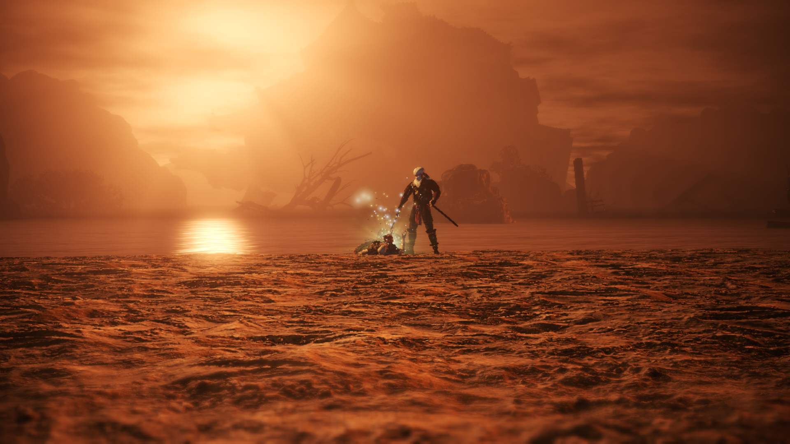

# **Freedom Fighters (предпоследняя сложность)**
Такая душка этот фридом файтер. В детстве он как-то пободрее выглядел. Подумал, ща такой веселый шутанчик будет на предпоследней сложности, но по итогу всю игру бегал отправлял тиммейтов зачищать локу, а сам сидел со спины их ресал, как местная хилочка. Еще и чекпоинты в половине случаев находятся либо супер далеко, либо он один на всю карту. Неловкое движение в сторону врага - смерть, и идем по новой проходить еще 20-30 минут. Разброс пуль огромный у всех ганов (кроме снайперки и пулемета, которые раз в год дают потрогать) из-за чего убить врага на средней дистанции становится довольно затруднительной задачей, да и вообще стрелять. Саунд так себе, который надоел повторяться уже на середине игры. Короче, игра ни о чем, не стоило вообще ее вспоминать

# **Фури (только без фурри) (2 рана: обычная и фури+)**
Если ласт босса скипать (альтернативная концовка), то игра 10 на 10, особенно максимальной сложности Furi+. Я хз, как можно было сделать финального босс файт настолько душным и неуместным. Типо у нас вся игра завязана на парированиях, уворотах и атаках, а меня заставляют играть в совершенно другую игру, да и еще максимально скучную. Радует, что это только один такой плохой босс, ведь весь остальной геймплей шикарный. Я давно не испытывал такой неподдельный восторг от игры

# **Гашиш от конторы**
Когда игра с достаточно интересной и перспективной боевкой скатилась до уровня типичной выжималки денег с унылейшими ивентами, посредственными заданиями и околонулевым лейтгеймом. И ведь мало того, что скипать диалоги нельзя, так они еще и сами по себе скучные и нудные, как будто их нейросеть писала. И единственная причина заходить в эту подделку - потыкаться в мобов в бездне раз в 2 недели

# **Sonic Heroes**
Если проходить только одну кампанию (4-5 часов продолжительность), то игра прикольная. Если начнете проходить все оставшиеся (которые повторяются точь-в-точь), то рискуете задушиться, а оценка игры падает до 0 колец, ведь геймплей вообще никак не отличается. А все ради того, чтобы анлокнуть истинного финального босса. Поэтому я прошел только команду соника, а на остальное забил, чтобы оставить более положительное впечатление от игры

# **FF15**
Игра в начале максимально унылая и начинает раскачиваться только под позднюю середину игры. Кроме крутого графона и лютого афига от происходящего в некоторых босс файтах сложно что-то еще подчеркнуть. FF7 во всех аспектах играется бодрее, и выглядит лучше. А эти нескипабельные поездки на машине в ирли в какой-то момент начинают надоедать. Я даже и не удивлен, почему эта часть мало кому зашла. Нам даже поиграть за других героев дают только ПОД КОНЕЦ ИГРЫ (вот тут я не уверен, может я что-то упустил). И либо я не понял, как в это играть, либо проглатывать миллион аптечек на боссах (потому что они часто просто шотают) - это нормальная тема. Боевка тоже не особо интересная (пока ты не врубаешь ульту). Была одна миссия веселая, где я был на переговорах, и игра мне постоянно говорила, что от моих выборов зависит, получу я важного для сюжета персонажа или нет. Ну по итогу, я решил вести себя так, чтобы провалить миссию, но как и ожидалось, ЭТО НИКАК НЕ ПОВЛИЯЛО НА СЮЖЕТ, просто я лишился пару строк диалога и некоторых наград. Я понимаю, что у вас сюжет максимально прямолинеен и скучен, но не до такой же степени

# **Глубокий вдох, громкий выдох. Как кипит моя кровь (Прохождения: ванильная с двумя ответвлениями и со всеми боссами в игре, в том числе и иными (с амулетом Куро); Sekiro:Resurrection Ver. 1.15 App Ver. 1.06 с двумя ответвлениями и со всеми боссами, кроме иных (с амулетом Куро); ванильная с двумя ответвлениями и со всеми боссами в игре, в том числе и иными (БЕЗ амулета Куро))**
По моему мнению, Cекиро является лучшей игрой Миядзаки. Почти все боссы сделаны отлично, откровенных проходных нет. Лучший финальный босс в линейке игр автора. Уникальная боевка, которая не похожа ни на одну из его предыдущий игр, и которая работает просто отлично. Дизайн локаций, который не уступает дс1, а иногда даже и превосходит его. Играть стало куда интереснее, потому что бои стали более интенсивные и требует от тебя не просто нажимать одну кнопку переката. При этом, вариативность подхода к боссам достаточно высокая, ведь существуют протезы и разные комбо (даже действия на одну и ту же атаку противника могут сильно различаться), которыми еще надо уметь пользоваться в разных ситуациях. Геймплей быстрый и динамичный, так как механики игры способствуют этому (концентрация, толстенный хп бар, высокая подвижность мобов). Даже музыка отлично дополняет игру и позволяет чувствовать ритм атак противника. Единственное, что в игре не так - это тот факт, что протезы используются за эмблемы (которые нужно фармить). Короче, игра 10

(Sekiro vanilla)

Sekiro: Resurrection Ver. 1.15 App Ver. 1.06. Если затрагивать сам мод, то он супер. Боссы стали гораздо интереснее и сложнее + куча других нововведений. Самое то для тех, кому ванильный Секиро наскучил

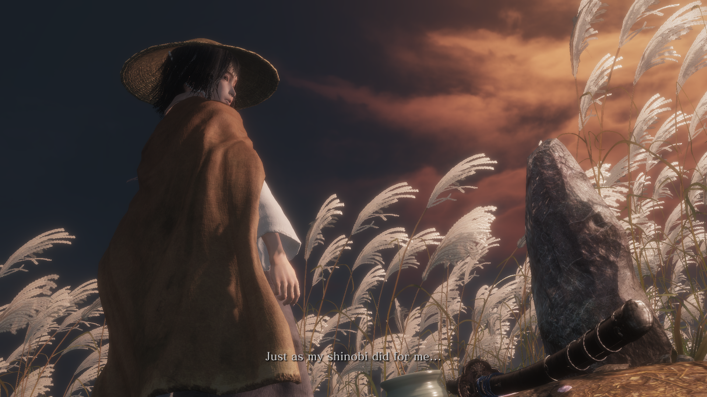
(Sekiro: Resurrection Ver. 1.15 App Ver. 1.06)

Isshin, Saint Sword (Sekiro: Resurrection Ver. 1.15 App Ver. 1.06)
https://www.twitch.tv/videos/1966225257
(Sekiro: Resurrection)

## Паста про усложненный режим игры (без амулета Куро)
Оформил 2 забега с нового сейва без амулета Куро со всеми боссами (и их иными версиями) на ванильной версии игры. На удивление, Филин и остальные его 2 версии отлетели чуть ли не за первые траи, а вот Госпожа Бабочка резко начала напрягать на турнире силы. Из примечательного. Почти все выпады, усиленные атаки и граб-атаки шотают на фулл хп. Даже через блок у тебя почти нет шансов выжить, если концентрация на грани срыва. Поэтому, отстоять в защите не получится, нужно учить каждый замах босса, и парировать его. Новыми красками заиграли протезы в турнире силы, так как там не тратятся эмблемы и расходники, поэтому их можно спокойно использовать (особенно выделяется зонт, которым можно парировать все атаки (даже грабы), кроме круговых, а затем моментально использовать его для усиленной атаки с определенным эффектом. Сюрикены тоже себя здорово показали с навыком, которые позволяет после использования протеза делать длинный рывок + атаку к боссу за короткое время). В обычном прохождении, подход: "буду просто стоять и парировать все атаки босса (иногда делать тычку), чтобы убить его через концентрацию" переставал эффективно работать где-то с середины игры. Без амулета Куро - это перестает работать с нулевой, поэтому приходится комбинировать парирования, агрессивный стиль игры и перекаты, чтобы наносить урон по хп босса. Так и дамаг по концентрации больше становится, и босс не успевает ее восстановить. В этом плане Филин - идеальный пример, где у тебя 1/3 файта - это атака по нему, другая 1/3 - парирования, а оставшуюся 1/3 составляют перекаты (или протез зонт) там, где парирование атаки использовать не вариант (в силу того, что ты будешь в долгой анимации после парирования), так как вместо нее можно дать халявную тычку по врагу. Ну и единственное, что меня не устроило - это количество хп у демона ненависти. Мало того, что этого чела тыкать минут 10, так если ты хоть раз ошибешься, то с большой вероятностью отправишься на костер (ну или воскреснешь, а только потом отправишься на костер). А еще, он играется так, как будто я в элден ринг зашел первым лвл'ом бить великана. Поэтому пришлось использовать так называемую "фишку", где ты его просто скидываешь с арены, и он умирает. Формально, никакие баги и глитчи не используются, только игровые механики, просто разраб не думал, что ты сможешь долететь и схватиться за нужную стенку. Да и в принципе, резчик (демон ненависти) и сам остается доволен своей участью, так что не вижу в этом ничего плохого хд. Больше чизить никого не приходилось. Ну и в принципе, Куро не врал, когда говорил, что я себя обрекаю на "страдания". Пришлось некоторых боссов закреплять, хотя их мувсет я примерно помнил

(Sekiro vanilla charmless)

# **ЭлденРингАкаХудшаяИграМиядзаки (2 прохождения: 1. Билд через ловкость с когтями и катанами в лейте; 2. Билд через силу с мечом Гатса на всю игру + онли парирование Маления)**

Плюсы игры:
- Красивые локации (хоть и пустые).
- Сложные, оригинальные и достаточно интересные ключевые боссы в игре (в большинстве случаев). Хоть я и считаю, что Маления моментами нечестный противник, но то, что это достаточно крутой босс - факт (еще и качественный, и самый запоминающийся во всей игре), и я испытал большое удовольствие, одолев ее 3 разными билдами.
- Визуально привлекательная игра (включая оружия, посохи).
- Спустя 2 прохождения, могу сказать, что оружия между собой вполне сбалансированы, хоть и не так хорошо, как в прошлых частях. Все руинит их скилы (weapon arts), но я ими не особо пользовался.
- Прыжок, который даже иногда полезен бывает.

Минусы:
- Открытый мир со всеми вытекающими проблемами, когда ты недокач пришел на локу и наоборот, когда ты перекач и бегаешь всех унижаешь.
- Никудышная система квестов, которая перекочевала из предыдущих игр автора, из-за чего ты идешь читать гайды, как их не пропустить случайно.
- Часто повторяющиеся данжи (ну и награда, обычно, соответствующая данжам). Во втором прохождении я в них перестал вообще заходить.
- Система крафта бесполезная, ни разу ей не воспользовался.
- Нужные оружия тоже иногда сложно найти без подсказок с интернета.
- Существование достаточно сломанных духов призывания (благо их существование можно игнорить, и тебя не заставляют их использовать).
- Лучше бы финальным боссом была Маления, а не та жижа в конце. Даже среди подделок соуса не найдется такой же отвратительный.

Из всех игр автора, для меня данная является худшей из лучших, и это не из-за плохих боевых механик, оружия или боссов, а из-за других не менее важных факторов, которые сформировали соответствующую оценку пользователей на метакритике

# **Бест соус (5 прохождений: 1.Билд со скимитарами (без длц); 2.Билд через удачу и кровотечение с ножом бандита (без длц); 3. SL1 (без dlc); 4. Билд через двуручный меч изгнанника (ALL BOSSES); 5. SL1 (ALL BOSSES))**

## Билд через двуручный меч изгнанника

## Первый SL1 ран (main bosses)

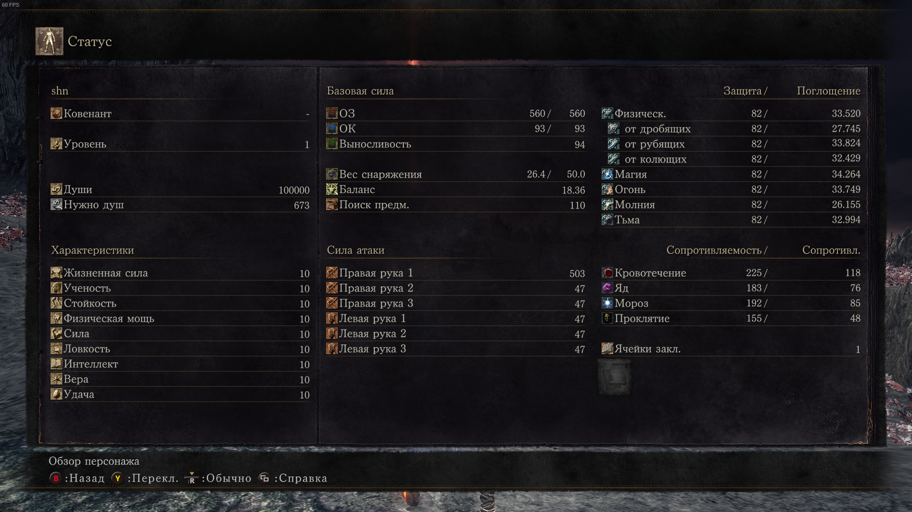

## Второй SL1 ран (ALL BOSSES)
В ране прокачивалось оружие, и использовались; кольца, броня и различные смазки. Не использовались саммоны. Прохождение было в автономном режиме. В первой половине игры использовался палаш, во второй - топор драконоборца. [Мидир откисает во второй раз на SL1](https://youtu.be/C-q9riCDTMI?si=a0lGdgefR_hL5nd4)

Тир лист боссов после SL1 рана

# **ниох2 (2 прохождения: 1. Катана гейминг, мэйн миссии, без длц; 2. SL1. Мэйн миссии основная сюжетка + мэйн миссии во всех 3 длц)**
Сразу скажу, что вторая часть стала в разы лучше первой, и что в нее точно стоит поиграть. Локи стали выглядеть в разы лучше. Разных мобов стало больше, и уже не так сильно раздражают повторы. Боевка стала разнообразнее, так как добавили особое парирование (контрудар на красные атаки) и способности демонов, что только пошло на пользу игре, потому что геймплей стал куда динамичнее. Боссы тоже теперь имеют 2 состояния: обычное и в мире тьмы. И сами по себе они стали гораздо лучше, чем были. Даже откровенно душных я в этот раз не обнаружил. Большинство боссов наказывают за бездумный блок, что тоже хорошо (есть специальные атаки, которые обнуляют стамину при блоке. Прокаченная на 99 стамина не даст соврать). Особенно порадовал последний босс, у которого было по 4 стадии. По своей концепции, он очень похож на душу пепла, только с куда более большим количеством хп и урона (в первой нио финальный босс был неведомый огромный треш). Хилки (и не только) теперь можно купить за кэшбэк с продажи всякого мусора (автопокупка даже есть), что избавляет от душного фарма. При входе на босс арену тебе сразу возвращают души и форму, не надо бегать и подбирать (ульту я принципиально всю игру игнорировал в обычном прохождении, и вполне без нее проходил). Это тоже прикольно. Диаблоидная система также осталась, но зато добавили новые оружия и они даже прикольные. Смена стоек стала полезнее, по ощущениям. За редактор персонажа тоже огромный лайк. Больше могилок с призывом союзников, да и сама игра как-то комфортнее стала для новичков. Кстати, не стоит повторять мою ошибку, и скипать все катсцены, потому что я не нашел на ютубе адекватного объяснения сюжета 2 части. Из минусов: структура уровней, которая редко меняется; незначительные (по сравнению с прошлой частью), но повторы мобов и лок; суперское повествование сюжета. Вторая часть отлично справилась с исправлением ошибок прошлой игры. Лучше начать со с неё, скипая первую. Если от прошлой части меня больше тошнило, то тут ситуация сложилась, наоборот. 

## SL1 основная сюжетка + все 3 длц (только мэйн миссии) (было очень больно)
Почти на всех боссов стабильно уходило по 2-4 часа, а иногда и больше. Есть парочка исключений, которых я случайно убил за 2-3 трая, но это скорее удача. К каждому боссу приходилось искать какой-то подход (свапать оружия, ёкаев). В основном использовал глефу и топор, но на последнем боссе третьего длц переключился на катану, так как мне показалось, что с ней мои шансы успешно задоджить его двойные атаки мечами гораздо выше, чем с любой другой пушкой (ну по итогу так и прошел). Никаких ограничений (кроме 1 лвл героя) в ране не было, но даже так это не особо облегчало задачу. Из магии использовал только талисман чистоты, что-то новое придумывать я не хотел. Специально выфармливать какие-то шмотки или оружия я не стал (даже могилки только в начале чистил, потом перестал), носил то, что дропали мобы и боссы. Поэтому дамага было не так много, как хотелось. Умение делать комбо с помощью оружия и способностей ёкаев приносит ощутимый импакт в боях. И только в этом ране я придрочился к тому, что надо постоянно переключать стойки, так как это тоже вносило лютый импакт, если ты умело ими пользуешься (спидраны с ютуба это показывают). Самый напряженный босс файт был с носителем кошмаров. Его атаки двумя мечами одновременно + взрывающийся пол, было невероятно сложно доджить. Все-таки, (на достаточном везении) удалось его пройти. Перепроходить для видео я уже передумал, но есть видос с [Отакэмару](https://youtu.be/gCqqZlioD5U?si=8YiCb4AQfGPNqFFf) (основная сюжетка)

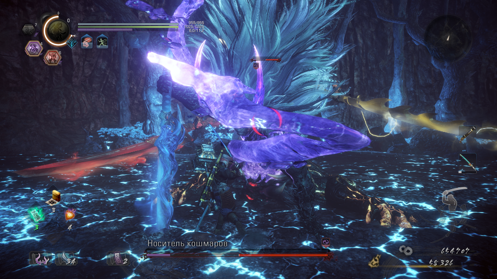

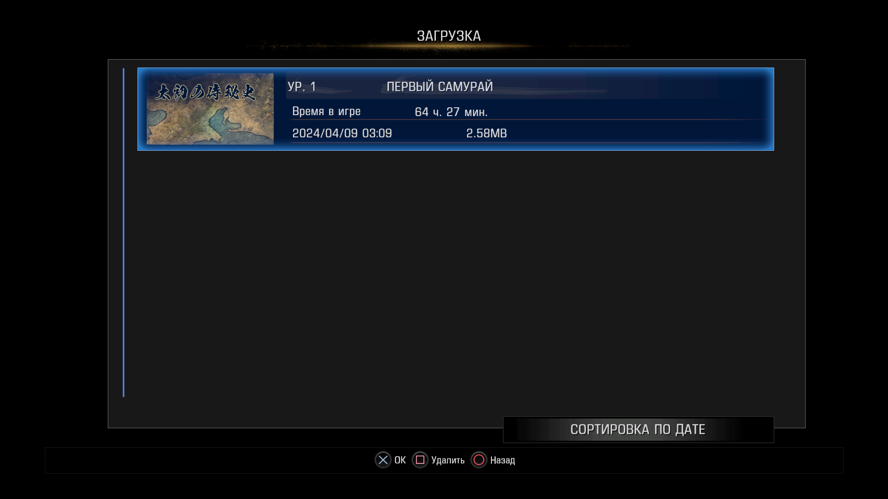

# **демоныдемоныдемоны**
Весьма смешанные впечатления от демонс соуса. С одной стороны, есть моменты, которые немного портят впечатление от игры. С другой, это был первый проект автора в таком жанре (который позже станет культовым с приходом темных душ), и он справился отлично. Большинство боссов сделаны с креативом, а некоторые заставляли поднапрячься. Но сложнее только сама дорога до них, ведь костер впритык тебе очень редко ставят. Это все компенсируется количеством травы (местный аналог хилок), которые ты спокойно можешь нафармить, и бегать с количеством 99 на КАЖДЫЙ вид (что я считаю огромным недостатком, потому что фарм - плохо, а заедать босса НЕМНОГО нечестно). Ну а можно и не фармить особо, потому что игра тебе дает впритык, чтобы ты мог пройти игру. Ремейк игры немного исправляет некоторые моменты оригинала, но он пока только для пс5. В целом норм, но игра явно для опытных смешариков

# **Ниох Лонг (мейн задания сюжеток + 3 длц)**
В целом, Wo Long: Fallen Dynasty хорош. Разрабы поправили косяки, которые были на релизе (оптимизацию и баланс всего в игре). Хоть и не полностью, но стало в разы лучше. Но есть несколько неоднозначных моментов, которые хотелось бы подметить (А в итоге получилась очередная паста):

- Проходил я без компаньонов и с огромными молотами и секирами, так как у них самые долгие атаки и % шанса парирования меньше всего + прокачивались все статы и равномерно. Магия (кроме взрыва стихии) почти не использовалась, потому что не очень полезная. И даже так, большинство боссов отлетали за пару траев. Сложности возникают до того момента, пока ты не освоился в игре и на последних длс боссах. И то, "сложность" - это когда у меня уходило больше 20 минут на босса. Так что тут разрабы немного налажали, так как в ниох мне больше нравился баланс сложности.
- Геймплей в Секиро работает лучше. В ву лонг'е у тебя за парирование отвечает отскок (он как бы выполняет задачу небольшого отскока в сторону и парирования одновременно), при этом, тратится концентрация. А перекат у тебя на двойное нажатие отскока. И тут есть несколько проблем: 1. Ты НЕ хочешь нажимать отскок, так как он не дает никакого профита (ты тратишь свою концентрацию, но не тратишь концентрацию противника). Ну разве что ты хочешь отбежать похилиться, но хилка НАСТОЛЬКО быстро кастуется, что в этом нет никакого смысла; 2. Ты пытаешься отпарировать миллион тычек, которые летят в твою сторону и случайно прокаешь перекат (= смерть или минус куча хп). Самый ржачный момент, что ты можешь одновременно зажать блок и парировать атаки противника (так как это две разные кнопки). Мало того, что ты сам по себе куда жирнее, чем в том же нио и секиро, так и еще блок не накладывает никакого штрафа для парирования (как мне кажется, парирование всегда должно нести определенный риск). Почему нельзя было оставить парирование с отскоком на кнопке блока (при этом оставив нормальный перекат) не понятно. Еще в игре есть прыжок, которым даже можно круговые атаки доджить. Но какой от этого смысл, если в игре ЛЮБАЯ атака парируется (даже огромные взрывы). Это буквально можно назвать "идеальным отскоком" и так будет даже точнее. В свое время секиро очень сильно хейтили за то, что в игре кроме парирования ничего больше делать не надо (тем временем существовали круговые атаки, выпады, протезы, боссы с огромной концентрацией, ну и агрессию еще можно было навязывать). В ву лонг'е буквально этим всю игру и занимаешься. Ну зато эффектно выглядит.
- Ужасные флаги, которые разрабы прячут на каждой локакции в самых изощренных местах. А от их количества зависит наносимый урон по боссу, который привязан к локе, и получемый тобой дамаг. Ну хоть количество хилок сделали фиксированным.
- Оптимизация далеко не идеальная, но зато теперь можно с комфортом (в большинстве случаев) поиграть. Буквально 2 вылета за всю игру, и то почему-то именно на кат-сценах (как в ниох 1 было ХД). Графон, в целом, пойдет (с пивом), но не такими жертвами.
- Эффекты и анимации прям слишком красочные, часто мешают на самих атаках сконцентрироваться, но для меня не критично.
- Лор не особо понял, сюжет прям смешной. Особенно, ржачно смотрится ГГ, который КАЖДУЮ СЦЕНУ МОЛЧКОМ СТОИТ И ЧТО-ТО ДЕЛАЕТ. Тут прям напрашивается мем: "ВООБЩЕ НИЧЕ НИКОГДА НЕ СКАЗАЛ ВАШ ГЕРОЙ, ВООБЩЕ НИКОГДА ОН И НИЧЕГО НИКОГДА НЕ СКАЗАЛ, И ЩАС МОЛЧИТ..." (c).
- Саундтреки как всегда достаточно хороши, на некоторых боссах даже шикарные.
- Разнообразие оружия с их уникальными абилками вполне хватает.
- Редактор перса тоже отличный
  
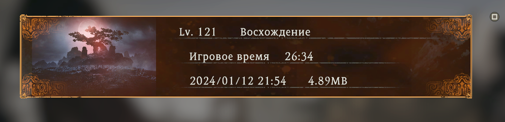

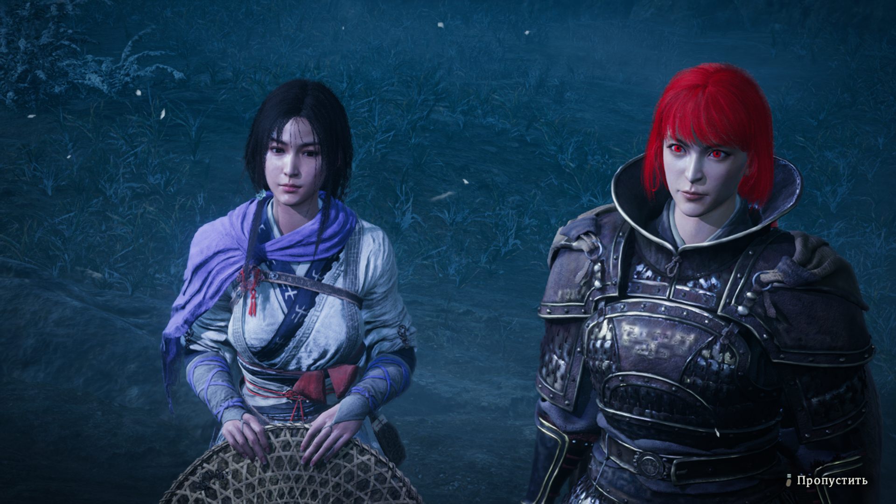

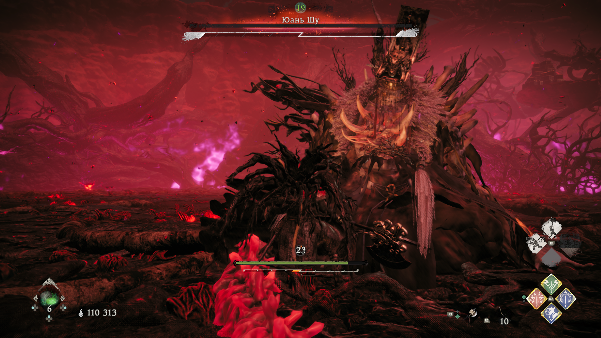

# **шелл мортал**
Каждый аспект этой игры ужасен. Хорошо хоть она длится 4 часа, иначе тут было бы краткое эссе на страниц 20 почему в ней все отвратительно работает

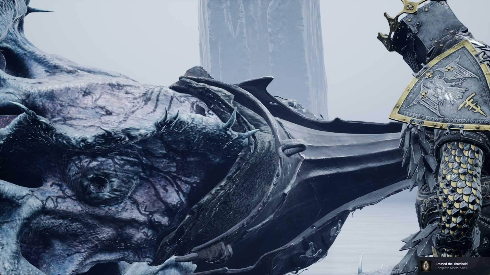

# **KH2 Final Mix (standard mode)**
Дважды я прошел финального босса в kh2, и столько же раз игра решила вылететь под начало титров и оставить без мультика. Порт от Square Enix просто великолепен, а ведь за него просят 5к рублей в эпике. Но вот сама игра на финальной локе резко начала меня нагибать до такой степени, что пришлось не иронично учить скиллсет боссов на СТАНДАРТНОЙ сложности (что происходило и в других частях). Что происходит на критикле с 1 лвл мне страшно представить. Игра реально начинает раскрываться на боссах из 13 организации и финальных, особенно где тебя оставляют одного. Саундтреки как всегда прикольные

# **KH1 FM (standard mode)**
Рума перед финальным боссом с миллионами волн врагов, и сам босс с 7 фазами оказались супер редкостной фигней с геймплейной точки зрения (пришлось даже пофармить лвл, и достать норм меч, чтобы пережить эту духоту), что лучше бы финальными боссами были опциональные сефирот и неизвестный. Радует, что в своих будущих частях, они исправили большинство ошибок оригинала. Зато ощутил в полной мере камеру со времен ps2. Ну хоть ни одного вылета за всю игру, и на этом спасибо. А то не очень хотелось бы ласт босса перетраивать

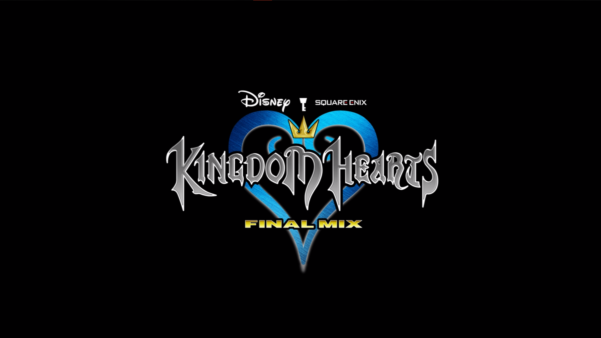

# **GOTY (нет) 2023**
Игра стала больше в плане контента, но его количество никак негативно не повлияло на качество. С большим интересом ходил по разным необязательным данжам и квестам (как и в прошлой части), хотя обычно в других играх, я просто пробегаю по мейн квесту. Почти все, что было в прошлой части, глобально переработали. И это только пошло на пользу игре. Да и вообще, TOTK по всем параметрам превосходит прошлую часть, и в этом плане разработчики очень сильно удивили (учитывая, какой шикарной была BOTW’а на выходе). Для меня все равно обе игры уникальны, и в каждую стоит поиграть

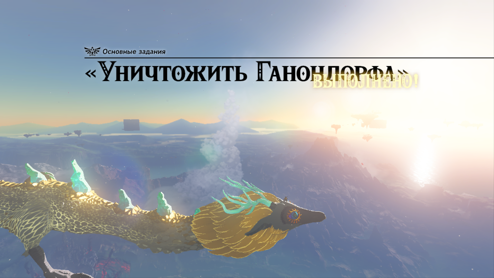

# **Slice of P(eak) (лучший соулс не от миядзаки) (3 прохождения до выхода длц: 1. До нерфов (сейв потерян); 2. После + лаксазия без нанесения атак; 3. SL10 (11.11.2023). DLC Overture: 1. Прохождение длц на втором сейве с прокаченным уровнем (21.06.2025) (все боссы); 2. SL10 (26.06.2025) (все боссы))**
Во всех прохождениях были забанены (даже на SL10): использование любых видов самонов; точильный камень на идеальное парирование;  любые виды кубов; покупаемые расходники (обычные хилки и заточка оружия использовались, они не входят в эту категорию)

## Первое прохождение на рандомной аккаунте (до нерфов)

## Второе прохождение на мейне (после нерфов)

[Лаксазия без нанесения атак](https://youtu.be/IODoQqlR7ig)

## Третье прохождение (SL10) (11.11.2023)
Прошел без использования покумаемых расходников. Сердце-П прокачивалось.
На мое удивление, ран со стартовым уровнем оказался достаточно простым (сложным, но не мега хардкорным). Да, на некоторых боссах приходилось сидеть по часу, но не сказать, что это много. Наносимый дамаг по боссам и мобам был всегда приемлемый (ну кроме мануса, просто босс всегда жирный был). Можно было навесить на себя кучу предметов с резистами и ходить с небольшим перевесом, что бьет только по регену стамины. Даже почти все красные атаки не шотали перса с фулл хп (исключение: финальный босс). А также, можно было взять АБСОЛЮТНО любое оружие, и спокойно его использовать (главное вес не набрать слишком большой). Это приятно, что в игре нет таких ограничений в виде нужных статов для использования гана, потому что в соусах и их клонах такая система раздражала даже на обычном прохождении. На sl 10 моим самым используемым оружием была вилка (Трезубец Завета), потому что атаки у нее были достаточно быстрыми, имели огромную ренжу и в нативке криты. Катану я юзнул на одном боссе, слишком долго и сложно ее реализовывать, хоть и на бумаге достаточно сломана. До вилки юзал гаечный ключ, который себя показывал отлично на медленных боссах, но дальности атаки ему дико не хватало. [Лаксазия](https://youtu.be/gYFSuyPU-RY?si=yK99QRrL9SK6guO8), [безымянная марионетка](https://youtu.be/RmCYSvrcrZo)

## Overture DLC. 
## Прохождение длц на втором сейве (сложность: “Легендарный гвардеец”; все боссы) (21.06.2025)

## SL10 на третьем сейве (сложность: “Легендарный гвардеец”; все боссы) (26.06.2025)
Как же меня уничтожал Арлекино, но просто на невероятном чуде и капельке скила получилось его победить. Остальные боссы тоже доставили некоторых проблем, но прям финальный на их фоне выделяется. Не очень уверен, что много челов это проходило на начальном уровне на НГ+0 без использования самонов, кубов и покупаемых расходников. На ютубе есть только 1 гений, который на арене + 5 сложности убил его на начальном уровне без получения дамага, но там амулеты и прокачка P органа из нг+2(3), с которыми урон разогнать в разы проще и стамина сама восстанавливается при дефлектах. Этого всего на обычном нг нет. Ты либо бегаешь без стамины, либо без урона (при этом ваншотаешься всегда). Амулеты в статы дают такую нищую прибавку, но без них тоже не вариант босса бить. Благо хоть гаечный ключ наносит хоть какой-то дамаг по хп и стойкости, а еще у него имбовое умение легенды, от которой финальный босс просто улетел на 1/5 хп в титры. Опыт от такого прохождения невероятно душный, но зато какое удовольствие было победить Арлекино при таких условиях

# **Броне Ядро 6 (все 3 концовки открыты) (NG++)**
Геймплей - топ. Роботы - супер. Эйра классная
А так, armored core - прикольная игруха. Я даже не думал, что мне так сильно игра про мех понравится. Скорее всего, это из-за того, что все игры про роботов супер медленные и скучные, а тут очень активный геймплей. Хоть и в начале было трудновато играть, но стоило зарашить один имба билд, как нг+ и нг+2 пронеслись на таком легке, что на миссиях я никогда не умирал, даже на финальном боссе. Поэтому тут на процентов 90 решает твой робот. Если не закреплять боссов, то каждая новая игра проходится за часов 9, поэтому тут уместно пройти ее еще 3 раза, так как и миссии новые открываются, и огромный кусок сюжета

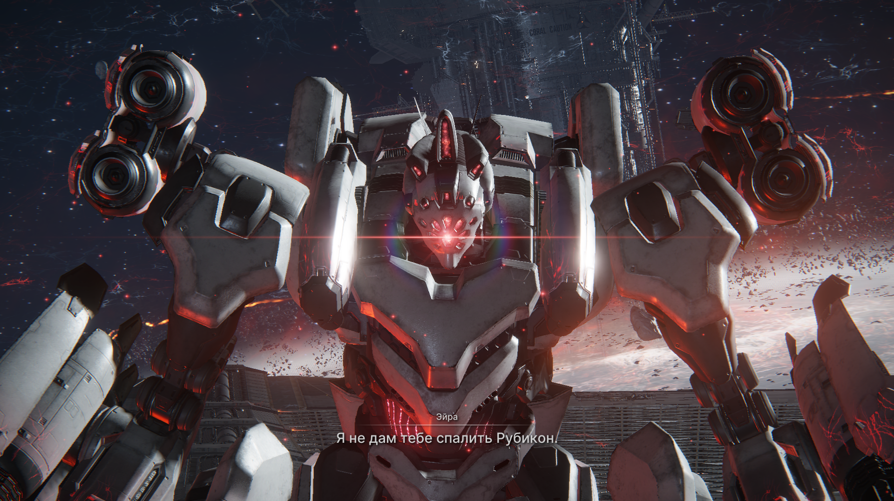

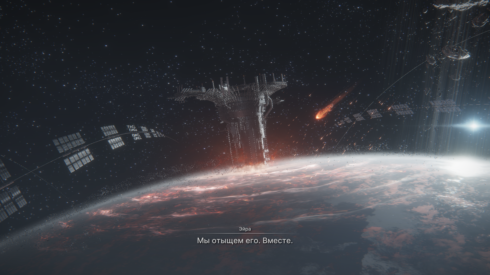

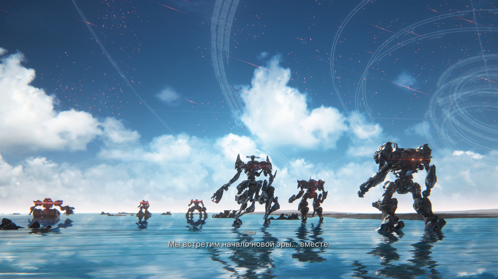

# **Бласфемус2**
В целом, все боссы были норм, а некоторые даже прикольные, за парочкой исключений. Например, босс саммонер, наличие которого обычно свидетельствует о бездарности того, кто его делал. Немного кривая была бенедикта, но в целом норм. Даже двойной босс был достойный. Но все остальные элементы игры либо остались на месте (хотя их стоило бы переделать), либо стали хуже.

Стало плохо:
- Шрифт (подвергся некому "осовремениванию", что стало хуже восприниматься).
- Новая рисовка кат-сцен (тоже самое, что и про шрифт. Ну они реально были лучше).
- Дизайн боссов (мне они до сих пор кажутся менее детализированными + в прошлой части боссы, да и вообще все остальные мобы были более "мерзкими" в хорошем смысле. Игра немного потеряла в уникальности, да и ее как будто специально цензурили).
- М А Г И Я (Хотя бы разрабы ее немного понерфили, потому что какой-нибудь стазис уничтожал всех боссов просто без шансов. Не уверен, что происходит после патча, потому что не пользовался. Да и без нее всегда интереснее играется). Было бы лучше, если бы они сделали это как отдельный класс имхо.

Осталось прежним, но я бы поменял:
- Система пассивных усилений (алтарь милостей). Я считаю, что делать артефакт, который просто увеличивает дамаг на какой-то % (причем, что мне должны говорить эти проценты?) - максимально бездарно. А большинство пассивных усилений так и работает.
- Разбросанные по всей карте (чаще всего в секретных местах) потки, улучшалки маны, хп и артефакты, которые ты легко мог не находить, а вынуждать игрока либо залезать в интернет, либо бегать 100500 раз по всем местам - идея крайне так себе. В этой части это ощущается в разы острее из-за того, что боссы стали дамажить в разы больше, да и мувсет стал куда сложнее. Ну хотя бы с хп и потками можно было сделать так, чтобы их улучшалки падали ПОСЛЕ убийства босса. В итоге, ты либо недокач, либо пропылесосил всю карту с открытой вкладкой ютуба/вики. Опять же, прошлой части можно было многое простить, потому что она была ПЕРВОЙ, неким экспериментом, чтобы собрать фидбек с игроков.
- Фазы у боссов, а точнее: отсутствие предупреждения о том, что у босса следующая фаза (чаще всего), а вместе с ней и другие атаки. По итогу, ты понимаешь это только, когда принял урон от измененной атаки у босса. Решение: выделить на это отдельную анимацию (лол).

Но есть и плюсы:
- 3 новых оружия, которые сильно отличаются, и которые задействованы в головоломках.
- Усложненный мувсет у боссов.
- Платформинг стал лучше.
Я даже не буду причислять к минусам супер "классную" подачу сюжета, которую обязательно нужно "позаимствовать" с дарк соуса (причем актуально для всех таких "вдохновленных"). В целом, игра неплоха. Хоть и для меня она стала хуже первой части

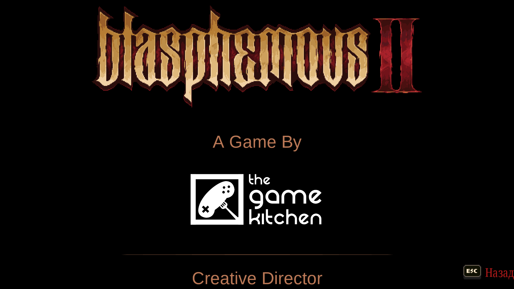

# **Местный Анор Лондо крутой (нет) (без длц) (2 прохождения: 1. С ботом в напарниках; 2. Без него (очень сильно душили парные боссы, поэтому не рекомендую так делать))**
На самом деле, игра максимально посредственная, но даже не смотря на все минусы, которые пойдут дальше, игра мне понравилась (и это удивительно, учитывая, что она куда хуже, чем я себе её представляю). Из того, что мне понравилось:редактор персонажа; адекватное повествование; иногда даже интересные боссы; визуально красивые и атмосферные локации. Из того, что ужасно: запутанность некоторых локаций (местный Анор Лондо передает привет); парный босс (ОСОБЕННО без напарника); вроде как в этой игре существуют билды, но солидная часть завязана на напарниках, но если ты захотел в соло побегать, то вариативность резко снижается; в целом, отсутствие каких-то уникальных геймплейных элементов (абилки ситуацию не особо исправляют)

# **Wheelchair gaming**
Некоторые локи просто запутанный лабиринт, от которого потом начинает голова болеть. Большинство из них однотипные, серые и скучные. Количество мобов на локах иногда зашкаливает, и часто они могут убить тебя за 2-3 тычки. Ничем, кроме firebug throttle я не бегал, потому что все остальное оружие супер долгое, и не подходит против рашащих врагов. Всех боссов, кроме как “норм” не описать, но есть одно исключение: чел, который через какое-то время отбегает от тебя и начинает лечиться в безопасной зоне, пока ты не убьешь появившегося огромного робота (самый первый босс в игре), которого чтобы уронить (чтобы его можно было дамажить), нужно выждать 1!!! определенную атаку босса, и с разгона дать ему по ногам (и в это время тот чел продолжает хилиться). И такой сценарий может хоть раз 100 повториться, пока вы не убьете босса. И да, сам босс тоже может разорвать лицо за 3 тыки. На прокачке и фарме сделан слишком большой акцент, потому что без нужного уровня тебе не открыть секретки и путь дальше, да и сносить тебя будут тогда за 1 удар. Какого-то разнообразия в плане прокачки и снаряжения тоже нет, а сама игра заканчивается тем, что чел тянется за коляской. Конец соответствует общему качеству игры. Прикольный сеттинг и музыка в хабе - единственные достоинства этой игры

# **Not wheelchair gaming**
Большинство элементов в игре стало лучше. Добавили прикольное парирование, которое в разы разнообразило игру. Стал лучше саунд в игре. Новая система аптечек мне больше понравилась (почти как в полом рыцаре сделали), хоть и немного облажались с балансом, потому что некоторых боссов из-за этого я мог спокойно пересустейнивать. Сами боссы стали в разы лучше и разнообразнее, чем в прошлой части. Добавили кат-сцены (и флешбеки). Сделали побочные миссии. Больше оружия, больше кастомизаций для дрона. Даже особо не терялся в локациях, потому что они стали чутка адекватнее и разнообразнее.
Из минусов: худший редактор персонажа за всю историю сосаликов (можно было сделать конкретного гг, как было в прошлой части, потому что из-за этого решения только хуже стало); хоть боссов и 11 штук, но они повторяются; лвл дизайн по-прежнему не очень хорош, но не так плох, как в первой части; иногда мобов пачками закидывают. 
До уровня отличных игр, лично для меня все равно не дотягивает, но было достаточно близко. Хотя бы не был огромный лабиринт под конец игры

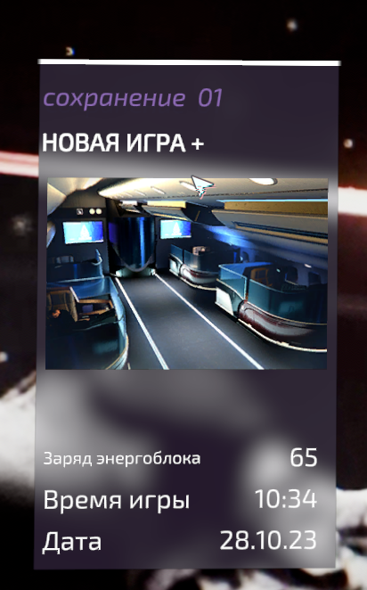

# **Гроб**
Ну, я надеюсь, что к 3 главе он все-таки закончит начатое (а не сломается в самый важный момент). Никакой симпатии к женскому ГГ не было и после первой главы, а тут все сомнения только подтвердились. Остальные развилки я не особо могу назвать каноном, так как действия не особо соответствуют характеру мужского ГГ, да и вряд ли кто-то выбрал бы остальные концовки на первом прохождении (только если им Эшли понравилась, но тут только клиника поможет). Не знаю, че челы так активизировались именно на моменте “инцеста” (там и других моментов вполне хватает), но именно эта тема затрагивается только в одной концовке (только если конкретно игрок к этому подводит) и то, в виде “пророчества”, которое легко можно задоджить, а по факту еще ничего не произошло. А так, я видел игрушки интереснее в таком жанре, поэтому игра в целом норм под пивом

# **Джедаи (сложность: "мастер-джедай")**
К боевой системе очень много претензий, но на мастере-джедае играется более-менее норм (ну пока мобами закидывать не начинают). Остальные элементы достаточно хорошо сделаны, поэтому игра в целом норм

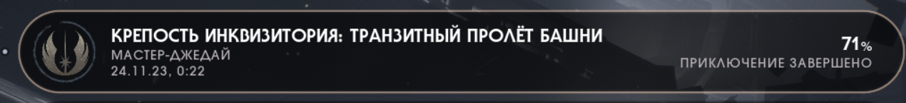
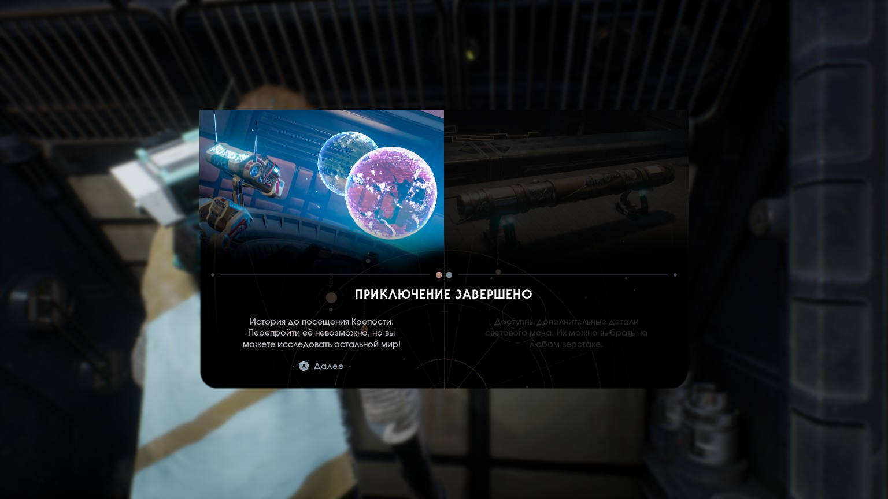

# **Пушистики (сложность: легенда)**
Игра является безумным аттракционом веселья. Не было ни одного эпизода, который был бы максимально скучным и нудным. Графон (вместе с эффектами) шикарный, глаза радовались до конца игры. Порт и оптимизация этого всего сделана достаточно хорошо (1 вылет за всю игру и парочка минорных багов, которые фиксятся рестартом контрольной точки). Доступного разнообразного арсенала вполне хватает на всю игру. Сцены тоже поставлены отлично. Отдельно стоит отметить взаимодействие игры с геймпадом. Миллион видов вибрации на любое действие, адаптивные триггеры, которые имитируют каждое оружие. Единственная игра, которая раскрыла геймпад на все 100 процентов. Геймплей прикольный, но максимальная сложность для меня была достаточно простой (даже на геймпаде без включенной помощи в прицеливании), хотелось бы немного хардкорнее. Мини-боссы и обычные враги достаточно интересные (даже не смотря на то, что они часто повторяются). Саундтрек в игре шикарный. Одна из немногих игр, где я выкручивал музыку поверх остальных звуков, чтобы послушать.
Сюжетка просто норм. Для человека, который впервые знакомится с серией, самое то (только жалко, что предыдущую часть не портанули на ПК)

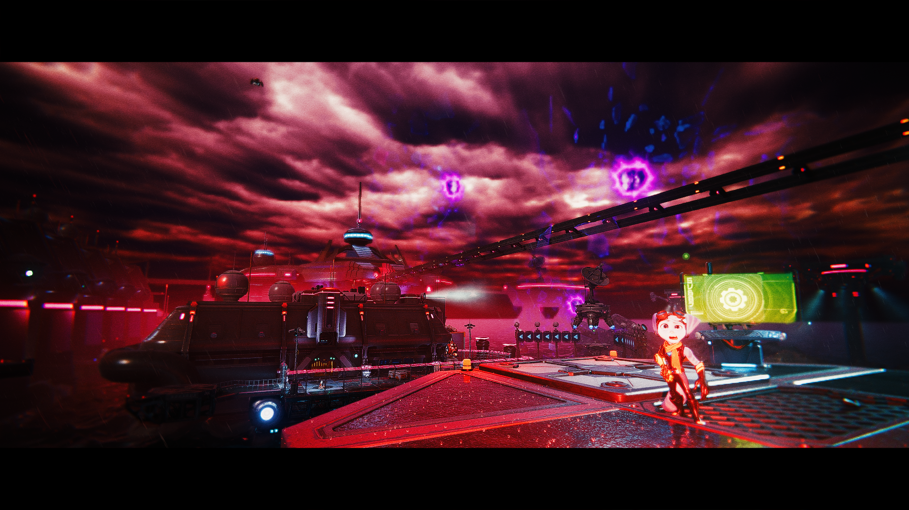

# **Резик4ремаке (сложность: хардкор)**

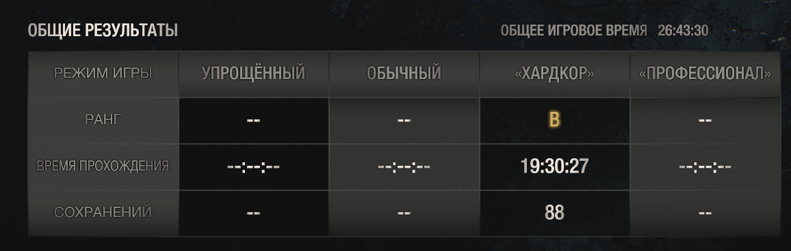
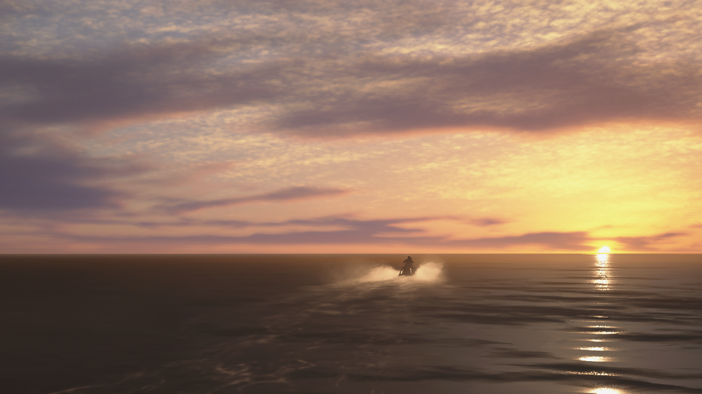

# **Морские свинки (сложность: тяжелая)**
Игра половину кат-сцен потеряла хд. Тяжелая сложность была уж совсем какой-то простой (g-force). В детстве игра казалась веселее

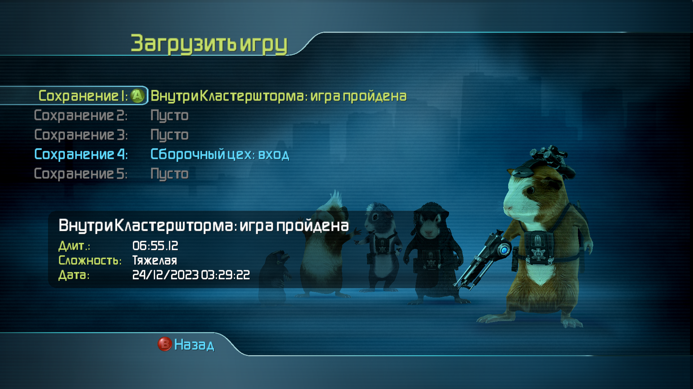

# **Орки умирают 3 (сложность: нормал; кооп)**

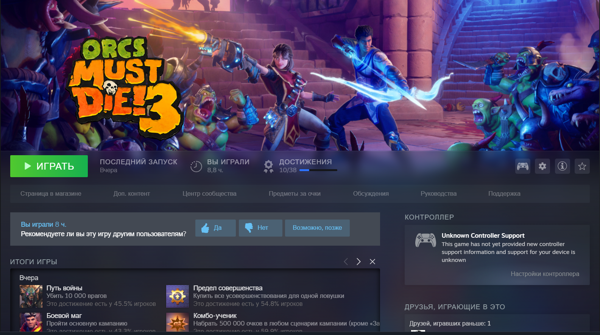

# **темные души 1 (3 прохождения: 1. через ловкость с катанами (без длц); 2. SL1 (ALL BOSSES WITHOUT PYROMANCY); 3. колдовство (без длц))**
В ране я не юзал пиромантию, хотя она активно качалась, просто потому что некуда было сливать души + я думал, что она мне может пригодиться. Духоты в таком ране очень много, а сложности возникают только на длц боссах и финальном. КАЛЛамит просто треш, на котором перекаты впритык срабатывают через раз, а он стагерит и шотает за 2 рандомные тычки. Пришлось перебороть себя, чтобы его одолеть (особенно, когда у него оставался 1 хп и я умер). А так, ран становится интересным только под [конец](https://www.youtube.com/watch?v=X9V-vK7T2dU)

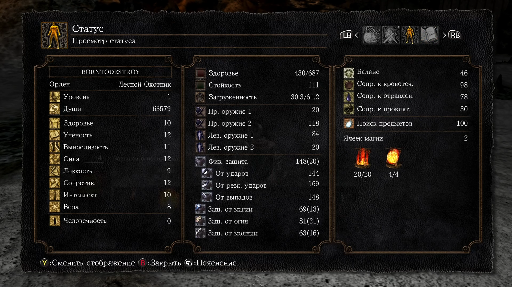

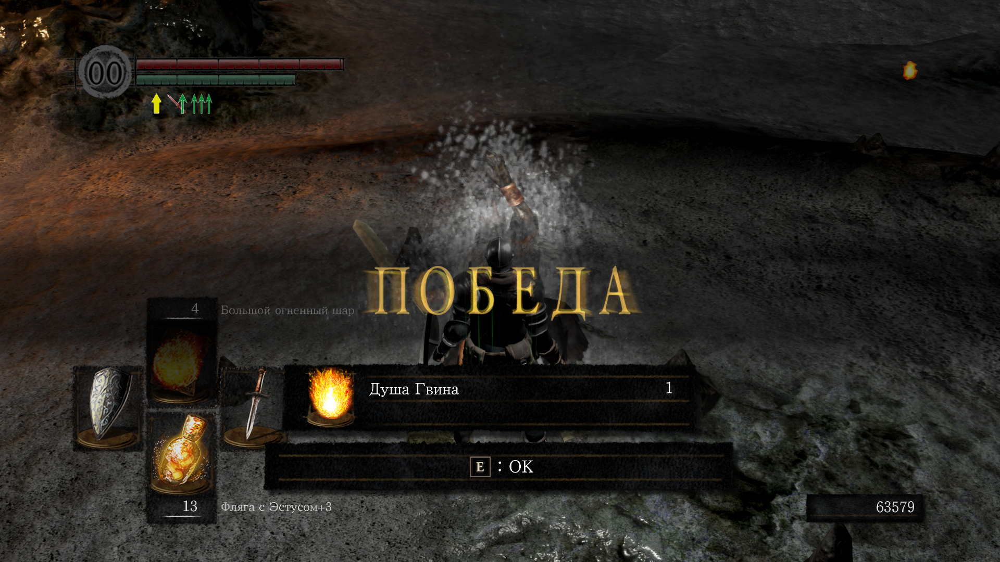

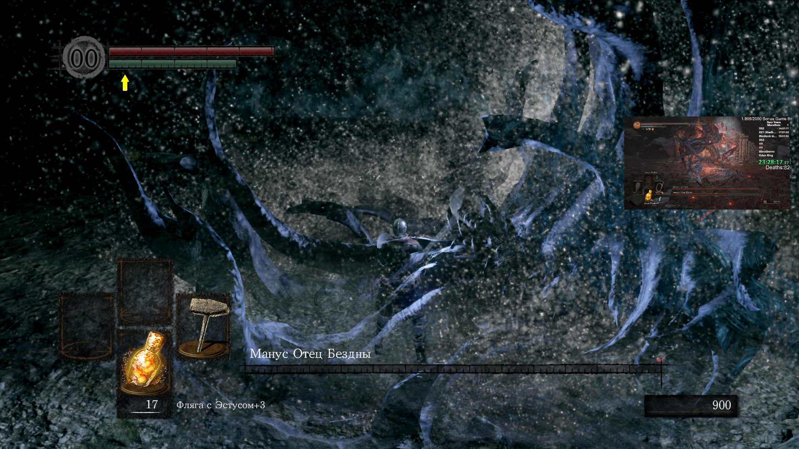
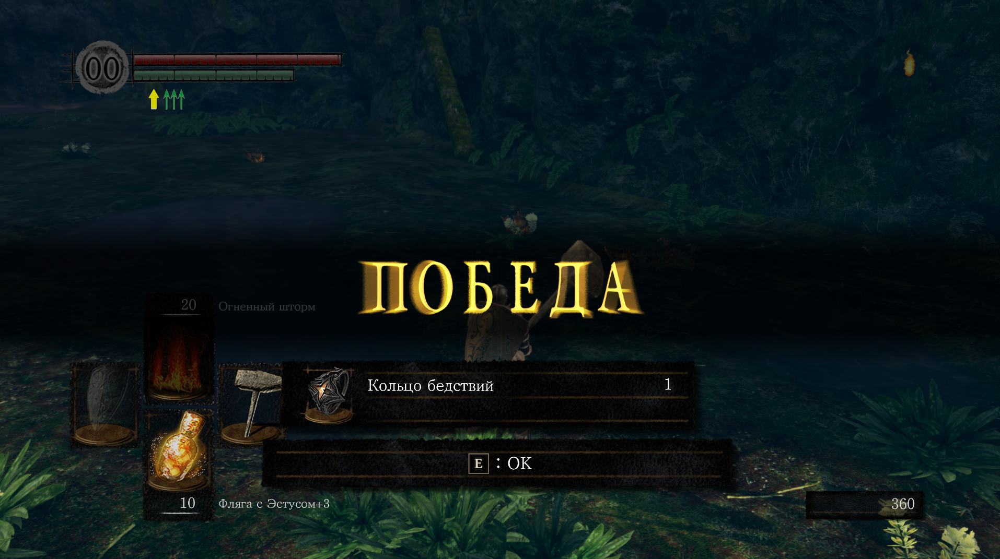

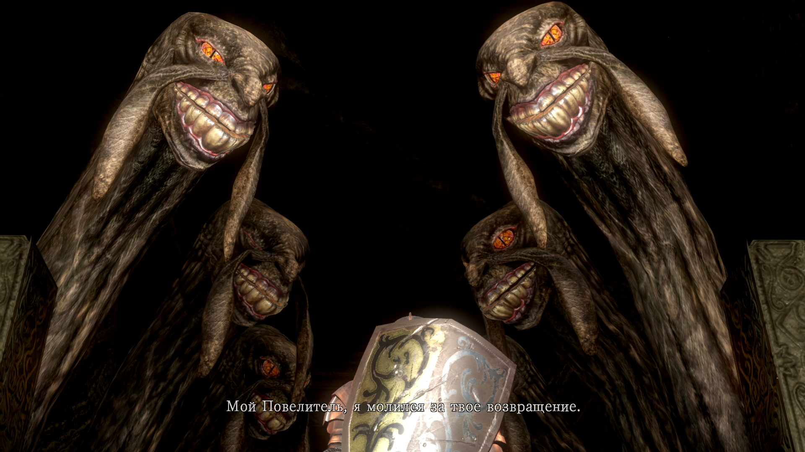

## Немного слов про прохождение за мага.
Треш. Перс любит промахиваться заклинаниями чуть ли не впритык. Вся игра становится мега унылой до встречи с гвином и длц боссами. Длц же я не стал проходить, потому что понял, что нужно бегать собирать кольца, которые я напропускал. Из-за чего я перестал дамажить по Арториасу (я на SL1 и то больше урона наносил дубинкой), а идти гриндить ради этого лвл’а я не собирался. Если честно, то нафиг такой геймплей. Это прикольно так бегать первые минут 30. Потом резко начинает надоедать, особенно, когда у тебя прокасты отличаются только названиями (я знаю, что там есть длц магия, но и она в целом не привносит какого-то ощутимого разнообразия). Короче хз, кому это может не иронично доставлять удовольствие, но я прям задушился с такого прохождения (1 из 10)

# **послесвечение**
Игра очень спорная. Лично мне зашел визуал. Как глоток свежего воздуха после скучных deep dark fantasy. Есть много оружий с различными комбинациями ударов (да, иногда очень дерьмовые инпуты для комбух, но все же). Очень много локаций, причем неплохих в целом. Просто максимальное погружение в геймплей. Но остальные моменты в этой игре, мягко говоря, огорчают...

- Почему-то, большинство метроидваний считают необязательным оставлять хоть какие-то метки или подсказки на мини-карте куда тебе стоит идти. В итоге, начинается агрессивное закрашивание карты в целях найти ключевой предмет/диалог (и не нарваться на высокую лвл локу, которая почему-то для тебя открыта), который позволит двигаться дальше. И в этой игре очень часто происходит такое, что исследовав 1/3 локации понимаешь, что у тебя нет какой-то способности, чтобы дальше пройти, и ты довольный открываешь мини-карту и начинаешь искать, что ты там еще не закрасил (а если надоест, отправляешься на ютуб).
- Боссы. Их достаточно много, но какого-то внятного объяснения что они забыли именно в этом месте (и лора) почти у всех нет (да и кат-сцены с ними часто отсутствуют). Большинство из них спокойно убиваются под пиво (даже если ты не особо сильно прокачиваешься), но и те, которые представляют хоть какую-то угрозу и имеют интересный мувсет, открыто украдены с полого рыцаря (Атус, голиаф пиро - гримм из ХК; Исиас, Вечная - Лучезарность из ХК).
- Открываемые способности. Большинство из них тоже взяты из полого рыцаря, да и принцип работы такой же. В этом нет ничего плохого, но проблема в том, что оригинальные вещи, которые придумали разрабы этой игры, работают хуже и на геймплей не оказывают никакого влияния.
- Саундтрек. Просто фоновая музыка, даже ничего особо не приметил. Просто существует. Зато звуки эффектов сделаны качественно.
- Ветка прокачки героя, местные амулеты из ХК, разные шмотки со статами, еда с разными бафами - на это все можно забить огромный болт и брать все на автопилоте (ну разве что со шлейфами можно поиграться, но полезных там не очень много). Глубина в подборе талантов и снаряжений отсутствует.
- Лор и сюжет. Лично я на такие моменты слабо обращаю внимание, но диалоги между персами как будто робот писал. Никаких эмоций эти персонажи не вызывают. Начал скипать все диалоги в середине. Да и лор тут весьма «своеобразный» (если верить одному челу с ютуба, у которого единственного есть нормальный критический разбор этой игры).
- Компаньон, который никак не задействован в геймплее.
- NG+ или скорее отдельная сюжетка на 10 глав за другого перса, у которого скиллсет унылый, и который нужен только для открытия истинной концовки. А так, в игре еще колизей есть (из ХК) XD

Если Модус геймс учтут все эти моменты и доработают боевую систему (ведь наличие различных комбо на оружиях была очень здравой задумкой) в своих будущих играх, то выйдет реально что-то очень интересное. А так, игра в целом “норм”. Я понимаю, почему она понравилась челам из стима, но если откровенно, то не самая удачная копирка полого рыцаря

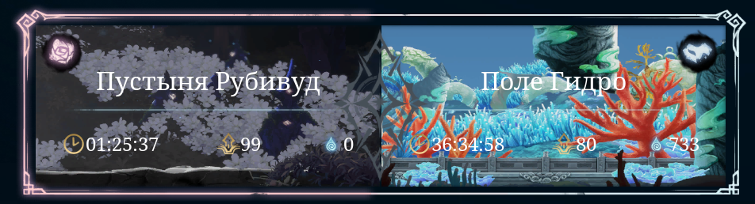

(Выбиты все 10 концовок)

[Лучезарность](https://youtu.be/TOVNkeHVFvI)

# **Бладборн на пк (BBPSX_1.05)**
Достаточно интересной вышла игра. Некий взгляд на то, что получилось, если бы бладборн вышел на PS1 (спойлер: с таким управлением, в это было бы достаточно мерзко играть, потому что у оригинального PS1 отсутствовали стики). Лок камеры спасает немного ситуацию. Идеальная игра, чтобы пробежать за 6 часов и насладиться пс1 экспириенсом (в плохом смысле), хотя визуал старых игр мне очень нравится. Автор(ка?) проделала [отличную работу](https://b0tster.itch.io/bbpsx) не просто скопировав всю игру, а переделывая кучу вещей, при этом сохранив основную идею. И да, я всю игру с начальным лвл’ом пробегал

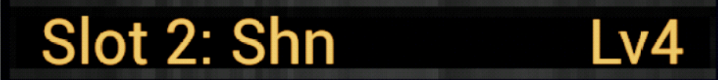
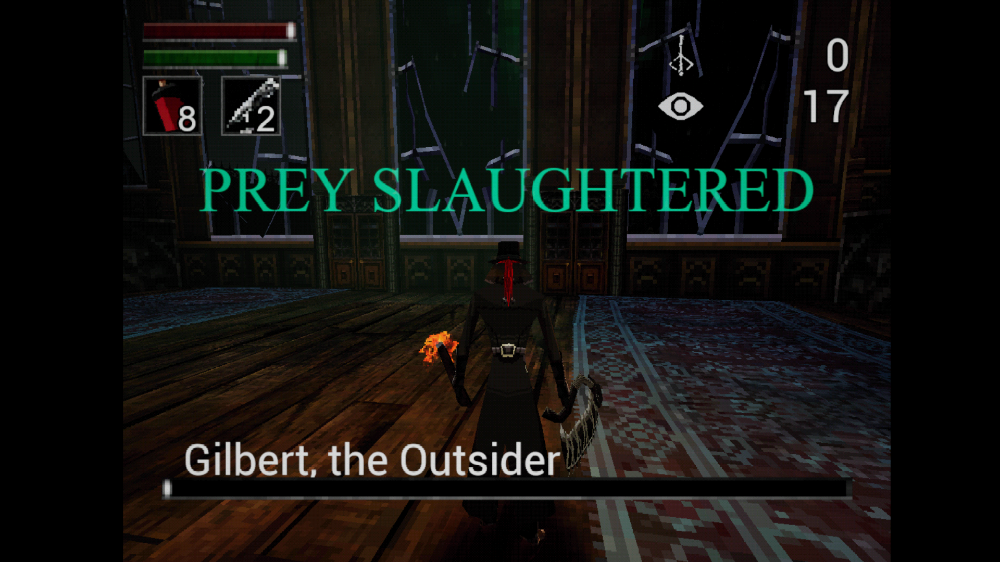
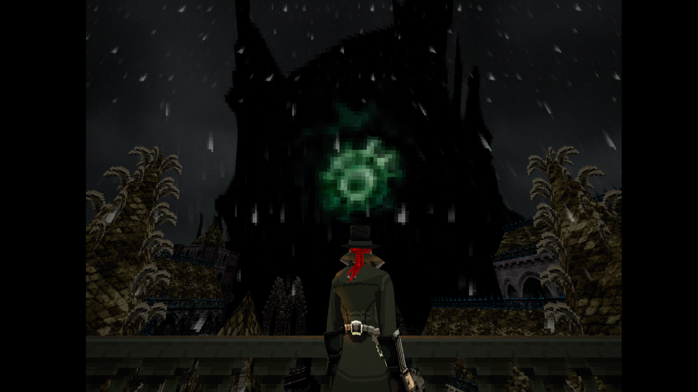
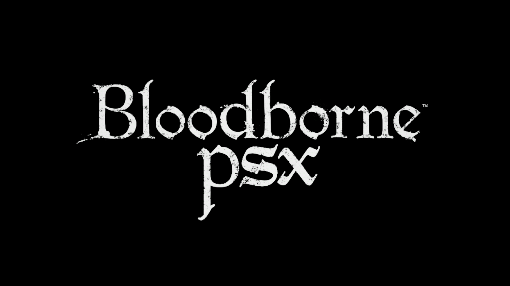

# **P5R (2 прохождения: 1. Нормал без третьего семестра; 2. Хард дифа с третьим семестром. Ограничения на харде: без использования бесплатных персон из коллекции, без использования в битвах идзанаги но оками, без использования бонусного контента (костюмы, расходники, деньги))**
## Первое прохождение (Normal; True Vanilla Ending)
Я проходил без спойлеров, поэтому забил на Маруки в середине прохождения. Только потом узнал, что он нужен для анлока 3 семестра, но уже было поздно. Поэтому мое прохождение закончилось на истинной концовке оригинальной персоны 5. Еще спасибо [челам](vk.com/persona5ru) за перевод. Не сказал бы, что без него было невозможно играть, но точно дольше

## Второе прохождение (Hard difficulty (сложнее merciless); True Royal Ending)
Даже без использования имбовых длц персон в игре все еще есть Люцифер, Йошитсуне и Метатрон. Но даже если не использовать их, то с оставшимися вариантами игру будет все равно легко пройти. Потому что тиммейты в лейте тоже способны наносить кучу урона, а также жестко бафать и дебафать. В этой игре не так много боссов, у которых много ходов, и которые способны шотнуть хоть кого-то. Только Маруки показал хоть какой-то дамаг в лейте и заставил немного подумать. В игре я умер максимум 4 раза, и то в ирли гейме. Ближе к лейту меня вообще ни один босс не смог убить. Еще и экспы с голдой щедро насыпают. Короче, мем “play a real smt game” обретает смысл (серьезно, даже в 4 персоне у меня на нормале было куда больше проблем). Если говорить про сам дополнительный контент в виде третьего семестра, то атлус проделали отличную работу (время вышло достаточно коротким, потому что я пропускал большинство диалогов, которые уже видел в прошлом прохождении)

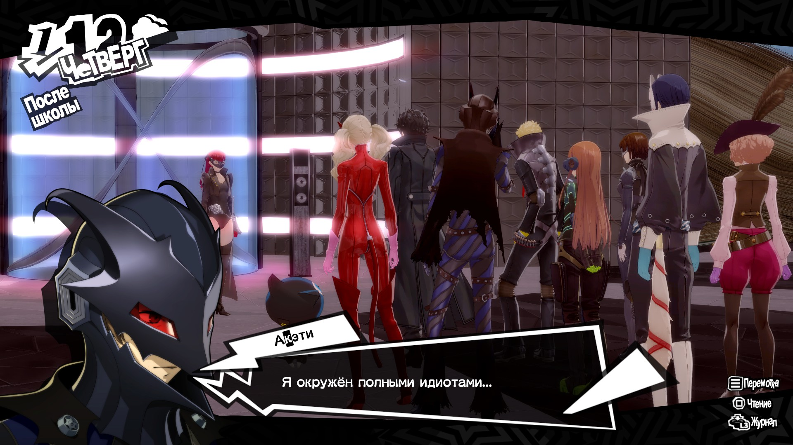
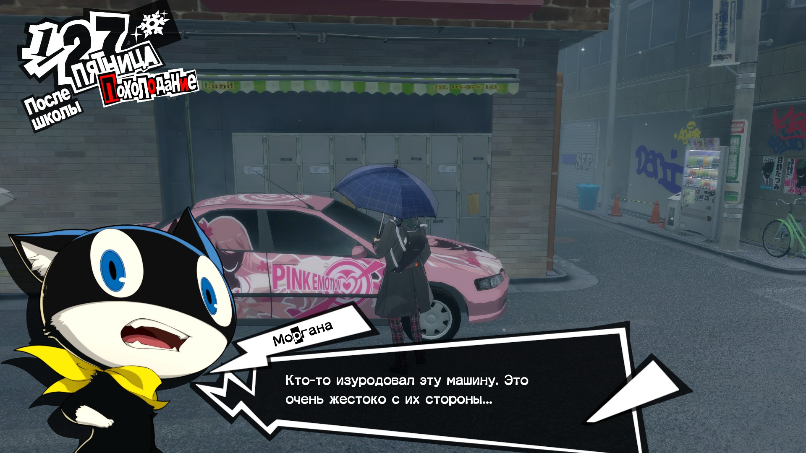
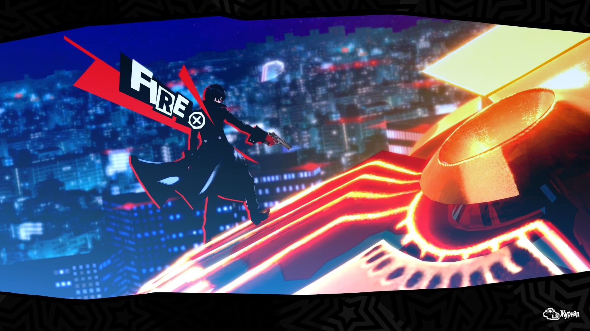

# **А говорят дмц 2 скучная игра (очень веселая) (сложность: normal)**

# **Первый дмц чутка лучше второго (сложность: normal)**

# **страйкерс (сложность: normal)**
+10 часов к общему времени, потому что я потерял сейв 2 тюрьмы, и пришлось начинать заново

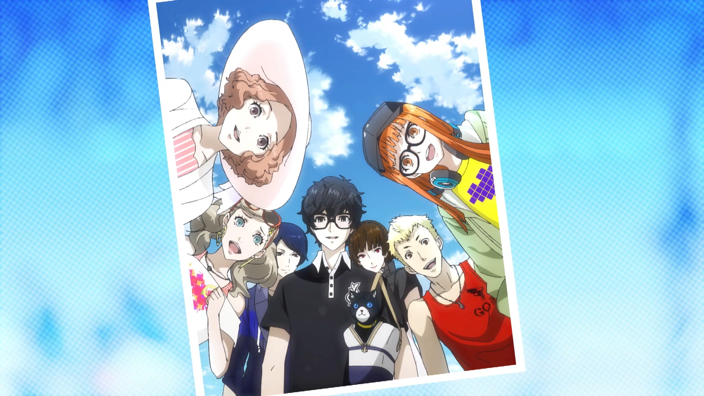
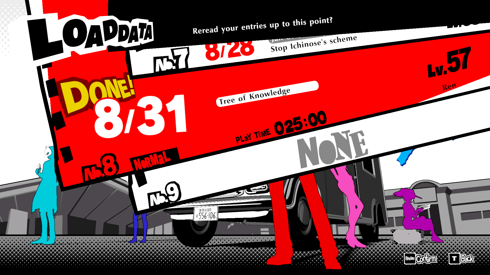

# **релоад (сложность: нормал; тру эндинг)**
Концовка до слез

# **one more friend rejected (maniax) (сложность: normal)**
Некоторые лабиринты просто мозговыносящие. Последняя лока максимально ужасно выглядела. У кого-то из разрабов был фетиш на красные квадраты с узорами. Очень сильно всю игру напрягали рандомные схватки. Как мне кажется, их количество можно было бы и приуменьшить. А так, игра очень атмосферная. Каждый файт требовал определенного подхода. Максимум геймплея, минимум диалогов. Если оценивать сам ремастер, то могло быть и лучше за такую цену, но в целом норм. Парочка модификаций (на анлок фпс’а и замену музыки на оригинальную не сжатую) все недостатки поправляют

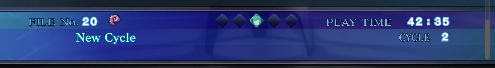
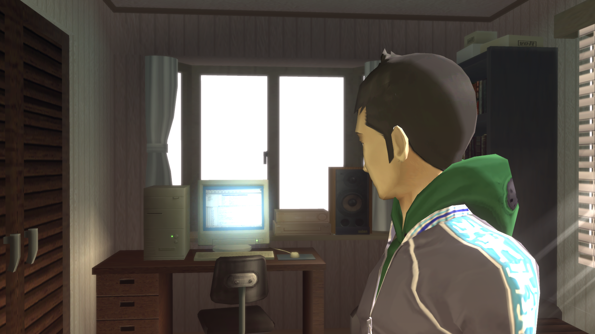
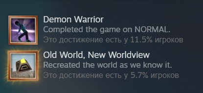

# **трули драгоняга оф ол тайм (начало (+3 длц) и пробуждение; главный герой - эльфийка маг; сложность: средняя)**

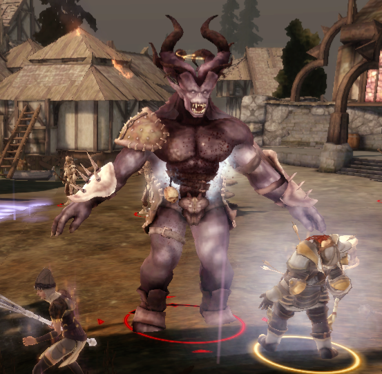

(Я часов 8 поиграл за другого перса, потом забил)

# **Формеры (сложность: hard)**

# **НеgrGигант (лучник; без дополнения iceborn)**
Мейби в дополнении (которое больше самой игры, и которое нужно отдельно покупать за такую же цену) приходится гриндить шмот, но конкретно я с луком застрял только на Нергиганте, потому что он очень сильно любил станить и шотать. А так, игра отличная. Есть парочка странных моментов (например, приходится минут 30 собирать следы босса перед тем как его найти), но они не критичны. А еще мне понравилось играть в соотношении 21:9

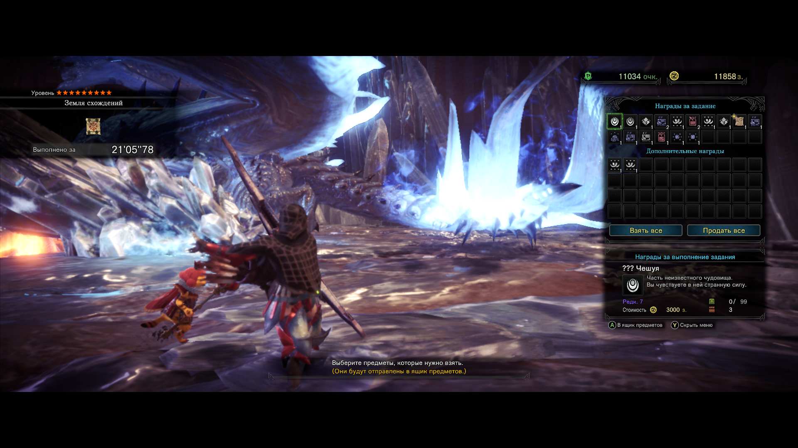
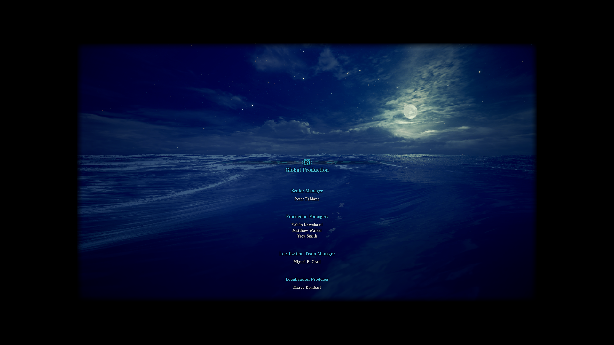
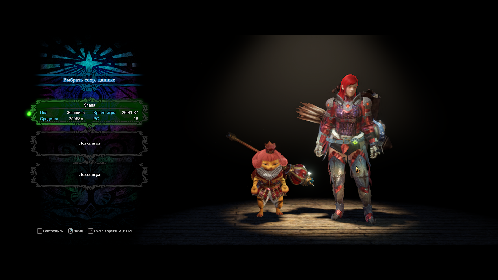

# **жесткий казуал 6 (сложность: нормал; хорошая концовка)**

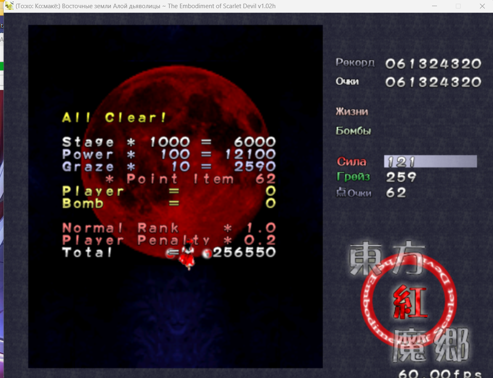

# **СЕНУА СЕНУА СЕНУА**
Лютая параша. Мало того, что она пробегается за 7-8 часов, из которых примерно 95% времени ты будешь ПРОСТО БРОДИТЬ И СЛУШАТЬ ШИЗУ ИЗ ГОЛОВЫ ГЛАВНОЙ ГЕРОИНИ, которая уже надоела на второй половине прохождения. Так и еще этот кусок кода у меня выдавал нестабильные 5-60 фпс (в одном напряженном файте у меня было литерали 6 кадров, из-за чего мне пришлось переключить сложность на изи). Да, я понимаю, что в рекомендуемых в 1080р стоят 6 гиговые видеокарты (но это без DLSS), но тогда почему когда я перезахожу, фпс резко вырастает в два раза???. Есть гораздо более красивые игры, которые не требуют такой заоблачной производительности. Хоть и боевка единственное, что меня развлекало в игре, но она тоже по факту не очень (даже хуже, чем во второсортных "соулслайках"). Эта игра даже на харде достаточно легкая. Сюжет отстой, персонажи тоже. Визуал большинство времени посредственный. Из плюсов только звуковой ряд. Ее даже пиратить не стоит, потому что это не игра, а очень унылый фильм. Мой личный победитель в номинации: "Худшая игра года"

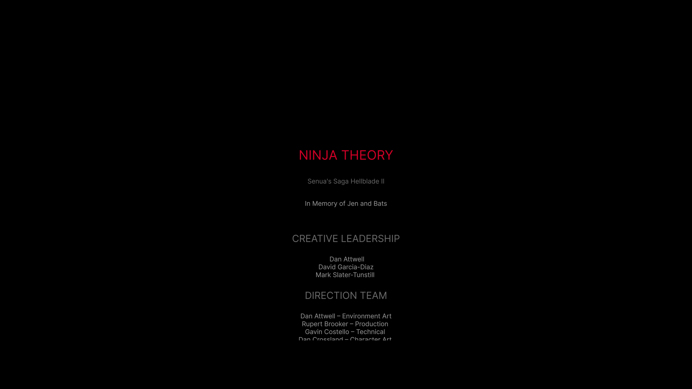

# **а хунте из а хунтер, ивэн ин э дрим (3 прохождения: 1. ALL BOSSES (без чаш), секретная концовка, билд с тонитрусом и пилой-топором; 2. BL4 (скипнуто: все длц боссы, Логариус, Герман и Присутствие луны); 3. ALL BOSSES (+ основные боссы из чаш для платины), секретная концовка, билд со священным клинком Людвига)**
## Первое прохождение

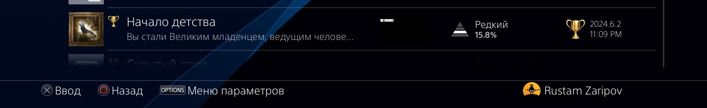

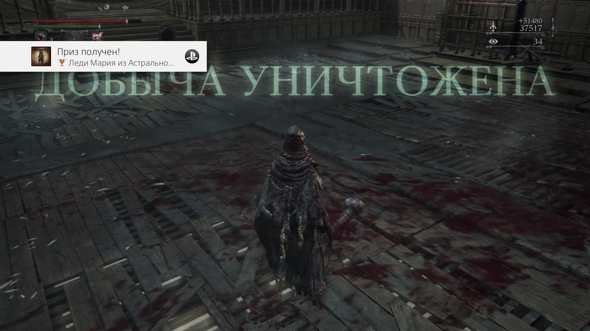
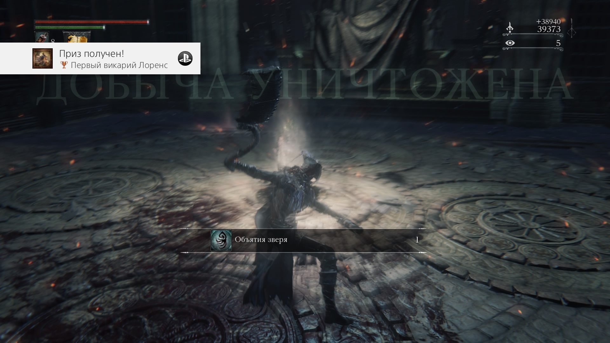


## BL4


## Третье прохождение (ALL BOSSES, основные чаши и остальные вещи для платины. Билд со священным клинком Людвига)
Советую перед чашами пройти весь основной контент и длц, а то потом можно случайно всех оставшихся боссов пробежать за 1 трай. Уж очень много нафармливается отголосков крови


# **хоноред2 (Проходил с магией и без нее, по стелсу)**

# **соль (2 полных прохождения со всеми боссами: 1. Через фулл ловкость с копьями; 2. Через клирика (раскачивалась преимущественно сила и мудрость, и немного других статов, но без магии и посохов), бегая с большим мечом)**

# **лорды 2023 (дроп, игра говна)**

# **итерхуитер (дроп, игра унылый куки кликер. Прошел только ⅓ от всей игры)**

# **пата3 (Тонденга диф)**

# **барда3 (2 прохождения)**

# **сифу (сложность: адепт)**
Сифу на нормале я закончил за 5 часов, учитывая закрепы на всех уровнях. Игра очень короткая, всего 5 уровней. Все бы ничего, если бы боевка была бы на уровне секиро, но увы, получилось хуже в разы. Там, где нормальная игра тебя за секунду предупредит, что сейчас будет атака снизу или особая атака, сифу кладет болт и заставляет наизусть заучивать тайминги каждого выпада босса. Окна для парирований и уклонений, соответственно, супер маленькие. А на большинстве уровней, шорткаты не ведут прямо к боссу. Игра-то сама по себе достаточно интересная, но столько неоднозначных моментов


# **секиро дома**


# **цусима основная компания + длц (сложность: "кошмар")**
Какую-то подробную статистику в виде процента пройденного всего контента игра не дает, но все мейн миссии, истории древних героев и истории ики я выполнил (ну и бОльшую часть второстепенных историй цусимы). Собирательством я не люблю заниматься, поэтому забил на это (тем более учитывая их количество). На кошмаре сильно помогают расходники, лук и правильное снаряжение, поэтому самое тяжелое - это пережить начало, а дальше становится куда проще. Ну и боссы мне показались достаточно простыми, даже последний длц’шный, но игра все равно отличная. Ассасин здорового человека


# **кретчет и планк**
Норм, но рифт апарт почти по всем параметрам лучше. Слишком отличным вышел сиквел (особенно с геймпадом dualsense). Версия 2016 года меркнет в сравнении с рифт апарт. Но чисто для ознакомления поиграть можно


# **фол3 (сложность: нормал; положительная карма; билд через холодное оружие)**
Все длц (кроме “Broken steel”, так как это длц СЛОМАЛОСЬ. Спустя сутки попыток его починить, ничего не получилось. Поэтому я отправился смотреть прохождение этого длц на ютубе), немного побочек. В конце закибербулил комп на Анклаве и пошел фидить в радиацию, чтобы всех спасти

# **селесте (мейн сюжетка + длц (без B и C уровней))**
До 7 главы суперчил, после - лютый хардкор. На стиках играть не рекомендуется, лучше сразу с крестовины начать


# **золото (сложность: Normal; True Golden Ending)**
За русские буквы спасибо [Работягам](https://vk.com/rabotyagi_rus). Выбрал транслитерацию Хэпбёрна, потому что хотел более фановый перевод. Крупных косяков в нем замечено не было, смело рекомендую. О самой игре. Саундтрек 10/10, как и стилистическое оформление в преимущественно желтом цвете (ну и большинство локаций отлично смотрятся). Супер много гриндить не приходилось, максимум перед митсуо и тру финальным боссом. Боссы интересные, социальные линки тоже. Почти все концовки выбил, кроме Адачи (я с ним вообще не общался). Из парочки негативных моментов (спойлеры): предугадать, кто убийца, практически невозможно, вплоть до конца игры (даже если внимательно следить за ним все время); какой смысл был убивать Нанако, если вы потом ее оживляете через 5 минут (драма теряется); Люцифер не такой сильный, как в смт 3 (хорошо, что я не стал ради него гриндить) (хд)


# **ФолычНовыйВегас (Ultimate Edition) (сложность: нормал; без хардкора) (2 прохождения: 1. Независимость с Йес-мэном через билд без оружия + все вышедшие длц; 2. Мистер Хаус через энергетические пушки, без длц. Потом откат на предыдущие сейвы, и концовка с НКР)**
Когда глянул на вики, то удивился, сколько всего я умудрился пропустить. И все это влияет на слайды в концовке, в большинстве случаев. Невероятно масштабная и очень вариативная игра. Даже несмотря на большое количество вылетов, каких-то багов, лучше этой части уже вряд ли сделают. Обсидиан отлично справилась за такие короткие сроки. И да, с каесаром я не стал выбивать концовку, потому что легион для отдельных индивидумов. Хотелось бы более масштабных изменений в геймплее, если сравнивать с тройкой, но за такие короткие сроки это просто невозможно было бы сделать.


# **персоналайк, только платформер (100% прохождение; True ending; без гонок по уровням)**

# **подвал гейминг (сложность 0)**
Ни цельного сюжета, ни нормального баланса сложности (начинаешь все шотать на 1/3 игры). Какой вообще смысл оставлять возможность для сейва в любом месте, когда эту задачу спокойно костры могли выполнять. Достаточно посредственный саунд, большая часть спрайтов мобов вообще как будто из интернета скопирована. Ну хоть картинки для кат-сцен вручную рисовали. Единственная “забавная” механика - коллекционирование тамагочи в подвале. На самом деле, кучу других игр на рпг мейкере существуют, которые с задачей напугать или "шокировать" игрока куда лучше справляются

# **мессиах (сложность: обычная)**


# **Царь обезьян (True ending)**
Игра не без недостатков (частые невидимые стены, отсутствие мини-карты и книги с квестами, для опытных игроков в таком жанре игра может даже показаться очень легкой вплоть до финальных боссов), но в целом, absolute cinema. Особенно понравились боссы: Эрлан, царь Якшей, четыре небесных царя, останки Великого Мудреца и каменная обезьяна. Прям откровенно ужасных не было. Достаточно достойная оптимизация (при таком-то шикарном графоне), крутая боевая система, саундтреки в целом норм. Отличная игра от китайских разрабов


# **Where is this legendary demon? (сложность: Prentice; nothing and chaos endings; mage build)**

# **балДурка3 (2 прохождения: 1. Сложность: баланс (все боссы убиты). Кооп из 4-х человек. Мейн: Гейл. В 3 акте ребилд из мага в барда. Около 90 часов; 2. Сложность: тактика (все боссы убиты). Кооп из 4-х человек. Мейн: кастомизированный персонаж с доменом жизни. Весь ран - уничтожение всех персов (в результате, на финальном боссе, пришлось спидранить до входа к мозгу). 60 часов)**
## Первое прохождение

## Второе прохождение

# **I do not comprehend (мейн перс: маг со льдом)**
Побочных боссов не проходил


# **I comprehend (сложность: hard, ALL BOSSES)**
Свой сейв с ддс 1 я потерял, поэтому чтобы разблокировать хардмод, я использовал сейв от chiikyuggi (02/11/2018; 31KB) (Digital Devil Saga New Game + All mantras unlocked). Скорее всего, сохранение потерялось из-за обновления эмулятора, но мне все равно стоило сделать бэкап на этот случай. Кольца за убитых секретных боссов в первой части я не использовал, так как я их не убивал. Остальные бонусы не так сильно влияют на прохождение (+10к баксов (лол), +5 к статам союзников (в лейте не решает вообще), бесполезная абилка Аргиллы в конце).
Что до самой игры, то она одна из лучших в серии smt. Баланс сложности отличный, шикарный саундтрек, неплохой сюжет, один из сложнейших опциональных боссов в серии smt - Сатана (мне достаточно сильно повезло одолеть его примерно за 15 попыток). Забавно, что в нее так мало людей поиграло. Игра годная. Также [табличка](https://docs.google.com/spreadsheets/d/1GJ-JCrp2X41xG_BZBmLiXAydGvJhlsmU_SWmgu6h4gc/edit?gid=462462708#gid=462462708) с Сатаной, которая мне сильно помогла

# **диснейДрагоняга (сложность: "Кошмар"; класс: маг (чародейский меч); 6 союзников выжили + гг; “хорошая” концовка)**
Ну хоть босс в конце был норм


Заплыв в “цикле”

# **райз (и санбрик). Всё прохождение - онли ГреатСворд. Основная сюжетка в райзе пройдена (+ Аматсу). Основная сюжетка в длц санбрейк пройдена (+ Древний Малзено)**
В основной игре прошел до моментов с победой над Нарвой “мать всего” и Аматсу. В санбрейке прошел до моментов с победой над Гайсмагормом и Древним Малзеном


# **Ad Victoriam (сложность: нормал; все длц пройдены; концовка за Братство Стали)**


Самый главный фанат коммунизма


# **спаси марину 2 (Кампания: нормальная сложность; все операции: средняя сложность)**


# **совершенная форма жизни**

# **дивинити 2 (Cложность: тактика; кооп из 4-х человек; мейн: Лоусе; класс: лучник)**

# **соникдх (Perfect Chaos Final Boss)**

# **соник закосплеил вергилия (сложность: хард) (в аркадном режиме выбиты все красные кольца и S’ки)**
Длц [имба](https://youtu.be/UQJu4ojTURk?si=Wi-G8ZC_O3Nva0qD)

# **мисиде (version 0.923)**
Вообще, если без лютых паст на 10 страниц, то мисиде в целом неплохая бродилка в своем жанре. В ней хороший визуал, даже какой-то саундтрек есть. Может для «профессиональных» актеров озвучки итоговый результат в игре покажется трешаниной, но как обычный игрок ты этого не особо замечаешь + скорее всего, так и было задумано из-за специфичного сеттинга. Не знаю, че докопались до мини игр, они неплохо разбавляют бродильный геймплей. Но игра очевидно недоделана, так как нормального эндинга не завезли, много чего не показали из-за продолжительности, контента в целом мало. Хотелось бы большей нелинейности (хоть что-то приближенное к детройту, хэви рейну). Но так как в таком сеттинге из конкурентов только доки (2д визуальная новелла лол, это как манхву читать, только с меньшим количеством картинок) и яндере симулятор (кусок мусорного кода), то и ожиданий не так много

# **нио фентези (Сложность: хард + 3 длц; True Ending; Соло прохождение без ботов в команде)**
Мейн игра достаточно хороша. Бегал почти со всеми оружиями, кроме магического посоха и револьвера (потому что ренжовые ганы). Топор все уничтожает без шансов, поэтому я его брал только на крайний случай. Сюжетка забавная, ост неплохой в игре. Боевая система - это нио + последние финалки. Получилось очень неплохо в этом плане. Боссы, в среднем, получились неплохими, но уж очень много позаимствовали из нио 2. Получилась интересная “сосаликовая фантазия”. Игра стоит того, чтобы ее пройти (хотя бы ради “забавных” кат-сцен с Джеком). Чего не скажешь о дополнениях…

## Паста про 3 дополнения игры ("Trials of the Dragon King", "Wanderer of the Rift" и "DIFFERENT FUTURE").
На них лучше сразу включать экстра мод, иногда выключая его на боссах. В первых двух “шикарных” дополнениях 85% контента - это тупо реюз (который тебя заставляют перепройти еще раз), и только 15% чего-то нового (3 дополнение намного лучше предыдущих двух, там повторение пройденного контента не так много + заканчивает историю. Это длц можно хотя бы неплохим считать на фоне остальных.). Я уже молчу про то, что уровень духоты в каждом дополнении максимальный (именно духоты, а не сложности, хотя этого там тоже навалили). Все эти 3 длц я проходил уже со включенной экстра сложностью и вам советую (лютый абуз игры через Overpower + Runic Protection, можно сказать легальный изи мод). Геймплейно - это просто худшие дополнения, в которые я вообще играл. Но и дропать их тоже было не вариант, так как они хорошо заканчивают историю этой игры (можно сказать тру эндинг). Поэтому, самое разумное решение (если вы все таки хотите пройти эти длц) - пробежать игру на экстра моде. Минимум духоты, минимум потраченного времени, максимум контента

# **реберф (сложность: динамическая)**
Открытый мир с его “очень” интересными активностями немного портят впечатление на фоне основного сюжета. Еще и много филлерных эпизодов, хоть что-то интересное начинает разворачиваться в конце. Пк порт не идеален (кучу статтеров в начале игры; баги с кат сценами, когда у тебя все застывает; какая-то старая версия длсс, без возможности поменять на фср или интел ксесс), но вполне играбелен


# **элизабет - худший босс за всю историю майнкрафта (Difficulty: PATH OF THE MASTER NINJA: PUNISHING; Ver.1.0.7.0) (Difficulty: PATH OF THE MENTOR: VERY HARD; Ver.1.0.5.0)**

# **ПИКОПАРК (4 чел)**

# **I’ve got a bigger dick (сложность: нефилим (Данте и Вергилий))**

# **бэктрекинг гейминг (сложность: охотник на демонов; неро/данте)**

# **жестер3 (main game: Platforming difficulty: normal; Combat difficulty: challenge Jester)(v1.2f) + DLC OUT OF BOUNDS (Combat difficulty: easy Jester)**
Эндлесс дайв (духота, на некоторых этажах максимально нечестная, даже на харде) немного подпортил впечатление от игры, но в общем, она шикарная

# **сплит (все сайд миры пройдены)**

Я не уверен, что стим посчитал все часы, которые были проведены в первый день

# **сигма2 (Difficulty: PATH OF THE MASTER NINJA: PUNISHING)**

# **визарды (1 прохождение)**

# **МИ?ГОНГАГА (difficulty: hard) (v1.03)**

# **лимитаи (True ending (All endings); All Bosses; All NPC Questlines)**
Я воспользовался небольшим сейв скамом, чтобы выбить все 3 концовки за одно прохождение. Если об игре, то парирование слишком сильное. Было бы неплохо его занерфить, так как оно ОП, по сравнению с другими способами избегать урон. Еще и практически всех мобов так можно убить без особых проблем (оно не такое имбалансное только на тех боссах, которые не падают после одного пэрри, но их штуки 3 на всю игру). Очень много натырили с элдена и бладборна (даже для квестов не сделали никакого журнала, что очень раздражает, потому что потом приходится залезать в интернет). У большого количества оружия идентичный мувсет, только специальная атака меняется, грустно. Но хотя бы много прикольных костюмов завезли. Были шикарные боссы, были просто норм, но прям отвратительных не было. Визуал и графика норм. В целом, неплохая игра, но ничего выдающегося

# **Witch May Cry (Сложность: нормал)**

# **нахобихо (Canon of Vengeance Chaos Ending; difficulty: Hard; Physical Build, Murakumo Gaming)**
Демифинд и Сатана скипнуты, очень долго бы пришлось собирать демонов под них. Практически все сайд квесты выполнены. Отличная игра, определенно лучшая в серии SMT

# **шифт происходит (мультиплеер)**

# **Heh… It’s apocalypse time (difficulty: War; all endings; mage build)**
Бой с финальным боссом выглядит пиздато, но именно сражаться против него на предпоследней сложности максимальный рак мозга. Немного неудачного рандома и можно отправляться заново его убивать минут 30 + успех очень сильно зависит от твоей пачки, буквально стак мечты надо собрать + еще и мана кост напрягает. Еще и экономика максимально убитая в игре. Денег очень мало дают, цены в магазинах просто космические. Пришлось на Яхву докачивать все длц на фарм, чтобы не задушиться об гринд. Походу реально под дополнения для фарма балансили экономику (достаточно новая практика для атлус давать все самое имбовое за лишние деньги). За исключением этих моментов, в остальном, достаточно неплохая игра. Гораздо бодрее оригинальной четвертой части

## Концовка с Дагдой

## Концовка с друзьями

## Концовка “хаос”

## Концовка “закон”

# **абобед (сложность: “Путь проклятых”; магический билд)**
Свап с ренж билда на магию в третьей локации

# **магики (2 игрока)**
Не повторяйте моей ошибки, не играйте в это на геймпаде. Ну и без фанатских патчей тоже (хотя и с ними тоже не все идеально)

# **финалочка16 (сложность: “Игровой процесс”; мейн сюжет + 2 длц; где-то процентов 80 побочек выполнено)**
Не хватает сложности в мейн сюжетке, кат сценами слишком много кормят. Сайд квесты (в большинстве случаев) унылые. В остальном, абсолют синема

# **магики 2 (4 игрока; сложность: нормал)**

# **33 (сложность: “Вызов”; все сложные опциональные боссы пройдены; карта вся изучена)**

мега чиз Симона хд

# **марвелc спидер мэн ремастеред (сложность: “потрясающий”; 100% прохождение основная сюжетка + 3 длц)**

# **venom**

# **Казан готов (2 прохождения: 1. Сложность: "Эксперт", билд через двуручный меч, true Ending (все остальные концовки тоже выбиты путем сейвскама), 100% прохождение, 04.07.2025; 2. Сложность: "Хардкор", билд через копье, true ending (все остальные концовки тоже выбиты сейвскамом), 100% прохождение, 13.07.2025)**

## Прохождение на эксперте
В целом шикарная игра. Еще бы челам побольше денег дали, чтобы не надо было повторять некоторых боссов иногда по 3 раза. Плюс локи разнообразить и оружий новых добавить, а то 3 маловато. Вообще бы тогда не было претензий к игрухе. Игра геймплейно похожа на допиленную не казуальную 16 финалку (или типикал игру от создателей нио). Слэшерный сосалик, в котором не иронично можно боссов держать в станлоке от длинных комбух, пока стамина или абилки не захончатся. Правда они часто любят преждевременно из стана выходить, но это чисто заскриптованный момент  
Все мейн и доп миссии выполнены, все горшки собраны, все камни душ собраны, все концовки выбиты (они пратически ничем не отличаются. Только на стандартной концовке у Озмы 2 фазы, а не 3. А, ну еще кат-сцены немного другие)

Khazan True Ending

Khazan Normal Ending

Khazan Chain Ending

## Прохождение на хардкоре
Хардкор оказался достаточно простым и сбалансированным в моем прохождении. Возможно все дело было в копье, которое на этой сложности мне показалось достаточно сильным по нескольким причинам. Во-первых, на хардкоре любой босс за 1-2 тычки выбивает блок + мобы часто стакают противные статусы, даже через парирование. Это вынуждает играть преимущественно через перекаты. Такой расклад идеален для копья благодаря сетовым бонусам и древу навыков, которые больше вознаграждают уклонение на грани, чем парирование. Во-вторых, ты очень быстро на нем выходишь из любой анимации атаки, чтобы успеть перекатиться. В-третьих, держать в контроле на копье гораздо проще, чем на том же двуручном мече. В-четвертых, дистанция вообще не является проблемой, если босс решит отойти. С копьем ты очень быстрый и далеко атакуешь. И при этом он отлично выбивает мобов из равновесия и дамажит неплохо. Но, скорее всего, с двуручем была бы +- такая же ситуация по сложности игры на хардкоре. Им стоило добавить новые атаки боссам, тогда бы это внесло больше разнообразия и сложности. А так в целом отличная сложность (даже с такой странной камерой когда лочишься на противнике)


Челы поленились сообщение обновить для новой сложности лол


# **марвелс милес моралес (сложность: "потрясающий"; 100% прохождение)**
Чутка лучше первого, потому что очень короткий. Из-за этого не успеваешь задушиться. И побочки для завершения на 100% не такие нудные были, даже вполне неплохие

# **Кусок японского кода (дроп)**
Уже давно пора было перестать делать игры на своем кастрированном движке, но у тим ниндзя свои планы на этот счет. Низкий фреймрейт, периодические вылеты игры по необъяснимой причине и все это при графике со времен PS3. Так мало того, геймплей стал в разы хуже, если сравнивать с предыдущими играми этого же издателя. Кому вообще пришла гениальная идея забиндить парирование на Y, где обычно находится силовая атака. Ну я еще могу понять подход в ву лонге, но конкретно это решение тяжело осмыслить. Сами оружия по ощущениям стали хуже ощущаться и играться, в сравнении с нио. Боевка не чувствуется из-за этого динамичной. Если по отдельности брать каждый элемент, то везде чувствуется какой-то даунгрейд. В итоге получился какой-то ужасный клон цусимы. Короче, тим ниндзя расстроили. Я надеюсь, что они сделают определенные выводы и перестанут выпускать настолько неоптимизированный продукт

# **WE'RE HERE TO KILL CHAOS**
Норм


# **PRESS F SIMULATOR**
Норм


# **Оскверненный Грааль (сложность: "режим выживания"; маг)**
Жалко, что в игре никак не обыграли момент с отсутствием одной руки. Много чего можно было сделать лучше, но получилось все равно неплохо


Таймер времени прохождения сбросился лол


Норм магия


Прикольный сет


Без комментариев


