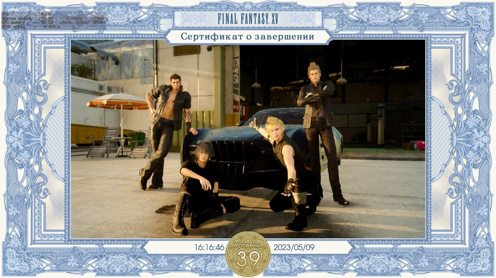
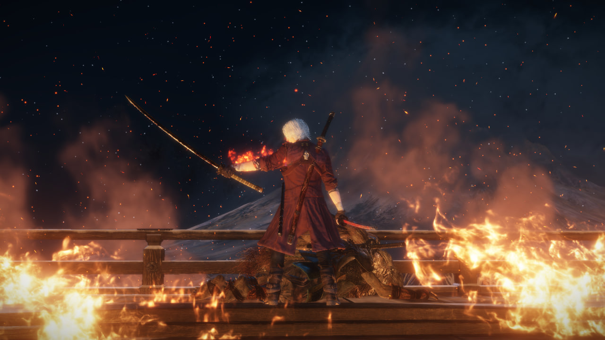
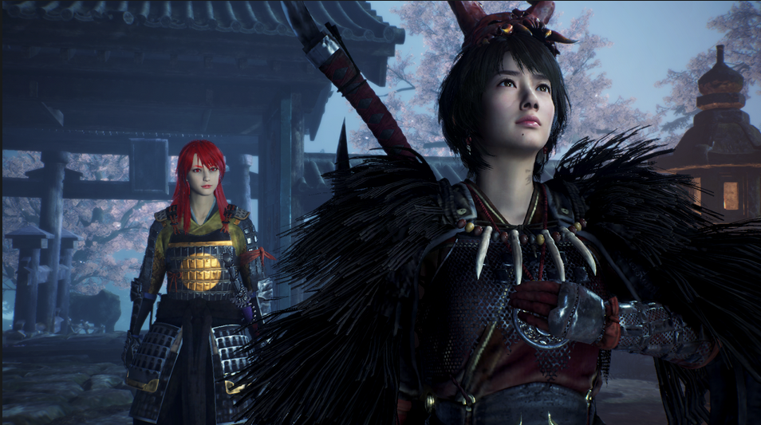
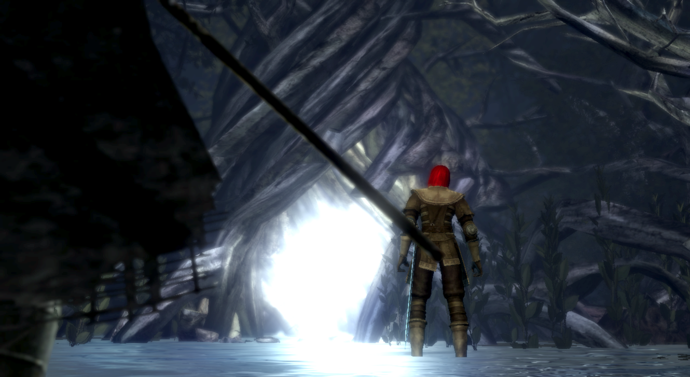
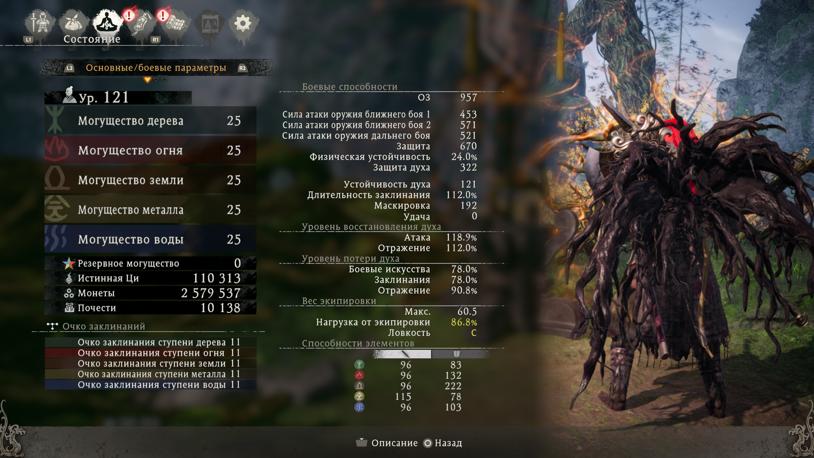
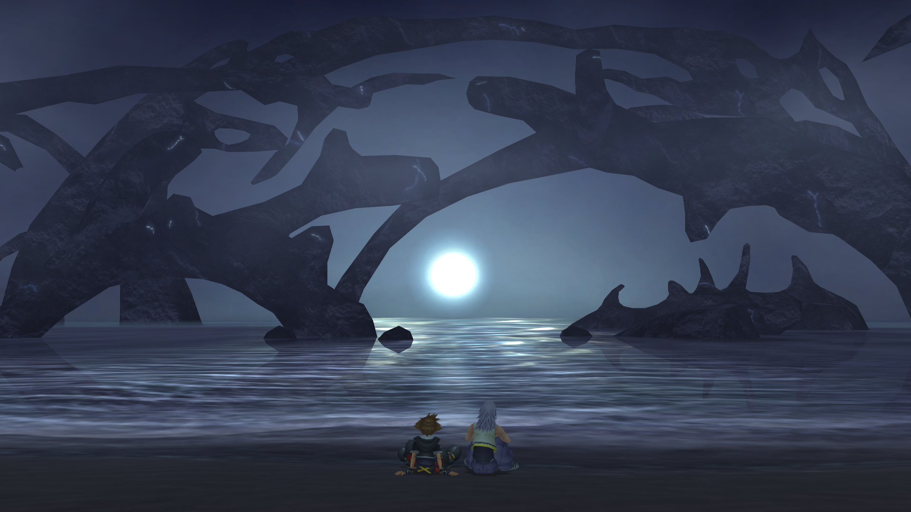
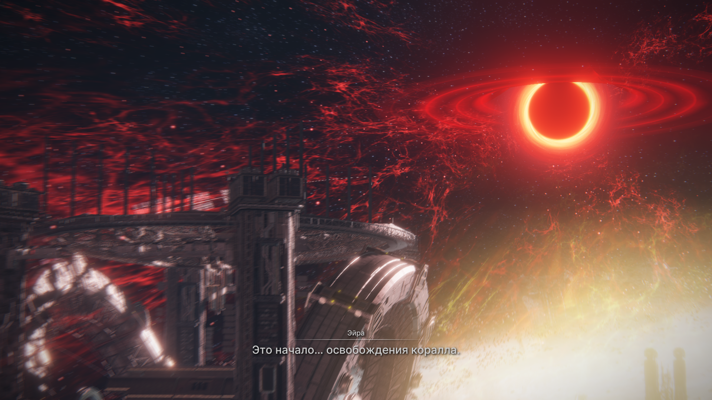
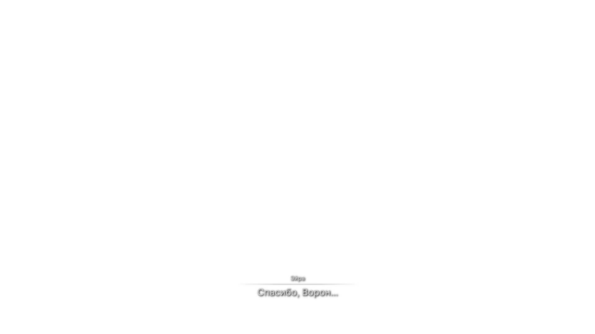
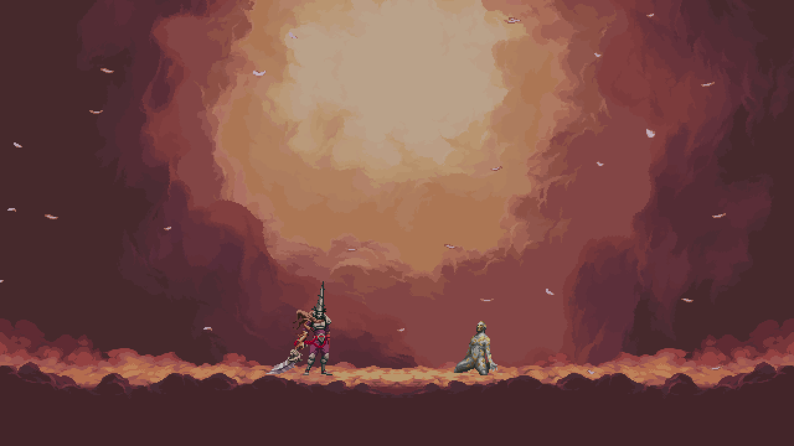
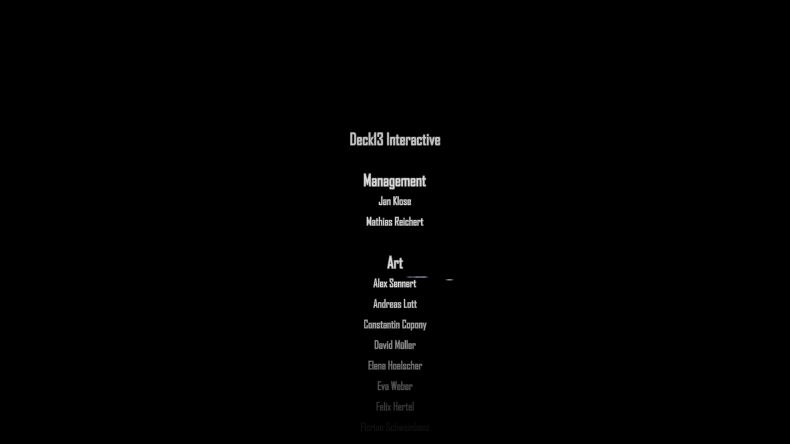

|Оценка|Игры|
|:-:|:-:|
|Маст плей (10)|Sekiro: Shadows Die Twice, Dishonored 2, Dishonored, Lies of P, Dark Souls 3, Kingdom Hearts 3, Shin Megami Tensei V: Vengeance, GTA:SA, TES IV: Oblivion, TES V: Skyrim, Clair Obscur: Expedition 33, Hollow Knight, Batman: Arkham Knight, Rogue Legacy 2, Salt and Sanctuary, Devil May Cry 3, Hi-Fi RUSH, Furi, Spider-Man: Shattered Dimensions, Spore, Persona 5 Royal, Armored Core VI, Resident Evil 4 Remake, Lego Batman 2: DC Super Heroes, Undertale, The Legend of Zelda: Breath of the Wild, The Legend of Zelda: Tears of the Kingdom, Baldur’s Gate III, Nioh 2, Simpsons hit and run, Final Fantasy VII Remake Intergrade, Split Fiction, It Takes Two, Devil May Cry 5, Ghost of Tsushima Director's Cut, Terraria, Fallout: New Vegas, Dragon Age: Origins, Black Myth: Wukong, Shin Megami Tensei: Digital Devil Saga 2, Monster Hunter Rise: Sunbreak, Spark the Electric Jester 3, Sonic Frontiers - The Final Horizon
|Почти маст плей (9-8.5)|Bloodborne, Persona 4 Golden, Ratchet & Clank: Rift Apart, Persona 3 Reload, Octopus: Dadliest Catch, Valiant Hearts: The Great War, South Park: The Stick of Truth, Ghostrunner, Fable, Borderlands 2, Lego Star Wars 3, The Outer Worlds, Celeste, Mirror's Edge, CS:GO (dead), The Escapists, Final Fantasy VII Rebirth, Kingdom Hearts birth by sleep, Kingdom Hearts 2 (HD 2.5 ReMIX), Dark Souls: Remastered, Metal Gear Rising: Revengeance, DOOM (2016), Monster Hunter: World, Orcs Must Die 2, GTA: Vice City, Shin Megami Tensei: Digital Devil Saga, Rogue Legacy, Thymesia, Saints Row 4, Transistor, Cyberpunk 2077, Singularity, Far Cry 3, Tarzan (video game), A Way Out, Persona 5 Strikers, Dying Light, Blasphemous, Neon White, DmC: Devil May Cry, Final Fantasy XVI
|Прикольные игры (8)|NINJA GAIDEN 2 Black, Warhammer 40,000: Space Marine 2, Shin Megami Tensei III Nocturne HD Remaster, Minecraft, Cuphead, Battlefield 4, Transformers: War for Cybertron, Orcs Must Die! 3, Infamous: Second Son, Super Hot, Shift Happens, GTA V, The 3rd Birthday, Bulletstorm, Bioshock Infinite, Borderlands 3, Watch Dogs, Wizard of Legend, Wo Long: Fallen Dynasty, Bayonetta 1, Avowed, Magicka, Ultimate Spider-Man
|Неплохие игры (7)|Brutal Legend, Blasphemous 2, Fallout 4: Game of the Year Edition, Stranger of Paradise: Final Fantasy Origin, Touhou 6 - The Embodiment of Scarlet Devil, The Surge 2, PAYDAY 2, Dead by Daylight, MiSide, Divinity: Original Sin 2, Sonic DX, PICO PARK, Dragon Age: The Veilguard, Final Fantasy 15, AI LIMIT, Shin Megami Tensei IV: Apocalypse, Ninja Gaiden Σ2, Devil May Cry 4: Special Edition, Code Vein, Magicka 2, Marvel's Spider-Man Remastered
|С пивком норм (6)|Fallout 3, Sonic Adventure 2 Battle, Demon's Souls (2009), Shin Megami Tensei IV, Ratchet & Clank (2016), Just Cause 2, Battlefield: Bad Company 2, Tales of Berseria, Shadow the hedgehog (game), Deadpool, Titanfall 2, Hogwarts Legacy, Assassin's Creed, Heavy Rain, The Lord of the Rings: War in the North, Lego Star Wars 2, Prototype 2, The Surge, Crisis Core -Final Fantasy VII- Reunion, Bloodborne PSX, TimeShift, Kingdom Hearts 1 (HD 1.5 ReMIX), Call of Duty 1, Saints Row: gat out of hell, Patapon 1, Patapon 2, Patapon 3, Mafia 2, Sonic Heroes, Saints Row: The Third, The Coffin of Andy and Leyley, Star Wars Jedi: Fallen Order, SIFU, KANNAGI USAGI, I am bread, G-Force, Dark Messiah of Might and Magic, TankiOnline, DMC 1
|Сомнительно(5)|Elden Ring, Afterimage, Trove (dead game xd), Dark Souls 2, Life is Strange, Homefront: The Revolution, Homefront, We Happy Few, League of Legends, Nioh, Freedom Fighters, Devil May Cry 2
|Мусор(4-1)|Black Souls 1, Genshin Impact, God Eater 3, Mortal shell, Lords of the fallen (2023), Tower of Fantasy, Senua's Saga: Hellblade II
|Дроп (без оценки)|Gothic II, TES 3, Othercide

Оценка игр преимущественно (на 90%) основывается на их геймплее

## Hi-Fi RUSH (Высокий уровень сложности и виртуоз)
Hi-Fi RUSH - топ. Особенно, когда открывается парирование. Если бы игра вышла в прошлом году, то спокойно бы выиграла номинацию лучшей игры года, по крайней мере для игроков. Из недостатков можно отметить только отсутствие лока камеры. Такую высокую концентрацию фана и адекватного челленджа мало какие игры генерировали. Все босс файты сделаны максимально оригинально. Ни один из них не похож ни на кого другого. Особенно последние 2 были просто шикарными. В первом случае потому, что на заднем фоне начала играть ремикснутая версия пятой симфонии, а во втором - сам босс. Очень редко со мной происходит такой момент, когда я хочу выбить максимальный ранг на миссии, но эта игра - один из таких случаев. Во второй половине игры я уже просто машинально начал попадать в ритм. Ну и самый главный плюс это компаньон котик, и возможность за него поиграть в конце игры.

## НИОК
- Она очень долгая, если учесть, что я проходил только мейн миссии. С этим можно было бы смириться, если только не было скучных и однообразных лок.
- Ключевой минус: минус босс котик (белый тигр, хотя че там от тигра мне до сих пор непонятно), земля пухом.
- Игра всячески одобряет и даже заставляет фармить себе лвл (что указывает рекомендованный уровень миссий), зельки (по дефолту у тебя их 3 дается, но можно разбить шмот ненужный, и у тебя будет 8 хилок. Или собрать ВСЕХ зеленых чудиков на карте), предметы, УЛЬТА, потому что средний игрок задушится траить боссов около идеально.
- Несколько боссов были прикольными (окацу, ода нобунага), большинство более-менее норм, но были прям ужасные и максимально наглые, на которых требуется нереальное задрачивание или максимальная удача.
- Большинство локаций - унылый коридорчик.
- На перекатах фреймов неуязвимости мало.
- Если говорить про прокачку статов, то она весьма специфична. Ты намертво привязан к одной пухе, если собираешься качать только один стат. Но если ты начнешь равномерно распределять очки, то такими темпами можно не скоро закончить игру (ну магия оп, так что все может быть не так плохо).
- Про стойки я даже хз че сказать, потому что я ими банально не пользовался, так как мне они показались максимально ситуативными. Средняя стойка всегда была лучшим выбором по соотношению дамаг/подвижность. Но сама боевка мне больше понравилась.
- Почему мне не дают ульту сразу на босс файте? Почему ее нужно выфармливать перед тем, как войти на арену к боссу? Не очень понятно. Как итог: забил на нее, даже не прокачивал. Когда была возможность ультануть - ультить, а не было - продолжал тыкать палкой.
- У большинства боссов огромный хп бар, поэтому файт минимум 5 минут идет, если делать все идеально. Ну это не особо минус игры, просто держу в курсе.
- Для меня прям нереально сложных боссов не было, но были максимально нечестные, но это уже не в новинку, поэтому в некоторые моменты придется открыть форточку, иначе велик шанс задушиться, и больше не открыть эту игру.
- Рядовые мобы постоянно повторяются.
- Кульминацией стало то, что после скриншота у меня должен был пойти мультик и титры, но игра внезапно ВЫЛЕТЕЛА, и откатила меня к ласт боссу основной компании, поэтому на длс боссов я забил болт. Больше нет особого желания запускать игру.

Если какие-то итоги подводить, то игруха чисто на 5 баллов. Все-таки какой-никакой челлендж. К этой боевке приходилось адаптироваться, а когда привыкаешь, становится гораздо легче. По моему мнению, лучше в другие соусы поиграть. Потому что игра балансирует между честной сложностью и духотой

## Freedom Fighters (предпоследняя сложность)
Такая душка этот фридом файтер. В детстве он как-то пободрее выглядел. Подумал, ща такой веселый шутанчик будет на предпоследней сложности, но по итогу всю игру бегал отправлял тиммейтов зачищать локу, а сам сидел со спины их ресал, как местная хилочка. Еще и чекпоинты в половине случаев находятся либо супер далеко, либо он один на всю карту. Неловкое движение в сторону врага - смерть, и идем по новой проходить еще 20-30 минут. Разброс пуль огромный у всех ганов (кроме снайперки и пулемета, которые раз в год дают потрогать) из-за чего убить врага на средней дистанции становится довольно затруднительной задачей, да и вообще стрелять. Саунд так себе, который надоел повторяться уже на середине игры. Короче, игра ни о чем, не стоило вообще ее вспоминать

## Фури (только без фурри) (2 рана: обычная и фури+)
Если ласт босса скипать (альтернативная концовка), то игра 10 на 10, особенно максимальной сложности Furi+. Я хз, как можно было сделать финального босс файт настолько душным и неуместным. Типо у нас вся игра завязана на парированиях, уворотах и атаках, а меня заставляют играть в совершенно другую игру, да и еще максимально скучную. Радует, что это только один такой плохой босс, ведь весь остальной геймплей шикарный. Я давно не испытывал такой неподдельный восторг от игры

## Гашиш от конторы
Когда игра с достаточно интересной и перспективной боевкой скатилась до уровня типичной выжималки денег с унылейшими ивентами, посредственными заданиями и околонулевым лейтгеймом. И ведь мало того, что скипать диалоги нельзя, так они еще и сами по себе скучные и нудные, как будто их нейросеть писала. И единственная причина заходить в эту подделку - потыкаться в мобов в бездне раз в 2 недели

## Sonic Heroes
Если проходить только одну кампанию (4-5 часов продолжительность), то игра прикольная. Если начнете проходить все оставшиеся (которые повторяются точь-в-точь), то рискуете задушиться, а оценка игры падает до 0 колец, ведь геймплей вообще никак не отличается. А все ради того, чтобы анлокнуть истинного финального босса. Поэтому я прошел только команду соника, а на остальное забил, чтобы оставить более положительное впечатление от игры

## FF15
Игра в начале максимально унылая и начинает раскачиваться только под позднюю середину игры. Кроме крутого графона и лютого афига от происходящего в некоторых босс файтах сложно что-то еще подчеркнуть. FF7 во всех аспектах играется бодрее, и выглядит лучше. А эти нескипабельные поездки на машине в ирли в какой-то момент начинают надоедать. Я даже и не удивлен, почему эта часть мало кому зашла. Нам даже поиграть за других героев дают только ПОД КОНЕЦ ИГРЫ (вот тут я не уверен, может я что-то упустил). И либо я не понял, как в это играть, либо проглатывать миллион аптечек на боссах (потому что они часто просто шотают) - это нормальная тема. Боевка тоже не особо интересная (пока ты не врубаешь ульту). Была одна миссия веселая, где я был на переговорах, и игра мне постоянно говорила, что от моих выборов зависит, получу я важного для сюжета персонажа или нет. Ну по итогу, я решил вести себя так, чтобы провалить миссию, но как и ожидалось, ЭТО НИКАК НЕ ПОВЛИЯЛО НА СЮЖЕТ, просто я лишился пару строк диалога и некоторых наград. Я понимаю, что у вас сюжет максимально прямолинеен и скучен, но не до такой же степени

## Глубокий вдох, громкий выдох. Как кипит моя кровь (Прохождения: ванильная с двумя ответвлениями и со всеми боссами в игре, в том числе и иными (с амулетом Куро); Sekiro:Resurrection Ver. 1.15 App Ver. 1.06 с двумя ответвлениями и со всеми боссами, кроме иных (с амулетом Куро); ванильная с двумя ответвлениями и со всеми боссами в игре, в том числе и иными (БЕЗ амулета Куро))
По моему мнению, Cекиро является лучшей игрой Миядзаки. Почти все боссы сделаны отлично, откровенных проходных нет. Лучший финальный босс в линейке игр автора. Уникальная боевка, которая не похожа ни на одну из его предыдущий игр, и которая работает просто отлично. Дизайн локаций, который не уступает дс1, а иногда даже и превосходит его. Играть стало куда интереснее, потому что бои стали более интенсивные и требует от тебя не просто нажимать одну кнопку переката. При этом, вариативность подхода к боссам достаточно высокая, ведь существуют протезы и разные комбо (даже действия на одну и ту же атаку противника могут сильно различаться), которыми еще надо уметь пользоваться в разных ситуациях. Геймплей быстрый и динамичный, так как механики игры способствуют этому (концентрация, толстенный хп бар, высокая подвижность мобов). Даже музыка отлично дополняет игру и позволяет чувствовать ритм атак противника. Единственное, что в игре не так - это тот факт, что протезы используются за эмблемы (которые нужно фармить). Короче, игра 10

(Sekiro vanilla)

Sekiro: Resurrection Ver. 1.15 App Ver. 1.06. Если затрагивать сам мод, то он супер. Боссы стали гораздо интереснее и сложнее + куча других нововведений. Самое то для тех, кому ванильный Секиро наскучил

(Sekiro: Resurrection Ver. 1.15 App Ver. 1.06)

Isshin, Saint Sword (Sekiro: Resurrection Ver. 1.15 App Ver. 1.06)
https://www.twitch.tv/videos/1966225257
(Sekiro: Resurrection)

### Паста про усложненный режим игры (без амулета Куро)
Оформил 2 забега с нового сейва без амулета Куро со всеми боссами (и их иными версиями) на ванильной версии игры. На удивление, Филин и остальные его 2 версии отлетели чуть ли не за первые траи, а вот Госпожа Бабочка резко начала напрягать на турнире силы. Из примечательного. Почти все выпады, усиленные атаки и граб-атаки шотают на фулл хп. Даже через блок у тебя почти нет шансов выжить, если концентрация на грани срыва. Поэтому, отстоять в защите не получится, нужно учить каждый замах босса, и парировать его. Новыми красками заиграли протезы в турнире силы, так как там не тратятся эмблемы и расходники, поэтому их можно спокойно использовать (особенно выделяется зонт, которым можно парировать все атаки (даже грабы), кроме круговых, а затем моментально использовать его для усиленной атаки с определенным эффектом. Сюрикены тоже себя здорово показали с навыком, которые позволяет после использования протеза делать длинный рывок + атаку к боссу за короткое время). В обычном прохождении, подход: "буду просто стоять и парировать все атаки босса (иногда делать тычку), чтобы убить его через концентрацию" переставал эффективно работать где-то с середины игры. Без амулета Куро - это перестает работать с нулевой, поэтому приходится комбинировать парирования, агрессивный стиль игры и перекаты, чтобы наносить урон по хп босса. Так и дамаг по концентрации больше становится, и босс не успевает ее восстановить. В этом плане Филин - идеальный пример, где у тебя 1/3 файта - это атака по нему, другая 1/3 - парирования, а оставшуюся 1/3 составляют перекаты (или протез зонт) там, где парирование атаки использовать не вариант (в силу того, что ты будешь в долгой анимации после парирования), так как вместо нее можно дать халявную тычку по врагу. Ну и единственное, что меня не устроило - это количество хп у демона ненависти. Мало того, что этого чела тыкать минут 10, так если ты хоть раз ошибешься, то с большой вероятностью отправишься на костер (ну или воскреснешь, а только потом отправишься на костер). А еще, он играется так, как будто я в элден ринг зашел первым лвл'ом бить великана. Поэтому пришлось использовать так называемую "фишку", где ты его просто скидываешь с арены, и он умирает. Формально, никакие баги и глитчи не используются, только игровые механики, просто разраб не думал, что ты сможешь долететь и схватиться за нужную стенку. Да и в принципе, резчик (демон ненависти) и сам остается доволен своей участью, так что не вижу в этом ничего плохого хд. Больше чизить никого не приходилось. Ну и в принципе, Куро не врал, когда говорил, что я себя обрекаю на "страдания". Пришлось некоторых боссов закреплять, хотя их мувсет я примерно помнил

(Sekiro vanilla charmless)

## ЭлденРингАкаХудшаяИграМиядзаки (2 прохождения: 1. Билд через ловкость с когтями и катанами в лейте; 2. Билд через силу с мечом Гатса на всю игру + онли парирование Маления)

Плюсы игры:
- Красивые локации (хоть и пустые).
- Сложные, оригинальные и достаточно интересные ключевые боссы в игре (в большинстве случаев). Хоть я и считаю, что Маления моментами нечестный противник, но то, что это достаточно крутой босс - факт (еще и качественный, и самый запоминающийся во всей игре), и я испытал большое удовольствие, одолев ее 3 разными билдами.
- Визуально привлекательная игра (включая оружия, посохи).
- Спустя 2 прохождения, могу сказать, что оружия между собой вполне сбалансированы, хоть и не так хорошо, как в прошлых частях. Все руинит их скилы (weapon arts), но я ими не особо пользовался.
- Прыжок, который даже иногда полезен бывает.

Минусы:
- Открытый мир со всеми вытекающими проблемами, когда ты недокач пришел на локу и наоборот, когда ты перекач и бегаешь всех унижаешь.
- Никудышная система квестов, которая перекочевала из предыдущих игр автора, из-за чего ты идешь читать гайды, как их не пропустить случайно.
- Часто повторяющиеся данжи (ну и награда, обычно, соответствующая данжам). Во втором прохождении я в них перестал вообще заходить.
- Система крафта бесполезная, ни разу ей не воспользовался.
- Нужные оружия тоже иногда сложно найти без подсказок с интернета.
- Существование достаточно сломанных духов призывания (благо их существование можно игнорить, и тебя не заставляют их использовать).
- Лучше бы финальным боссом была Маления, а не та жижа в конце. Даже среди подделок соуса не найдется такой же отвратительный.

Из всех игр автора, для меня данная является худшей из лучших, и это не из-за плохих боевых механик, оружия или боссов, а из-за других не менее важных факторов, которые сформировали соответствующую оценку пользователей на метакритике

## Бест соус (5 прохождений: 1.Билд со скимитарами (без длц); 2.Билд через удачу и кровотечение с ножом бандита (без длц); 3. SL1 (без dlc); 4. Билд через двуручный меч изгнанника (ALL BOSSES); 5. SL1 (ALL BOSSES))
### Билд через двуручный меч изгнанника

### Первый SL1 ран (main bosses)

### Второй SL1 ран (ALL BOSSES)
В ране прокачивалось оружие, и использовались; кольца, броня и различные смазки. Не использовались саммоны. Прохождение было в автономном режиме. В первой половине игры использовался палаш, во второй - топор драконоборца. [Мидир откисает во второй раз на SL1](https://youtu.be/C-q9riCDTMI?si=a0lGdgefR_hL5nd4)

Тир лист боссов после SL1 рана

## ниох2 (2 прохождения: 1. катана гейминг, мэйн миссии, без длц; 2. SL1. Мэйн миссии основная сюжетка + мэйн миссии во всех 3 длц)
Сразу скажу, что вторая часть стала в разы лучше первой, и что в нее точно стоит поиграть. Локи стали выглядеть в разы лучше. Разных мобов стало больше, и уже не так сильно раздражают повторы. Боевка стала разнообразнее, так как добавили особое парирование (контрудар на красные атаки) и способности демонов, что только пошло на пользу игре, потому что геймплей стал куда динамичнее. Боссы тоже теперь имеют 2 состояния: обычное и в мире тьмы. И сами по себе они стали гораздо лучше, чем были. Даже откровенно душных я в этот раз не обнаружил. Большинство боссов наказывают за бездумный блок, что тоже хорошо (есть специальные атаки, которые обнуляют стамину при блоке. Прокаченная на 99 стамина не даст соврать). Особенно порадовал последний босс, у которого было по 4 стадии. По своей концепции, он очень похож на душу пепла, только с куда более большим количеством хп и урона (в первой нио финальный босс был неведомый огромный треш). Хилки (и не только) теперь можно купить за кэшбэк с продажи всякого мусора (автопокупка даже есть), что избавляет от душного фарма. При входе на босс арену тебе сразу возвращают души и форму, не надо бегать и подбирать (ульту я принципиально всю игру игнорировал в обычном прохождении, и вполне без нее проходил). Это тоже прикольно. Диаблоидная система также осталась, но зато добавили новые оружия и они даже прикольные. Смена стоек стала полезнее, по ощущениям. За редактор персонажа тоже огромный лайк. Больше могилок с призывом союзников, да и сама игра как-то комфортнее стала для новичков. Кстати, не стоит повторять мою ошибку, и скипать все катсцены, потому что я не нашел на ютубе адекватного объяснения сюжета 2 части. Из минусов: структура уровней, которая редко меняется; незначительные (по сравнению с прошлой частью), но повторы мобов и лок; суперское повествование сюжета. Вторая часть отлично справилась с исправлением ошибок прошлой игры. Лучше начать со с неё, скипая первую. Если от прошлой части меня больше тошнило, то тут ситуация сложилась, наоборот. 

### SL1 основная сюжетка + все 3 длц (только мэйн миссии) (было очень больно)
Почти на всех боссов стабильно уходило по 2-4 часа, а иногда и больше. Есть парочка исключений, которых я случайно убил за 2-3 трая, но это скорее удача. К каждому боссу приходилось искать какой-то подход (свапать оружия, ёкаев). В основном использовал глефу и топор, но на последнем боссе третьего длц переключился на катану, так как мне показалось, что с ней мои шансы успешно задоджить его двойные атаки мечами гораздо выше, чем с любой другой пушкой (ну по итогу так и прошел). Никаких ограничений (кроме 1 лвл героя) в ране не было, но даже так это не особо облегчало задачу. Из магии использовал только талисман чистоты, что-то новое придумывать я не хотел. Специально выфармливать какие-то шмотки или оружия я не стал (даже могилки только в начале чистил, потом перестал), носил то, что дропали мобы и боссы. Поэтому дамага было не так много, как хотелось. Умение делать комбо с помощью оружия и способностей ёкаев приносит ощутимый импакт в боях. И только в этом ране я придрочился к тому, что надо постоянно переключать стойки, так как это тоже вносило лютый импакт, если ты умело ими пользуешься (спидраны с ютуба это показывают). Самый напряженный босс файт был с носителем кошмаров. Его атаки двумя мечами одновременно + взрывающийся пол, было невероятно сложно доджить. Все-таки, (на достаточном везении) удалось его пройти. Перепроходить для видео я уже передумал, но есть видос с [Отакэмару](https://youtu.be/gCqqZlioD5U?si=8YiCb4AQfGPNqFFf) (основная сюжетка)

### демоныдемоныдемоны
Весьма смешанные впечатления от демонс соуса. С одной стороны, есть моменты, которые немного портят впечатление от игры. С другой, это был первый проект автора в таком жанре (который позже станет культовым с приходом темных душ), и он справился отлично. Большинство боссов сделаны с креативом, а некоторые заставляли поднапрячься. Но сложнее только сама дорога до них, ведь костер впритык тебе очень редко ставят. Это все компенсируется количеством травы (местный аналог хилок), которые ты спокойно можешь нафармить, и бегать с количеством 99 на КАЖДЫЙ вид (что я считаю огромным недостатком, потому что фарм - плохо, а заедать босса НЕМНОГО нечестно). Ну а можно и не фармить особо, потому что игра тебе дает впритык, чтобы ты мог пройти игру. Ремейк игры немного исправляет некоторые моменты оригинала, но он пока только для пс5. В целом норм, но игра явно для опытных смешариков

## Ниох Лонг (мейн задания сюжеток + 3 длц)
В целом, Wo Long: Fallen Dynasty хорош. Разрабы поправили косяки, которые были на релизе (оптимизацию и баланс всего в игре). Хоть и не полностью, но стало в разы лучше. Но есть несколько неоднозначных моментов, которые хотелось бы подметить (А в итоге получилась очередная паста):

- Проходил я без компаньонов и с огромными молотами и секирами, так как у них самые долгие атаки и % шанса парирования меньше всего + прокачивались все статы и равномерно. Магия (кроме взрыва стихии) почти не использовалась, потому что не очень полезная. И даже так, большинство боссов отлетали за пару траев. Сложности возникают до того момента, пока ты не освоился в игре и на последних длс боссах. И то, "сложность" - это когда у меня уходило больше 20 минут на босса. Так что тут разрабы немного налажали, так как в ниох мне больше нравился баланс сложности.
- Геймплей в Секиро работает лучше. В ву лонг'е у тебя за парирование отвечает отскок (он как бы выполняет задачу небольшого отскока в сторону и парирования одновременно), при этом, тратится концентрация. А перекат у тебя на двойное нажатие отскока. И тут есть несколько проблем: 1. Ты НЕ хочешь нажимать отскок, так как он не дает никакого профита (ты тратишь свою концентрацию, но не тратишь концентрацию противника). Ну разве что ты хочешь отбежать похилиться, но хилка НАСТОЛЬКО быстро кастуется, что в этом нет никакого смысла; 2. Ты пытаешься отпарировать миллион тычек, которые летят в твою сторону и случайно прокаешь перекат (= смерть или минус куча хп). Самый ржачный момент, что ты можешь одновременно зажать блок и парировать атаки противника (так как это две разные кнопки). Мало того, что ты сам по себе куда жирнее, чем в том же нио и секиро, так и еще блок не накладывает никакого штрафа для парирования (как мне кажется, парирование всегда должно нести определенный риск). Почему нельзя было оставить парирование с отскоком на кнопке блока (при этом оставив нормальный перекат) не понятно. Еще в игре есть прыжок, которым даже можно круговые атаки доджить. Но какой от этого смысл, если в игре ЛЮБАЯ атака парируется (даже огромные взрывы). Это буквально можно назвать "идеальным отскоком" и так будет даже точнее. В свое время секиро очень сильно хейтили за то, что в игре кроме парирования ничего больше делать не надо (тем временем существовали круговые атаки, выпады, протезы, боссы с огромной концентрацией, ну и агрессию еще можно было навязывать). В ву лонг'е буквально этим всю игру и занимаешься. Ну зато эффектно выглядит.
- Ужасные флаги, которые разрабы прячут на каждой локакции в самых изощренных местах. А от их количества зависит наносимый урон по боссу, который привязан к локе, и получемый тобой дамаг. Ну хоть количество хилок сделали фиксированным.
- Оптимизация далеко не идеальная, но зато теперь можно с комфортом (в большинстве случаев) поиграть. Буквально 2 вылета за всю игру, и то почему-то именно на кат-сценах (как в ниох 1 было ХД). Графон, в целом, пойдет (с пивом), но не такими жертвами.
- Эффекты и анимации прям слишком красочные, часто мешают на самих атаках сконцентрироваться, но для меня не критично.
- Лор не особо понял, сюжет прям смешной. Особенно, ржачно смотрится ГГ, который КАЖДУЮ СЦЕНУ МОЛЧКОМ СТОИТ И ЧТО-ТО ДЕЛАЕТ. Тут прям напрашивается мем: "ВООБЩЕ НИЧЕ НИКОГДА НЕ СКАЗАЛ ВАШ ГЕРОЙ, ВООБЩЕ НИКОГДА ОН И НИЧЕГО НИКОГДА НЕ СКАЗАЛ, И ЩАС МОЛЧИТ..." (c).
- Саундтреки как всегда достаточно хороши, на некоторых боссах даже шикарные.
- Разнообразие оружия с их уникальными абилками вполне хватает.
- Редактор перса тоже отличный
  

## шелл мортал
Каждый аспект этой игры ужасен. Хорошо хоть она длится 4 часа, иначе тут было бы краткое эссе на страниц 20 почему в ней все отвратительно работает

## KH2 Final Mix (standard mode)
Дважды я прошел финального босса в kh2, и столько же раз игра решила вылететь под начало титров и оставить без мультика. Порт от Square Enix просто великолепен, а ведь за него просят 5к рублей в эпике. Но вот сама игра на финальной локе резко начала меня нагибать до такой степени, что пришлось не иронично учить скиллсет боссов на СТАНДАРТНОЙ сложности (что происходило и в других частях). Что происходит на критикле с 1 лвл мне страшно представить. Игра реально начинает раскрываться на боссах из 13 организации и финальных, особенно где тебя оставляют одного. Саундтреки как всегда прикольные

## KH1 FM (standard mode)
Рума перед финальным боссом с миллионами волн врагов, и сам босс с 7 фазами оказались супер редкостной фигней с геймплейной точки зрения (пришлось даже пофармить лвл, и достать норм меч, чтобы пережить эту духоту), что лучше бы финальными боссами были опциональные сефирот и неизвестный. Радует, что в своих будущих частях, они исправили большинство ошибок оригинала. Зато ощутил в полной мере камеру со времен ps2. Ну хоть ни одного вылета за всю игру, и на этом спасибо. А то не очень хотелось бы ласт босса перетраивать

## GOTY (нет) 2023
Игра стала больше в плане контента, но его количество никак негативно не повлияло на качество. С большим интересом ходил по разным необязательным данжам и квестам (как и в прошлой части), хотя обычно в других играх, я просто пробегаю по мейн квесту. Почти все, что было в прошлой части, глобально переработали. И это только пошло на пользу игре. Да и вообще, TOTK по всем параметрам превосходит прошлую часть, и в этом плане разработчики очень сильно удивили (учитывая, какой шикарной была BOTW’а на выходе). Для меня все равно обе игры уникальны, и в каждую стоит поиграть

## Slice of P(eak) (лучший соулс не от миядзаки) (3 прохождения до выхода длц: 1. До нерфов (сейв потерян); 2. После + лаксазия без нанесения атак; 3. SL10 (11.11.2023). DLC Overture: 1. Прохождение длц на втором сейве с прокаченным уровнем (21.06.2025) (все боссы); 2. SL10 (26.06.2025) (все боссы))
Во всех прохождениях были забанены (даже на SL10): использование любых видов самонов; точильный камень на идеальное парирование;  любые виды кубов; покупаемые расходники (обычные хилки и заточка оружия использовались, они не входят в эту категорию)

### Первое прохождение на рандомной аккаунте (до нерфов)

### Второе прохождение на мейне (после нерфов)

[Лаксазия без нанесения атак](https://youtu.be/IODoQqlR7ig)

### Третье прохождение (SL10) (11.11.2023)
Прошел без использования покумаемых расходников. Сердце-П прокачивалось.
На мое удивление, ран со стартовым уровнем оказался достаточно простым (сложным, но не мега хардкорным). Да, на некоторых боссах приходилось сидеть по часу, но не сказать, что это много. Наносимый дамаг по боссам и мобам был всегда приемлемый (ну кроме мануса, просто босс всегда жирный был). Можно было навесить на себя кучу предметов с резистами и ходить с небольшим перевесом, что бьет только по регену стамины. Даже почти все красные атаки не шотали перса с фулл хп (исключение: финальный босс). А также, можно было взять АБСОЛЮТНО любое оружие, и спокойно его использовать (главное вес не набрать слишком большой). Это приятно, что в игре нет таких ограничений в виде нужных статов для использования гана, потому что в соусах и их клонах такая система раздражала даже на обычном прохождении. На sl 10 моим самым используемым оружием была вилка (Трезубец Завета), потому что атаки у нее были достаточно быстрыми, имели огромную ренжу и в нативке криты. Катану я юзнул на одном боссе, слишком долго и сложно ее реализовывать, хоть и на бумаге достаточно сломана. До вилки юзал гаечный ключ, который себя показывал отлично на медленных боссах, но дальности атаки ему дико не хватало. [Лаксазия](https://youtu.be/gYFSuyPU-RY?si=yK99QRrL9SK6guO8), [безымянная марионетка](https://youtu.be/RmCYSvrcrZo)

### Overture DLC. 
### Прохождение длц на втором сейве (сложность: “Легендарный гвардеец”; все боссы) (21.06.2025)

### SL10 на третьем сейве (сложность: “Легендарный гвардеец”; все боссы) (26.06.2025)
Как же меня уничтожал Арлекино, но просто на невероятном чуде и капельке скила получилось его победить. Остальные боссы тоже доставили некоторых проблем, но прям финальный на их фоне выделяется. Не очень уверен, что много челов это проходило на начальном уровне на НГ+0 без использования самонов, кубов и покупаемых расходников. На ютубе есть только 1 гений, который на арене + 5 сложности убил его на начальном уровне без получения дамага, но там амулеты и прокачка P органа из нг+2(3), с которыми урон разогнать в разы проще и стамина сама восстанавливается при дефлектах. Этого всего на обычном нг нет. Ты либо бегаешь без стамины, либо без урона (при этом ваншотаешься всегда). Амулеты в статы дают такую нищую прибавку, но без них тоже не вариант босса бить. Благо хоть гаечный ключ наносит хоть какой-то дамаг по хп и стойкости, а еще у него имбовое умение легенды, от которой финальный босс просто улетел на 1/5 хп в титры. Опыт от такого прохождения невероятно душный, но зато какое удовольствие было победить Арлекино при таких условиях

## Броне Ядро 6 (все 3 концовки открыты) (NG++)
Геймплей - топ. Роботы - супер. Эйра классная
А так, armored core - прикольная игруха. Я даже не думал, что мне так сильно игра про мех понравится. Скорее всего, это из-за того, что все игры про роботов супер медленные и скучные, а тут очень активный геймплей. Хоть и в начале было трудновато играть, но стоило зарашить один имба билд, как нг+ и нг+2 пронеслись на таком легке, что на миссиях я никогда не умирал, даже на финальном боссе. Поэтому тут на процентов 90 решает твой робот. Если не закреплять боссов, то каждая новая игра проходится за часов 9, поэтому тут уместно пройти ее еще 3 раза, так как и миссии новые открываются, и огромный кусок сюжета

## Бласфемус2
В целом, все боссы были норм, а некоторые даже прикольные, за парочкой исключений. Например, босс саммонер, наличие которого обычно свидетельствует о бездарности того, кто его делал. Немного кривая была бенедикта, но в целом норм. Даже двойной босс был достойный. Но все остальные элементы игры либо остались на месте (хотя их стоило бы переделать), либо стали хуже.

Стало плохо:
- Шрифт (подвергся некому "осовремениванию", что стало хуже восприниматься).
- Новая рисовка кат-сцен (тоже самое, что и про шрифт. Ну они реально были лучше).
- Дизайн боссов (мне они до сих пор кажутся менее детализированными + в прошлой части боссы, да и вообще все остальные мобы были более "мерзкими" в хорошем смысле. Игра немного потеряла в уникальности, да и ее как будто специально цензурили).
- М А Г И Я (Хотя бы разрабы ее немного понерфили, потому что какой-нибудь стазис уничтожал всех боссов просто без шансов. Не уверен, что происходит после патча, потому что не пользовался. Да и без нее всегда интереснее играется). Было бы лучше, если бы они сделали это как отдельный класс имхо.

Осталось прежним, но я бы поменял:
- Система пассивных усилений (алтарь милостей). Я считаю, что делать артефакт, который просто увеличивает дамаг на какой-то % (причем, что мне должны говорить эти проценты?) - максимально бездарно. А большинство пассивных усилений так и работает.
- Разбросанные по всей карте (чаще всего в секретных местах) потки, улучшалки маны, хп и артефакты, которые ты легко мог не находить, а вынуждать игрока либо залезать в интернет, либо бегать 100500 раз по всем местам - идея крайне так себе. В этой части это ощущается в разы острее из-за того, что боссы стали дамажить в разы больше, да и мувсет стал куда сложнее. Ну хотя бы с хп и потками можно было сделать так, чтобы их улучшалки падали ПОСЛЕ убийства босса. В итоге, ты либо недокач, либо пропылесосил всю карту с открытой вкладкой ютуба/вики. Опять же, прошлой части можно было многое простить, потому что она была ПЕРВОЙ, неким экспериментом, чтобы собрать фидбек с игроков.
- Фазы у боссов, а точнее: отсутствие предупреждения о том, что у босса следующая фаза (чаще всего), а вместе с ней и другие атаки. По итогу, ты понимаешь это только, когда принял урон от измененной атаки у босса. Решение: выделить на это отдельную анимацию (лол).

Но есть и плюсы:
- 3 новых оружия, которые сильно отличаются, и которые задействованы в головоломках.
- Усложненный мувсет у боссов.
- Платформинг стал лучше.
Я даже не буду причислять к минусам супер "классную" подачу сюжета, которую обязательно нужно "позаимствовать" с дарк соуса (причем актуально для всех таких "вдохновленных"). В целом, игра неплоха. Хоть и для меня она стала хуже первой части

## Местный Анор Лондо крутой (нет) (без длц) (2 прохождения: 1. С ботом в напарниках; 2. Без него (очень сильно душили парные боссы, поэтому не рекомендую так делать))
На самом деле, игра максимально посредственная, но даже не смотря на все минусы, которые пойдут дальше, игра мне понравилась (и это удивительно, учитывая, что она куда хуже, чем я себе её представляю). Из того, что мне понравилось:редактор персонажа; адекватное повествование; иногда даже интересные боссы; визуально красивые и атмосферные локации. Из того, что ужасно: запутанность некоторых локаций (местный Анор Лондо передает привет); парный босс (ОСОБЕННО без напарника); вроде как в этой игре существуют билды, но солидная часть завязана на напарниках, но если ты захотел в соло побегать, то вариативность резко снижается; в целом, отсутствие каких-то уникальных геймплейных элементов (абилки ситуацию не особо исправляют)

## Wheelchair gaming
Некоторые локи просто запутанный лабиринт, от которого потом начинает голова болеть. Большинство из них однотипные, серые и скучные. Количество мобов на локах иногда зашкаливает, и часто они могут убить тебя за 2-3 тычки. Ничем, кроме firebug throttle я не бегал, потому что все остальное оружие супер долгое, и не подходит против рашащих врагов. Всех боссов, кроме как “норм” не описать, но есть одно исключение: чел, который через какое-то время отбегает от тебя и начинает лечиться в безопасной зоне, пока ты не убьешь появившегося огромного робота (самый первый босс в игре), которого чтобы уронить (чтобы его можно было дамажить), нужно выждать 1!!! определенную атаку босса, и с разгона дать ему по ногам (и в это время тот чел продолжает хилиться). И такой сценарий может хоть раз 100 повториться, пока вы не убьете босса. И да, сам босс тоже может разорвать лицо за 3 тыки. На прокачке и фарме сделан слишком большой акцент, потому что без нужного уровня тебе не открыть секретки и путь дальше, да и сносить тебя будут тогда за 1 удар. Какого-то разнообразия в плане прокачки и снаряжения тоже нет, а сама игра заканчивается тем, что чел тянется за коляской. Конец соответствует общему качеству игры. Прикольный сеттинг и музыка в хабе - единственные достоинства этой игры

## Not wheelchair gaming
Большинство элементов в игре стало лучше. Добавили прикольное парирование, которое в разы разнообразило игру. Стал лучше саунд в игре. Новая система аптечек мне больше понравилась (почти как в полом рыцаре сделали), хоть и немного облажались с балансом, потому что некоторых боссов из-за этого я мог спокойно пересустейнивать. Сами боссы стали в разы лучше и разнообразнее, чем в прошлой части. Добавили кат-сцены (и флешбеки). Сделали побочные миссии. Больше оружия, больше кастомизаций для дрона. Даже особо не терялся в локациях, потому что они стали чутка адекватнее и разнообразнее.
Из минусов: худший редактор персонажа за всю историю сосаликов (можно было сделать конкретного гг, как было в прошлой части, потому что из-за этого решения только хуже стало); хоть боссов и 11 штук, но они повторяются; лвл дизайн по-прежнему не очень хорош, но не так плох, как в первой части; иногда мобов пачками закидывают. 
До уровня отличных игр, лично для меня все равно не дотягивает, но было достаточно близко. Хотя бы не был огромный лабиринт под конец игры

