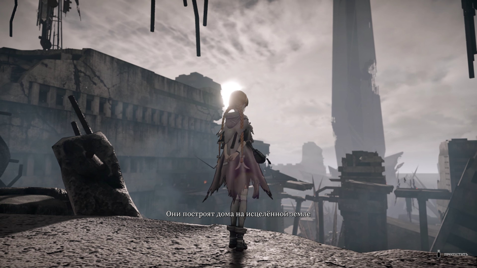
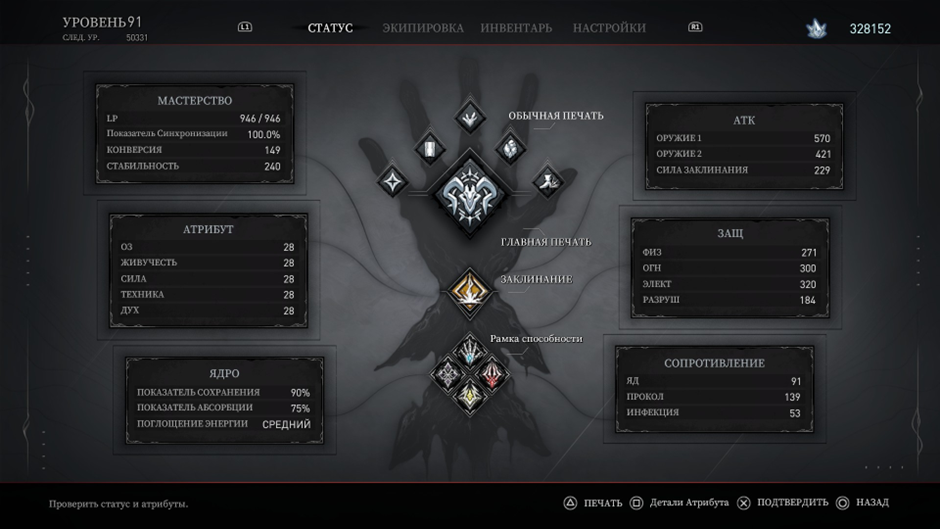
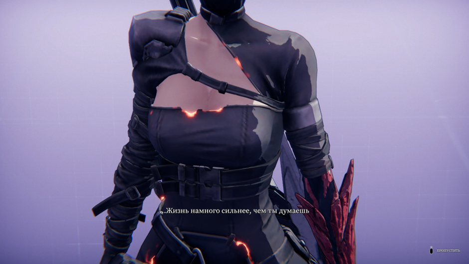
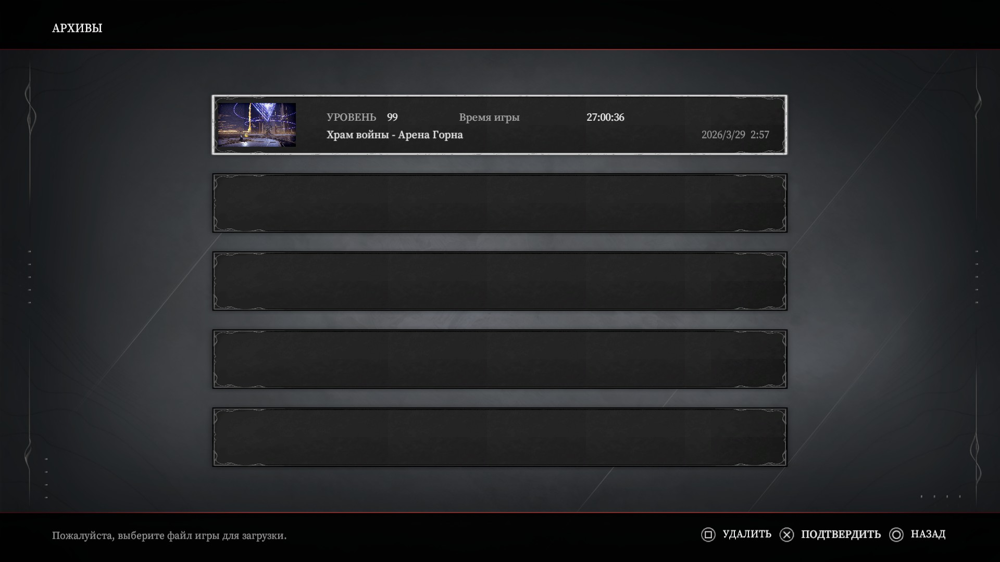
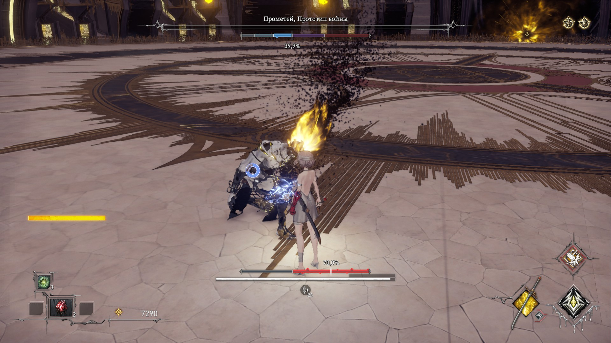

# **лимитаи (main game + Eirene’s Furnace of War DLC; true ending (all endings); all bosses; all NPC questlines;)**
## Основная сюжетка
Я воспользовался небольшим сейв скамом, чтобы выбить все 3 концовки за одно прохождение. Если об игре, то парирование слишком сильное. Было бы неплохо его занерфить, так как оно ОП, по сравнению с другими способами избегать урон. Еще и практически всех мобов так можно убить без особых проблем (оно не такое имбалансное только на тех боссах, которые не падают после одного пэрри, но их штуки 3 на всю игру). Очень много позаимствовали с элдена и бладборна (даже для квестов не сделали никакого журнала, что очень раздражает, потому что потом приходится залезать в интернет). У большого количества оружия идентичный мувсет, только специальная атака меняется, грустно. Но хотя бы много прикольных костюмов завезли. Были шикарные боссы, были просто норм, но прям отвратительных не было. Визуал и графика норм

## Дополнение "Горн войны Эйрены"
Для любителей рогаликов длц прям зайдет. Под конец много новых боссов добавили. Кенсер билд через турельку с прокаченными хп и резистами не оставили практически никаких шансов ласт боссу (да и другим боссам тоже не очень повезло находиться 1/4 времени в контроле от дрона, который еще и дамажит). Я изначально не оценил идею с добавлением рогалика в виде длц (хотелось бы сюжетку, да и у одного сосалика тоже было дополнение в виде такого режима, которое оказалось полным говном), но в конечном итоге даже я остался доволен

