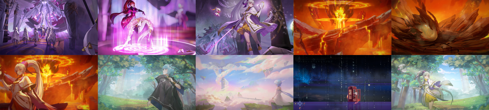
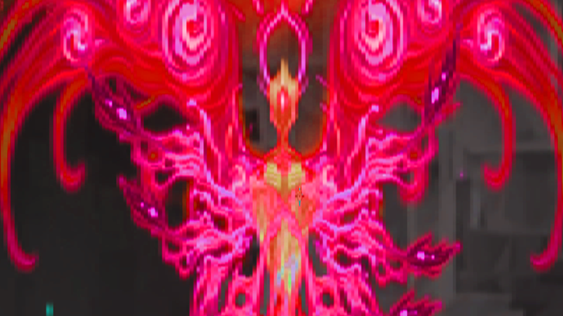

# **послесвечение**
Игра очень спорная. Лично мне зашел визуал. Как глоток свежего воздуха после скучных deep dark fantasy. Есть много оружий с различными комбинациями ударов (да, иногда очень дерьмовые инпуты для комбух, но все же). Очень много локаций, причем неплохих в целом. Просто максимальное погружение в геймплей. Но остальные моменты в этой игре, мягко говоря, огорчают...
- Почему-то, большинство метроидваний считают необязательным оставлять хоть какие-то метки или подсказки на мини-карте куда тебе стоит идти. В итоге, начинается агрессивное закрашивание карты в целях найти ключевой предмет/диалог (и не нарваться на высокую лвл локу, которая почему-то для тебя открыта), который позволит двигаться дальше. И в этой игре очень часто происходит такое, что исследовав 1/3 локации понимаешь, что у тебя нет какой-то способности, чтобы дальше пройти, и ты довольный открываешь мини-карту и начинаешь искать, что ты там еще не закрасил (а если надоест, отправляешься на ютуб).
- Боссы. Их достаточно много, но какого-то внятного объяснения что они забыли именно в этом месте (и лора) почти у всех нет (да и кат-сцены с ними часто отсутствуют). Большинство из них спокойно убиваются под пиво (даже если ты не особо сильно прокачиваешься), но и те, которые представляют хоть какую-то угрозу и имеют интересный мувсет, открыто украдены с полого рыцаря (Атус, голиаф пиро - гримм из ХК; Исиас, Вечная - Лучезарность из ХК).
- Открываемые способности. Большинство из них тоже взяты из полого рыцаря, да и принцип работы такой же. В этом нет ничего плохого, но проблема в том, что оригинальные вещи, которые придумали разрабы этой игры, работают хуже и на геймплей не оказывают никакого влияния.
- Саундтрек. Просто фоновая музыка, даже ничего особо не приметил. Просто существует. Зато звуки эффектов сделаны качественно.
- Ветка прокачки героя, местные амулеты из ХК, разные шмотки со статами, еда с разными бафами - на это все можно забить огромный болт и брать все на автопилоте (ну разве что со шлейфами можно поиграться, но полезных там не очень много). Глубина в подборе талантов и снаряжений отсутствует.
- Лор и сюжет. Лично я на такие моменты слабо обращаю внимание, но диалоги между персами как будто робот писал. Никаких эмоций эти персонажи не вызывают. Начал скипать все диалоги в середине. Да и лор тут весьма «своеобразный» (если верить одному челу с ютуба, у которого единственного есть нормальный критический разбор этой игры).
- Компаньон, который никак не задействован в геймплее.
- NG+ или скорее отдельная сюжетка на 10 глав за другого перса, у которого скиллсет унылый, и который нужен только для открытия истинной концовки. А так, в игре еще колизей есть (из ХК) XD

Если Модус геймс учтут все эти моменты и доработают боевую систему (ведь наличие различных комбо на оружиях была очень здравой задумкой) в своих будущих играх, то выйдет реально что-то очень интересное. А так, игра в целом “норм”. Я понимаю, почему она понравилась челам из стима, но если откровенно, то не самая удачная копирка полого рыцаря

(Выбиты все 10 концовок)

[Лучезарность](https://youtu.be/TOVNkeHVFvI)