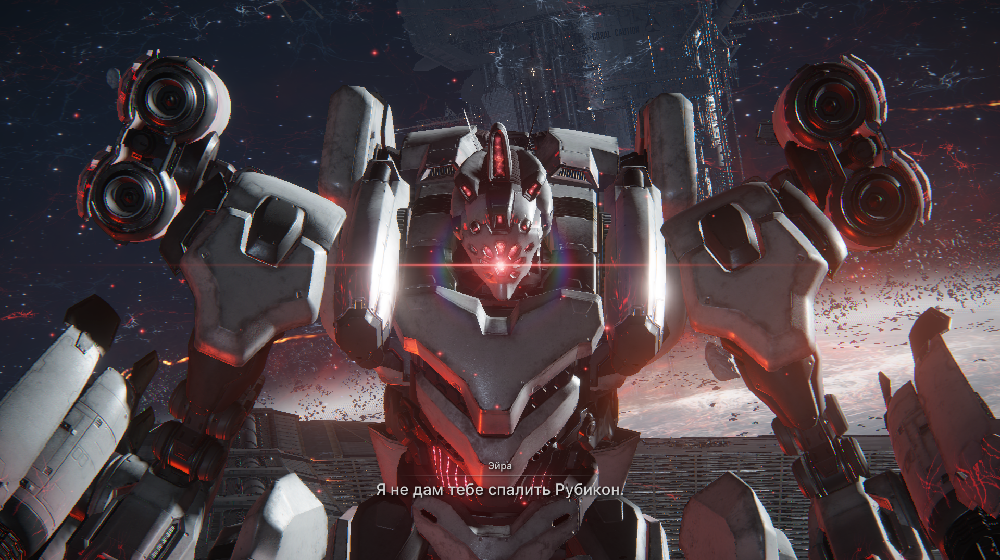
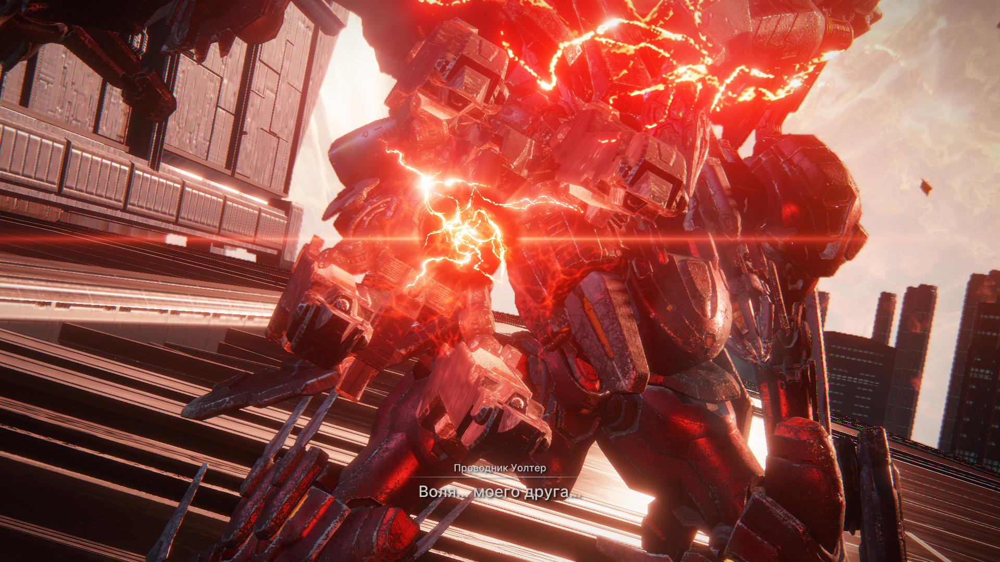
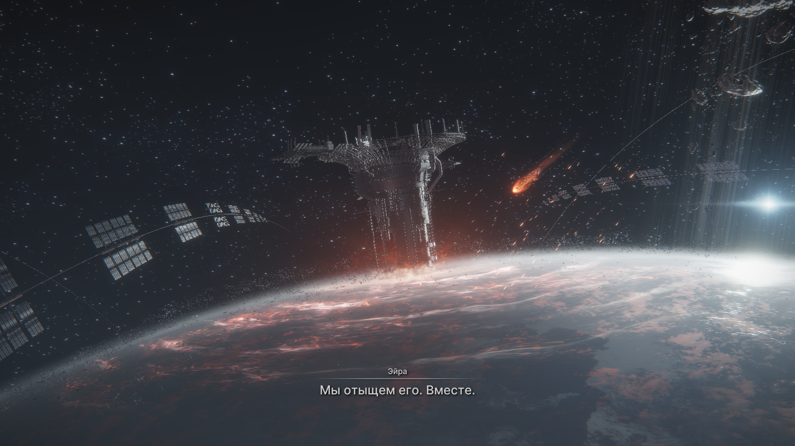
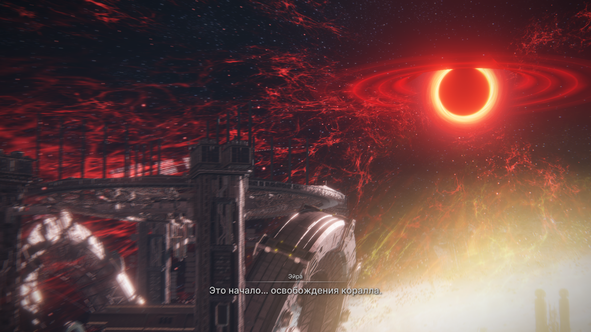
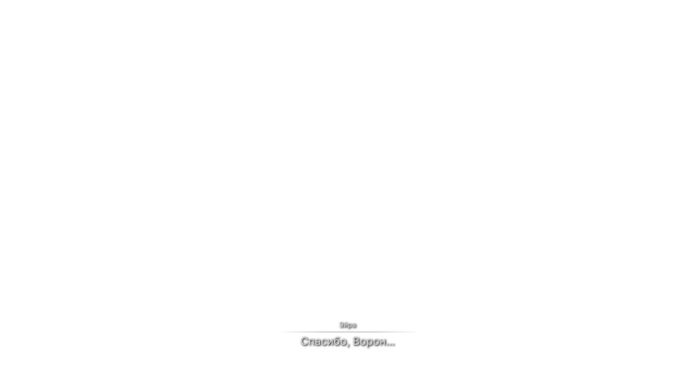

# **Броне Ядро 6 (все 3 концовки открыты) (NG++)**
Геймплей - топ. Роботы - супер. Эйра классная
А так, armored core - прикольная игруха. Я даже не думал, что мне так сильно игра про мех понравится. Скорее всего, это из-за того, что все игры про роботов супер медленные и скучные, а тут очень активный геймплей. Хоть и в начале было трудновато играть, но стоило зарашить один имба билд, как нг+ и нг+2 пронеслись на таком легке, что на миссиях я никогда не умирал, даже на финальном боссе. Поэтому тут на процентов 90 решает твой робот. Если не закреплять боссов, то каждая новая игра проходится за часов 9, поэтому тут уместно пройти ее еще 3 раза, так как и миссии новые открываются, и огромный кусок сюжета

