# **балДурка3 (2 прохождения: 1. Сложность: баланс (все боссы убиты). Кооп из 4-х человек. Мейн: Гейл. В 3 акте ребилд из мага в барда. Около 90 часов; 2. Сложность: тактика (все боссы убиты). Кооп из 4-х человек. Мейн: кастомизированный персонаж с доменом жизни. Весь ран - уничтожение всех персов (в результате, на финальном боссе, пришлось спидранить до входа к мозгу). 60 часов)**
## Первое прохождение

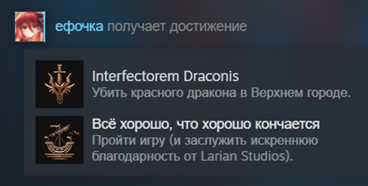

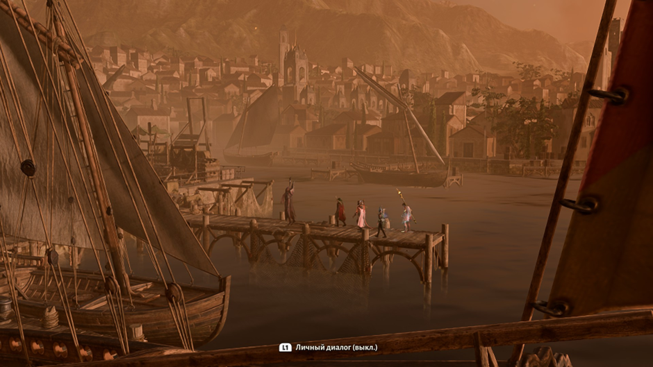

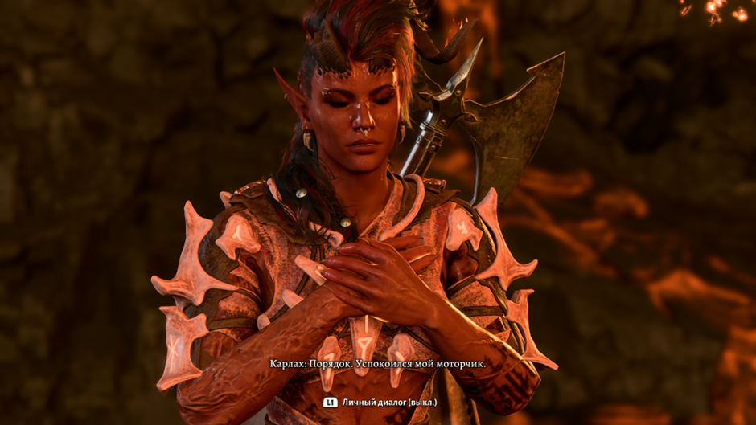
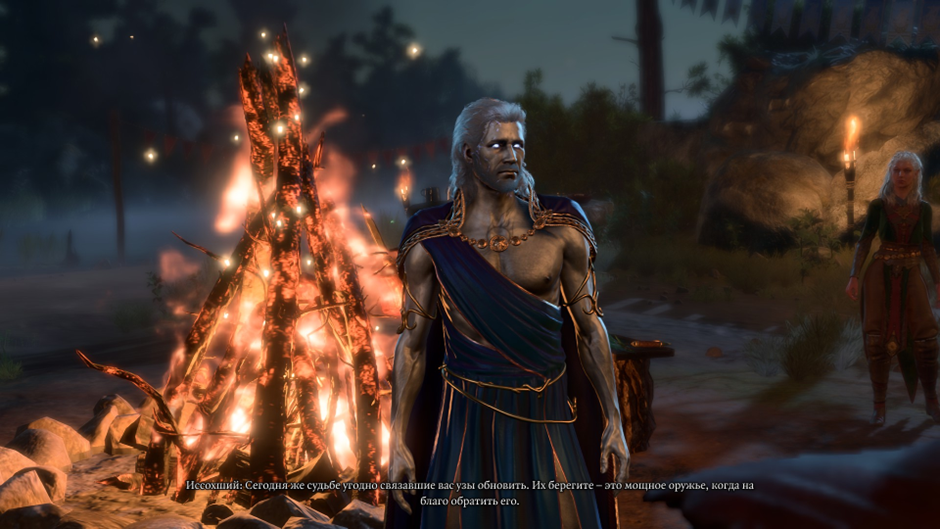
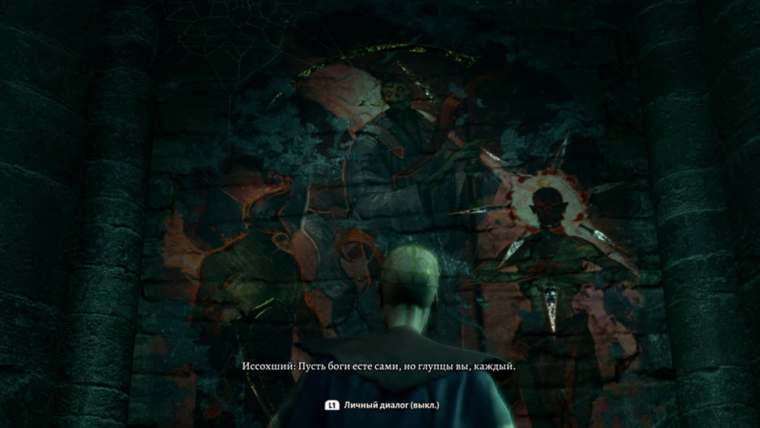

## Второе прохождение

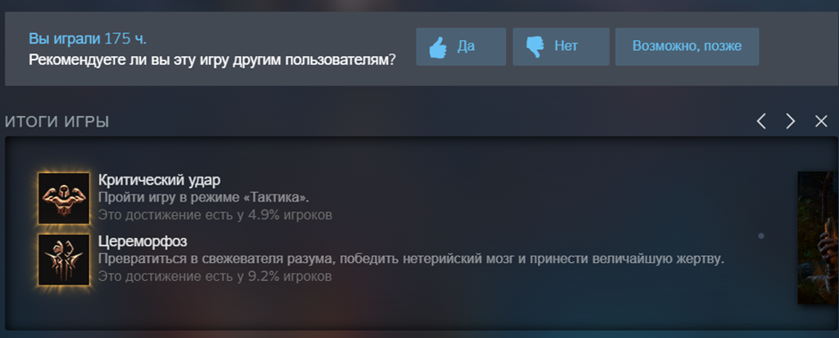

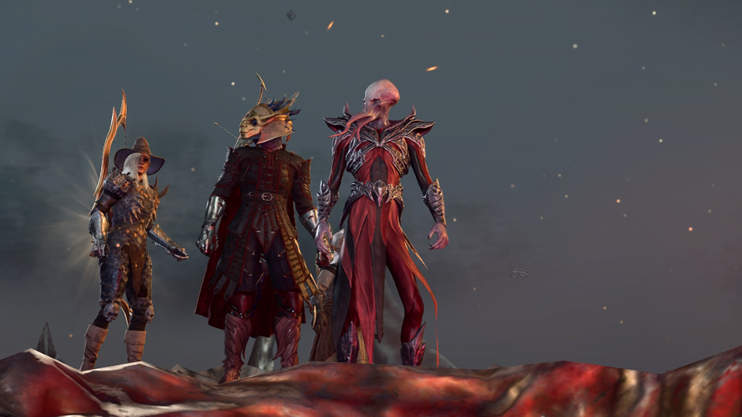

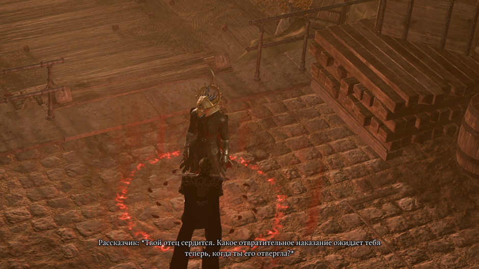

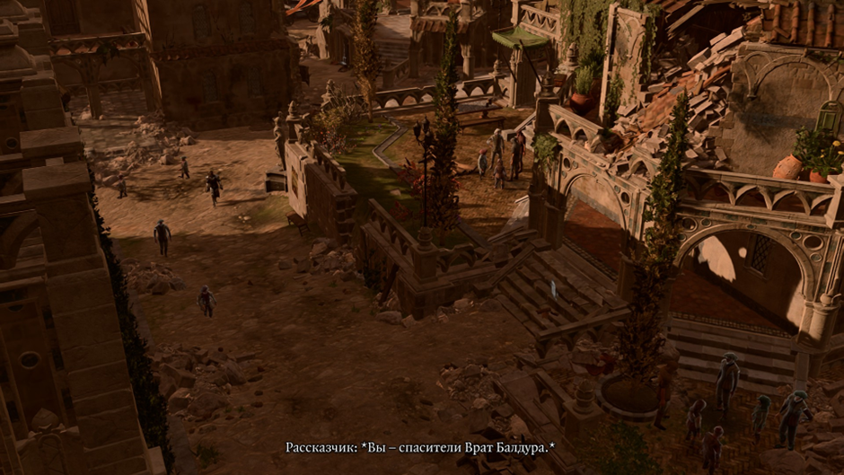
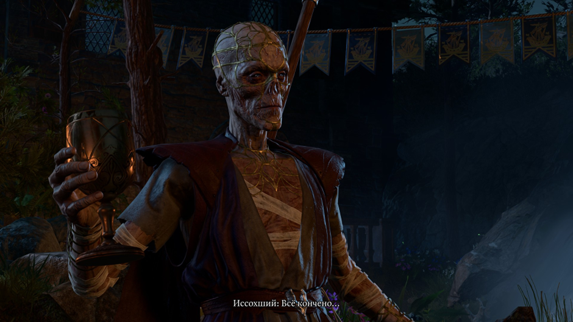
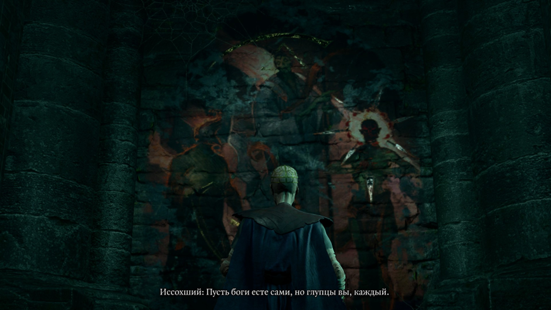