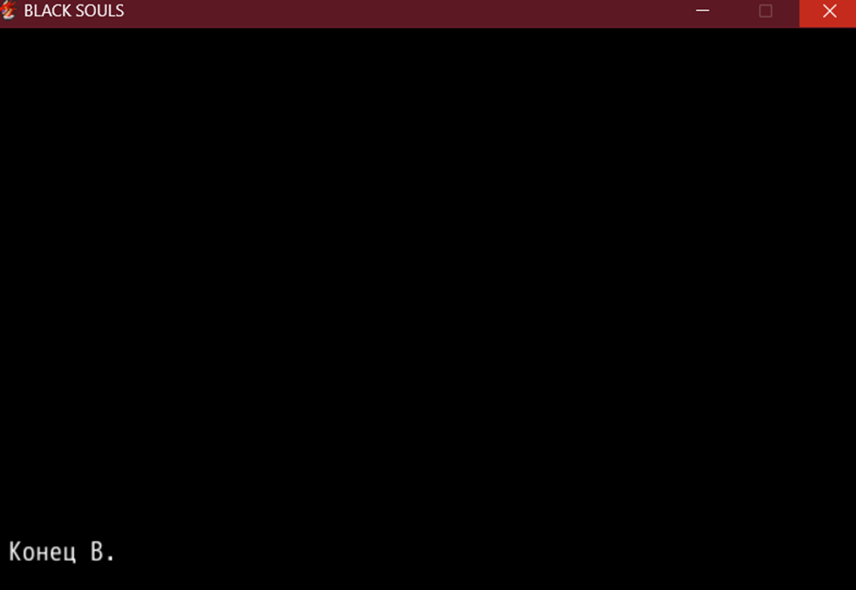

# **подвал гейминг (сложность 0)**
Ни цельного сюжета, ни нормального баланса сложности (начинаешь все шотать на 1/3 игры). Какой вообще смысл оставлять возможность для сейва в любом месте, когда эту задачу спокойно костры могли выполнять. Достаточно посредственный саунд, большая часть спрайтов мобов вообще как будто из интернета скопирована. Ну хоть картинки для кат-сцен вручную рисовали. Единственная “забавная” механика - коллекционирование тамагочи в подвале. На самом деле, кучу других игр на рпг мейкере существуют, которые с задачей напугать или "шокировать" игрока куда лучше справляются

