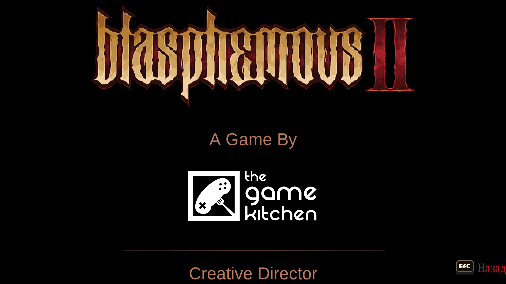

# **Бласфемус2**
В целом, все боссы были норм, а некоторые даже прикольные, за парочкой исключений. Например, босс саммонер, наличие которого обычно свидетельствует о бездарности того, кто его делал. Немного кривая была бенедикта, но в целом норм. Даже двойной босс был достойный. Но все остальные элементы игры либо остались на месте (хотя их стоило бы переделать), либо стали хуже.
Стало плохо:
- Шрифт (подвергся некому "осовремениванию", что стало хуже восприниматься).
- Новая рисовка кат-сцен (тоже самое, что и про шрифт. Ну они реально были лучше).
- Дизайн боссов (мне они до сих пор кажутся менее детализированными + в прошлой части боссы, да и вообще все остальные мобы были более "мерзкими" в хорошем смысле. Игра немного потеряла в уникальности, да и ее как будто специально цензурили).
- М А Г И Я (Хотя бы разрабы ее немного понерфили, потому что какой-нибудь стазис уничтожал всех боссов просто без шансов. Не уверен, что происходит после патча, потому что не пользовался. Да и без нее всегда интереснее играется). Было бы лучше, если бы они сделали это как отдельный класс имхо.

Осталось прежним, но я бы поменял:
- Система пассивных усилений (алтарь милостей). Я считаю, что делать артефакт, который просто увеличивает дамаг на какой-то % (причем, что мне должны говорить эти проценты?) - максимально бездарно. А большинство пассивных усилений так и работает.
- Разбросанные по всей карте (чаще всего в секретных местах) потки, улучшалки маны, хп и артефакты, которые ты легко мог не находить, а вынуждать игрока либо залезать в интернет, либо бегать 100500 раз по всем местам - идея крайне так себе. В этой части это ощущается в разы острее из-за того, что боссы стали дамажить в разы больше, да и мувсет стал куда сложнее. Ну хотя бы с хп и потками можно было сделать так, чтобы их улучшалки падали ПОСЛЕ убийства босса. В итоге, ты либо недокач, либо пропылесосил всю карту с открытой вкладкой ютуба/вики. Опять же, прошлой части можно было многое простить, потому что она была ПЕРВОЙ, неким экспериментом, чтобы собрать фидбек с игроков.
- Фазы у боссов, а точнее: отсутствие предупреждения о том, что у босса следующая фаза (чаще всего), а вместе с ней и другие атаки. По итогу, ты понимаешь это только, когда принял урон от измененной атаки у босса. Решение: выделить на это отдельную анимацию (лол).

Но есть и плюсы:
- 3 новых оружия, которые сильно отличаются, и которые задействованы в головоломках.
- Усложненный мувсет у боссов.
- Платформинг стал лучше.
Я даже не буду причислять к минусам супер "классную" подачу сюжета, которую обязательно нужно "позаимствовать" с дарк соуса (причем актуально для всех таких "вдохновленных"). В целом, игра неплоха. Хоть и для меня она стала хуже первой части

