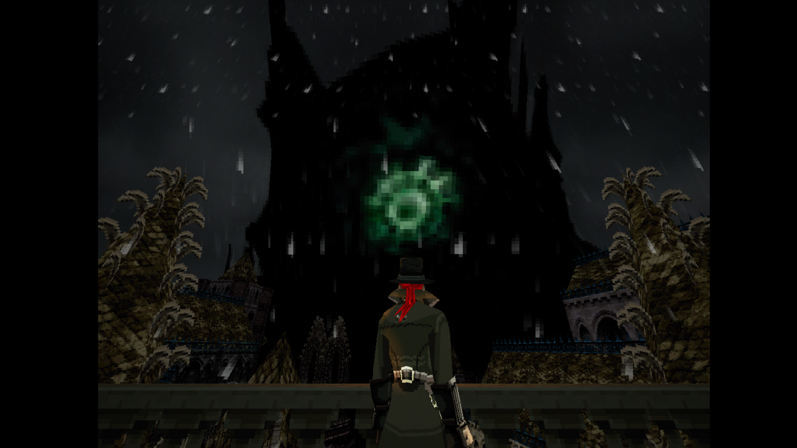

# **Бладборн на пк (BBPSX_1.05)**
Достаточно интересной вышла игра. Некий взгляд на то, что получилось, если бы бладборн вышел на PS1 (спойлер: с таким управлением, в это было бы достаточно мерзко играть, потому что у оригинального PS1 отсутствовали стики). Лок камеры спасает немного ситуацию. Идеальная игра, чтобы пробежать за 6 часов и насладиться пс1 экспириенсом (в плохом смысле), хотя визуал старых игр мне очень нравится. Автор(ка?) проделала [отличную работу](https://b0tster.itch.io/bbpsx) не просто скопировав всю игру, а переделывая кучу вещей, при этом сохранив основную идею. И да, я всю игру с начальным лвл’ом пробегал

