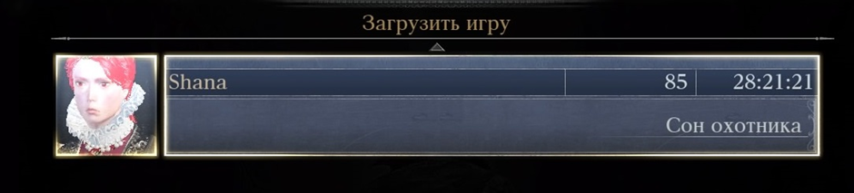
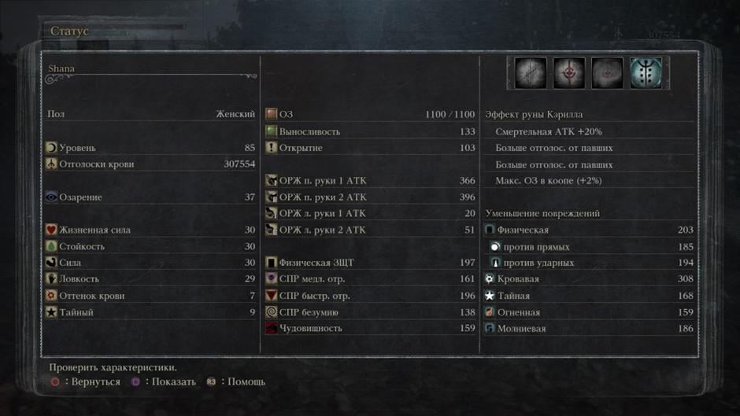
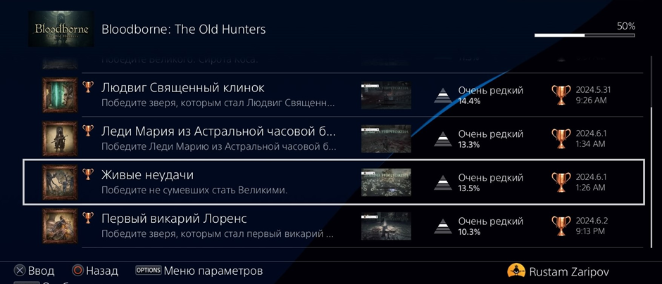
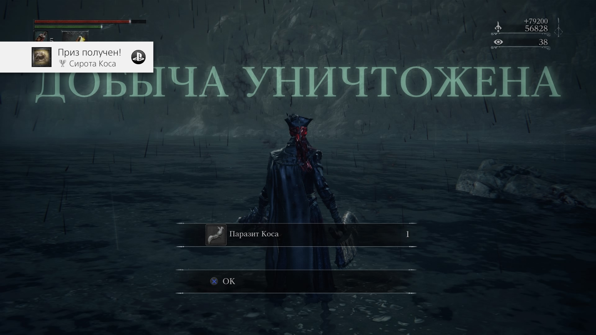
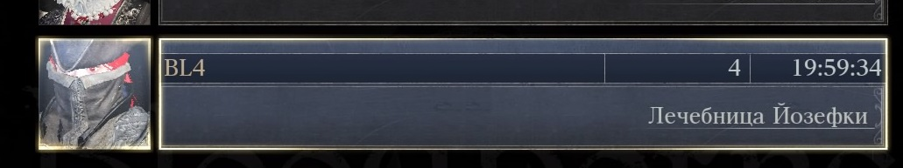
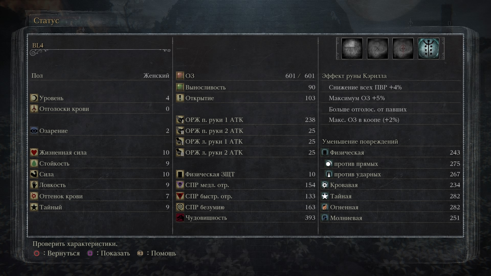
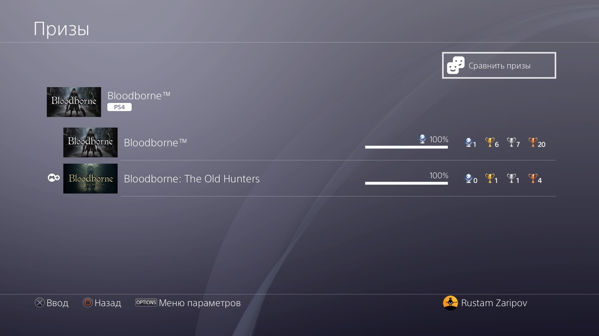
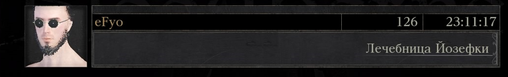

# **а хунте из а хунтер, ивэн ин э дрим (3 прохождения: 1. ALL BOSSES (без чаш), секретная концовка, билд с тонитрусом и пилой-топором; 2. BL4 (скипнуто: все длц боссы, Логариус, Герман и Присутствие луны); 3. ALL BOSSES (+ основные боссы из чаш для платины), секретная концовка, билд со священным клинком Людвига)**
## Первое прохождение

## BL4

## Третье прохождение (ALL BOSSES, основные чаши и остальные вещи для платины. Билд со священным клинком Людвига)
Советую перед чашами пройти весь основной контент и длц, а то потом можно случайно всех оставшихся боссов пробежать за 1 трай. Уж очень много нафармливается отголосков крови

