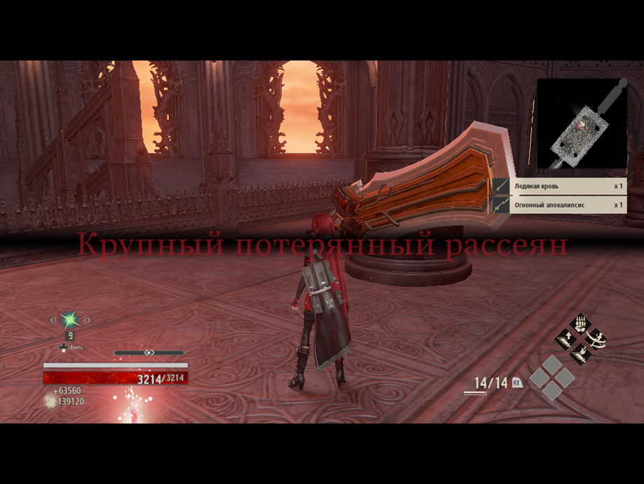

# **Местный Анор Лондо крутой (нет) (без длц) (2 прохождения: 1. С ботом в напарниках; 2. Без него (очень сильно душили парные боссы, поэтому не рекомендую так делать))**
На самом деле, игра максимально посредственная, но даже не смотря на все минусы, которые пойдут дальше, игра мне понравилась (и это удивительно, учитывая, что она куда хуже, чем я себе её представляю). Из того, что мне понравилось:редактор персонажа; адекватное повествование; иногда даже интересные боссы; визуально красивые и атмосферные локации. Из того, что ужасно: запутанность некоторых локаций (местный Анор Лондо передает привет); парный босс (ОСОБЕННО без напарника); вроде как в этой игре существуют билды, но солидная часть завязана на напарниках, но если ты захотел в соло побегать, то вариативность резко снижается; в целом, отсутствие каких-то уникальных геймплейных элементов (абилки ситуацию не особо исправляют)

