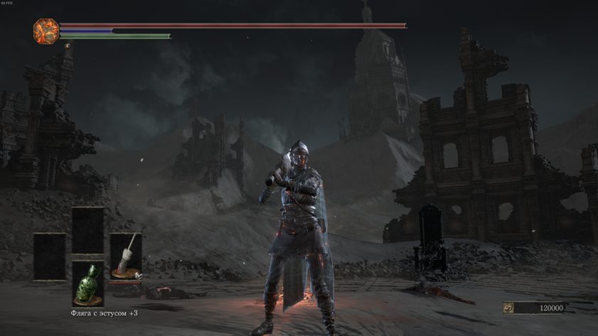
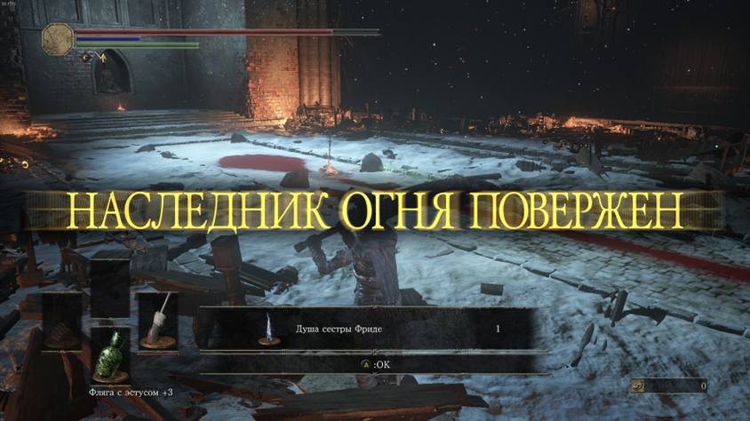
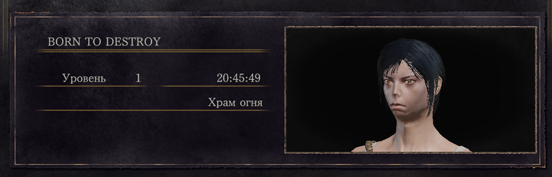
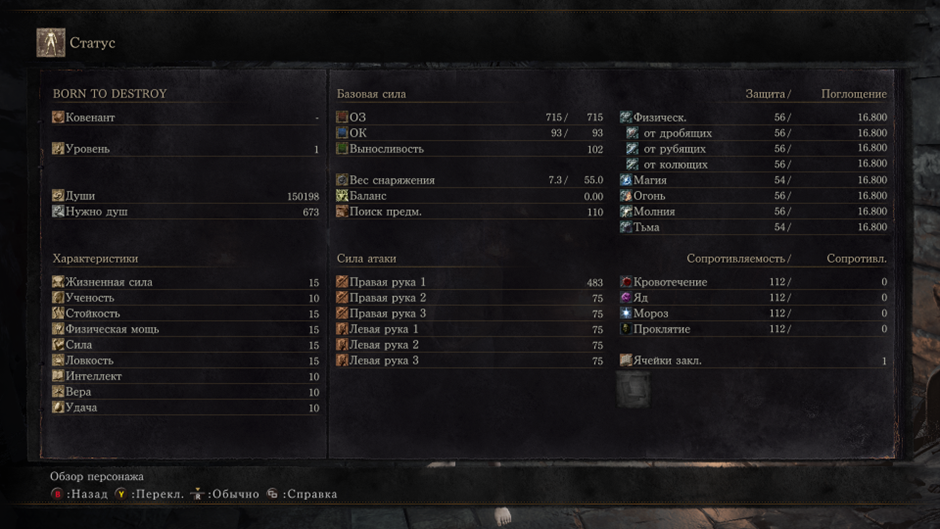

# **Бест соус (5 прохождений: 1.Билд со скимитарами (без длц); 2.Билд через удачу и кровотечение с ножом бандита (без длц); 3. SL1 (без dlc); 4. Билд через двуручный меч изгнанника (ALL BOSSES); 5. SL1 (ALL BOSSES))**
## Билд через двуручный меч изгнанника

## Первый SL1 ран (main bosses)

## Второй SL1 ран (ALL BOSSES)
В ране прокачивалось оружие, и использовались; кольца, броня и различные смазки. Не использовались саммоны. Прохождение было в автономном режиме. В первой половине игры использовался палаш, во второй - топор драконоборца. [Мидир откисает во второй раз на SL1](https://youtu.be/C-q9riCDTMI?si=a0lGdgefR_hL5nd4)

## Тир лист боссов после SL1 рана

