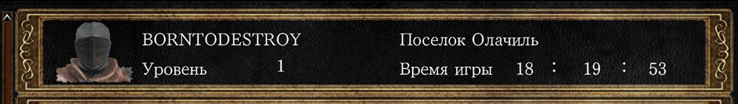
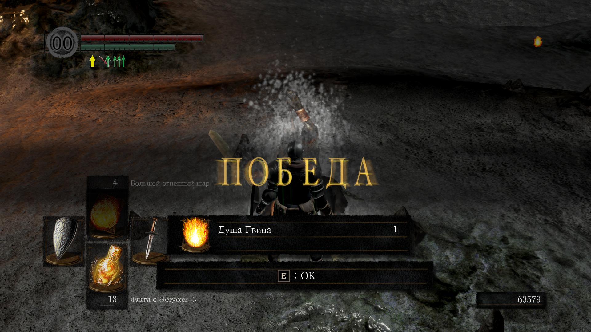
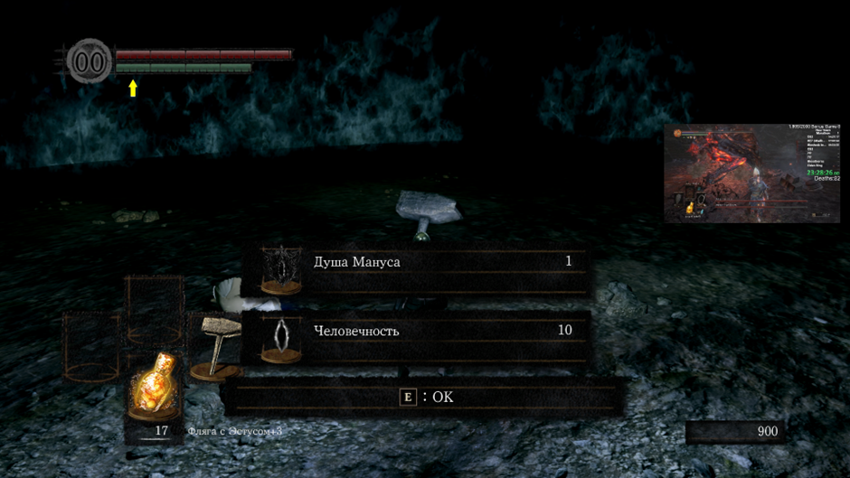
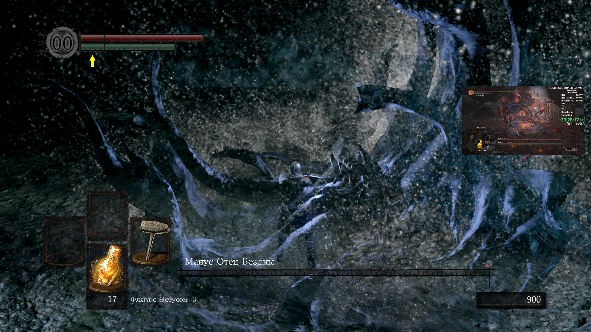
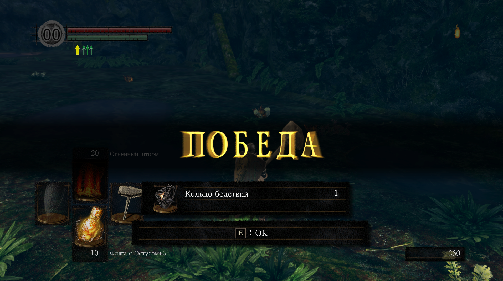
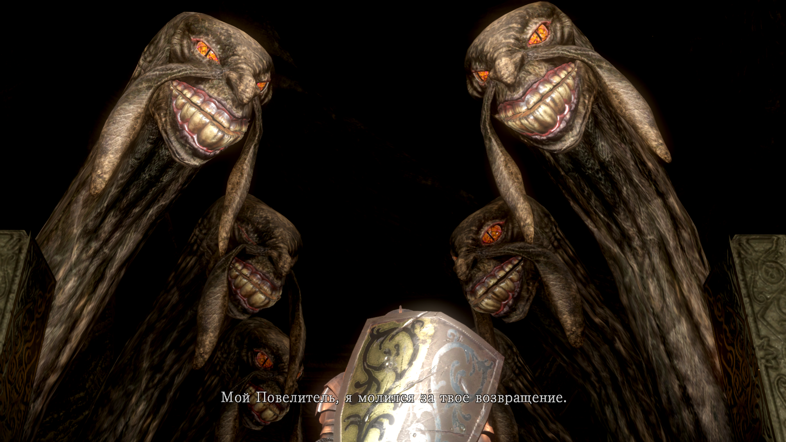
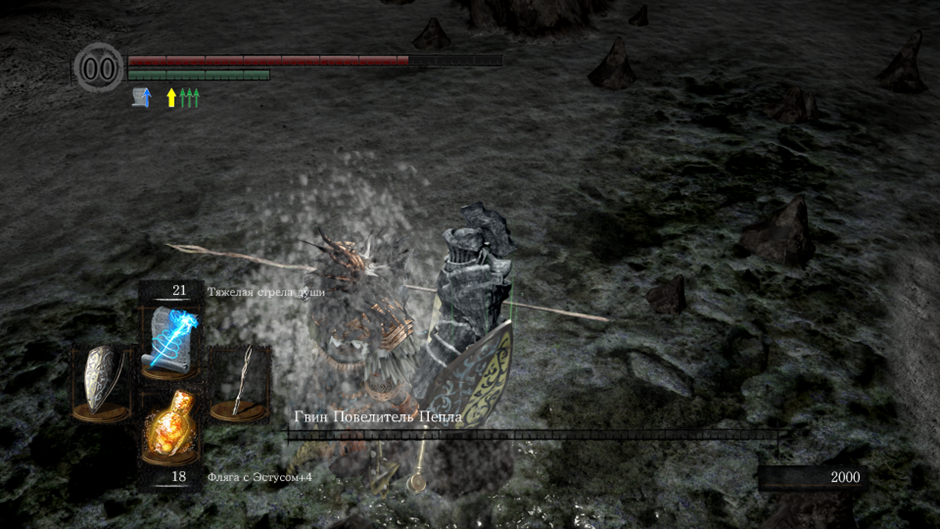

# **темные души 1 (3 прохождения: 1. через ловкость с катанами (без длц); 2. SL1 (ALL BOSSES WITHOUT PYROMANCY); 3. колдовство (без длц))**
В ране я не юзал пиромантию, хотя она активно качалась, просто потому что некуда было сливать души + я думал, что она мне может пригодиться. Духоты в таком ране очень много, а сложности возникают только на длц боссах и финальном. КАЛЛамит просто треш, на котором перекаты впритык срабатывают через раз, а он стагерит и шотает за 2 рандомные тычки. Пришлось перебороть себя, чтобы его одолеть (особенно, когда у него оставался 1 хп и я умер). А так, ран становится интересным только под [конец](https://www.youtube.com/watch?v=X9V-vK7T2dU)

## Немного слов про прохождение за мага.
Треш. Перс любит промахиваться заклинаниями чуть ли не впритык. Вся игра становится мега унылой до встречи с гвином и длц боссами. Длц же я не стал проходить, потому что понял, что нужно бегать собирать кольца, которые я напропускал. Из-за чего я перестал дамажить по Арториасу (я на SL1 и то больше урона наносил дубинкой), а идти гриндить ради этого лвл’а я не собирался. Если честно, то нафиг такой геймплей. Это прикольно так бегать первые минут 30. Потом резко начинает надоедать, особенно, когда у тебя прокасты отличаются только названиями (я знаю, что там есть длц магия, но и она в целом не привносит какого-то ощутимого разнообразия). Короче хз, кому это может не иронично доставлять удовольствие, но я прям задушился с такого прохождения (1 из 10)

