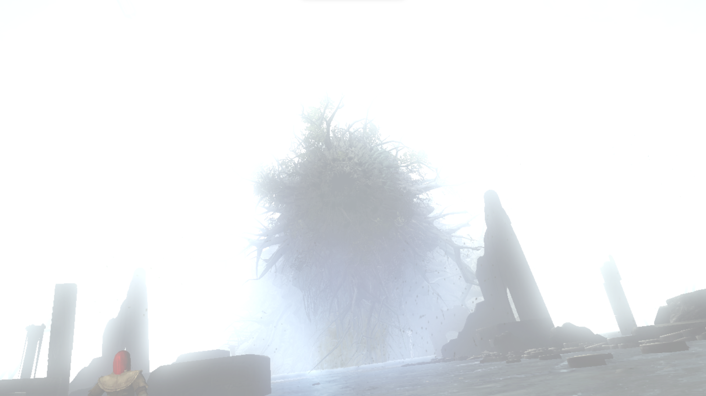

# **демоныдемоныдемоны**
Весьма смешанные впечатления от демонс соуса. С одной стороны, есть моменты, которые немного портят впечатление от игры. С другой, это был первый проект автора в таком жанре (который позже станет культовым с приходом темных душ), и он справился отлично. Большинство боссов сделаны с креативом, а некоторые заставляли поднапрячься. Но сложнее только сама дорога до них, ведь костер впритык тебе очень редко ставят. Это все компенсируется количеством травы (местный аналог хилок), которые ты спокойно можешь нафармить, и бегать с количеством 99 на КАЖДЫЙ вид (что я считаю огромным недостатком, потому что фарм - плохо, а заедать босса НЕМНОГО нечестно). Ну а можно и не фармить особо, потому что игра тебе дает впритык, чтобы ты мог пройти игру. Ремейк игры немного исправляет некоторые моменты оригинала, но он пока только для пс5. В целом норм, но игра явно для опытных смешариков

