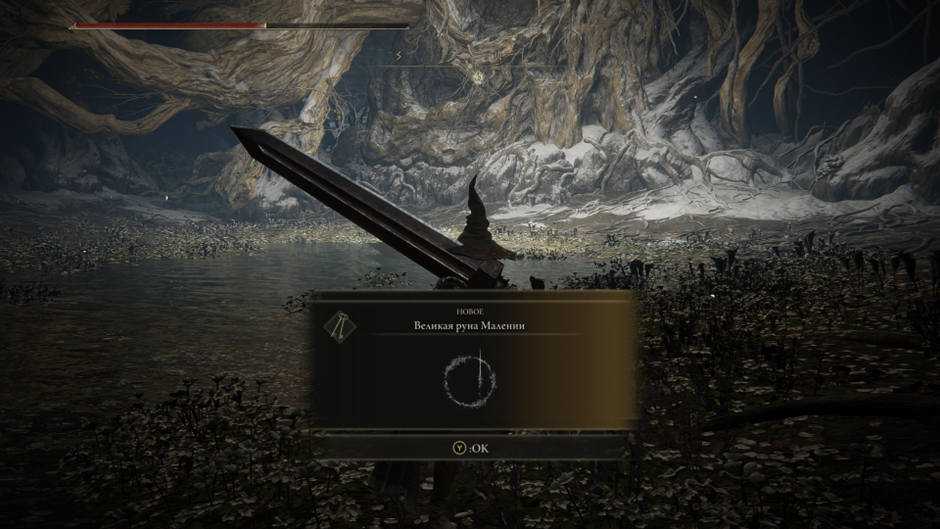
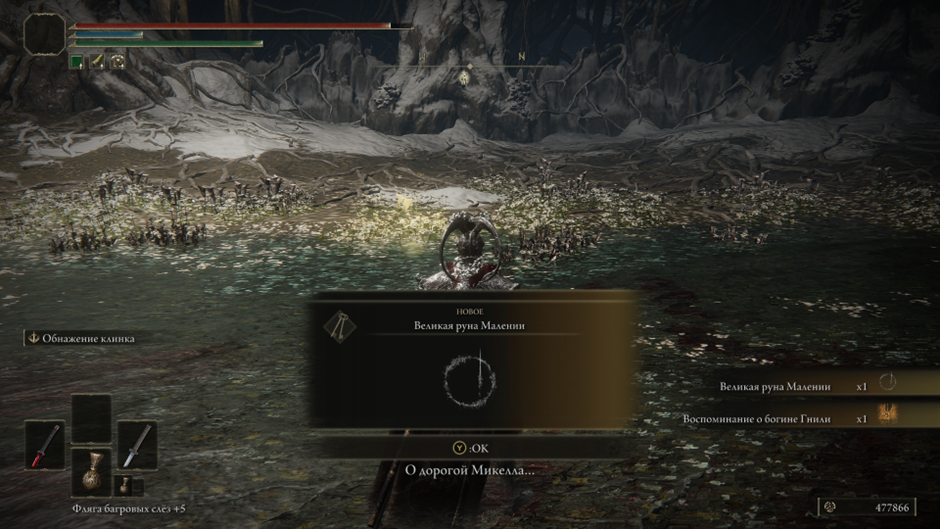

# **ЭлденРингАкаХудшаяИграМиядзаки (2 прохождения: 1. Билд через ловкость с когтями и катанами в лейте; 2. Билд через силу с мечом Гатса на всю игру + онли парирование Маления)**
Плюсы игры:
- Красивые локации (хоть и пустые).
- Сложные, оригинальные и достаточно интересные ключевые боссы в игре (в большинстве случаев). Хоть я и считаю, что Маления моментами нечестный противник, но то, что это достаточно крутой босс - факт (еще и качественный, и самый запоминающийся во всей игре), и я испытал большое удовольствие, одолев ее 3 разными билдами.
- Визуально привлекательная игра (включая оружия, посохи).
- Спустя 2 прохождения, могу сказать, что оружия между собой вполне сбалансированы, хоть и не так хорошо, как в прошлых частях. Все руинит их скилы (weapon arts), но я ими не особо пользовался.
- Прыжок, который даже иногда полезен бывает.

Минусы:
- Открытый мир со всеми вытекающими проблемами, когда ты недокач пришел на локу и наоборот, когда ты перекач и бегаешь всех унижаешь.
- Никудышная система квестов, которая перекочевала из предыдущих игр автора, из-за чего ты идешь читать гайды, как их не пропустить случайно.
- Часто повторяющиеся данжи (ну и награда, обычно, соответствующая данжам). Во втором прохождении я в них перестал вообще заходить.
- Система крафта бесполезная, ни разу ей не воспользовался.
- Нужные оружия тоже иногда сложно найти без подсказок с интернета.
- Существование достаточно сломанных духов призывания (благо их существование можно игнорить, и тебя не заставляют их использовать).
- Лучше бы финальным боссом была Маления, а не та жижа в конце. Даже среди подделок соуса не найдется такой же отвратительный.
Из всех игр автора, для меня данная является худшей из лучших, и это не из-за плохих боевых механик, оружия или боссов, а из-за других не менее важных факторов, которые сформировали соответствующую оценку пользователей на метакритике

