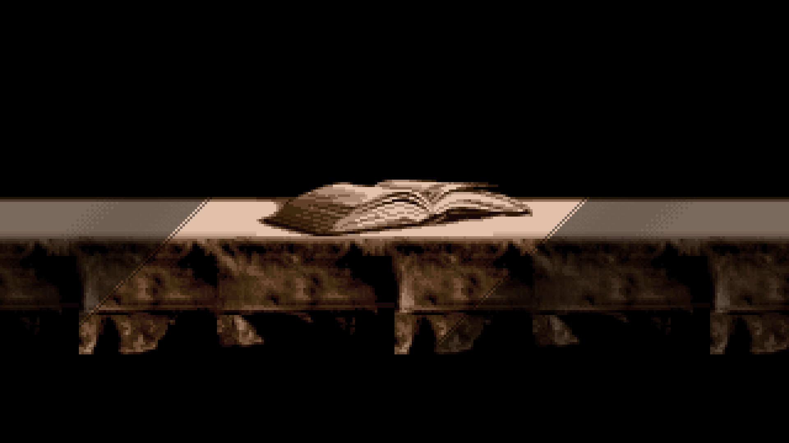
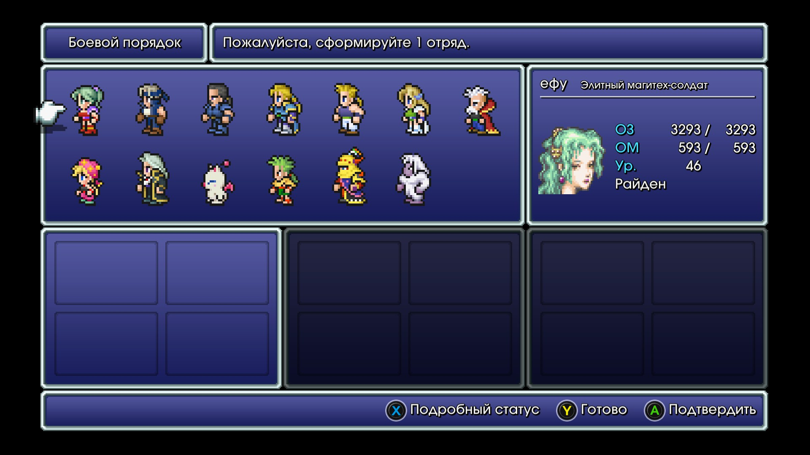
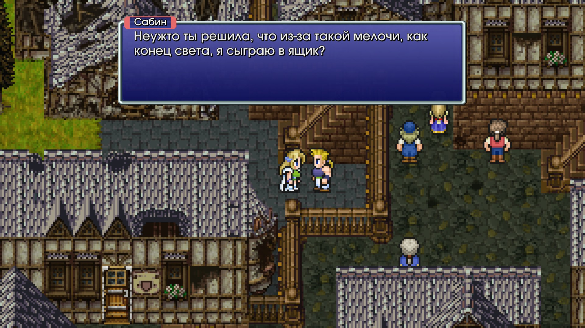

# **кефка момент**
Все сделали лучше, чем в прошлых частях (как обычно). Меня расстроило, что не сделали флешбека через каких-нибудь 5 лет, где показали бы, что с персами вообще произошло после файта с Кефкой (романтическая линия персов Селес и Локк не закончена нормально, хотя на это неплохой кусок сюжета уходит). События с Оперным Театром пик.  
В общем про пиксель ремастеры: шикарно. Свою задачу они идеально выполняют. Да, пришлось в процессе какой-то дополнительный контент вырезать (по информации в интернете), но ничего важного не было упущено. Переработанный баланс только на пользу пошел (ну и фикс всяких багов). Визуально мне пиксель ремастеры больше нравятся

