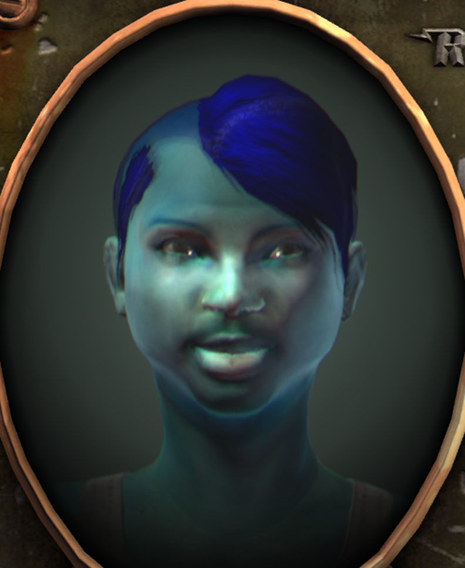
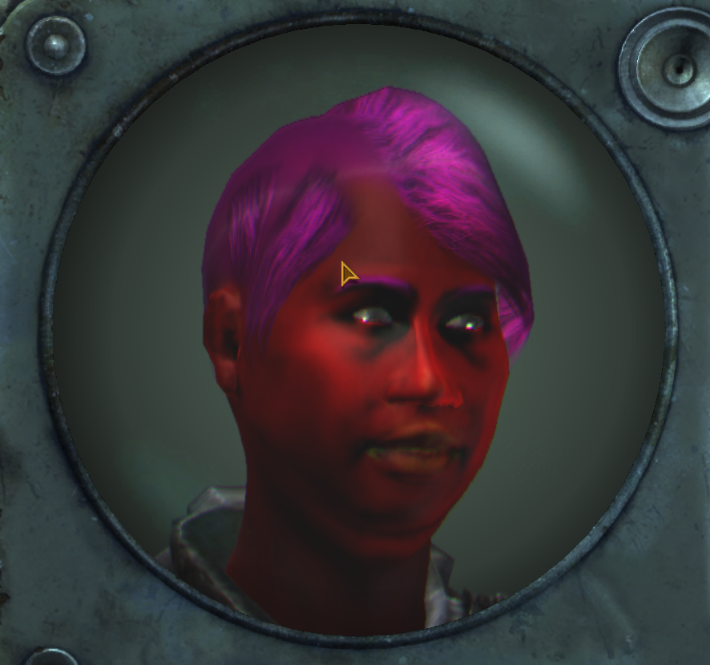
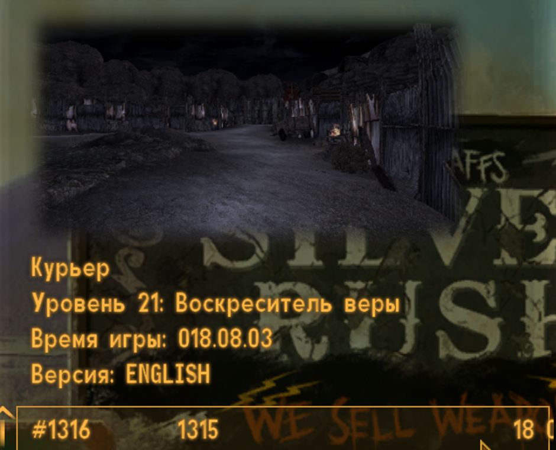

# **ФолычНовыйВегас (Ultimate Edition) (сложность: нормал; без хардкора) (2 прохождения: 1. Независимость с Йес-мэном через билд без оружия + все вышедшие длц; 2. Мистер Хаус через энергетические пушки, без длц. Потом откат на предыдущие сейвы, и концовка с НКР)**
Когда глянул на вики, то удивился, сколько всего я умудрился пропустить. И все это влияет на слайды в концовке, в большинстве случаев. Невероятно масштабная и очень вариативная игра. Даже несмотря на большое количество вылетов, каких-то багов, лучше этой части уже вряд ли сделают. Обсидиан отлично справилась за такие короткие сроки. И да, с каесаром я не стал выбивать концовку, потому что легион для отдельных индивидумов. Хотелось бы более масштабных изменений в геймплее, если сравнивать с тройкой, но за такие короткие сроки это просто невозможно было бы сделать.

