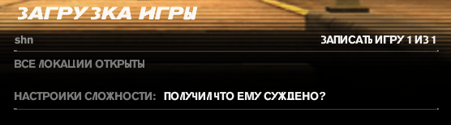

# **Freedom Fighters (предпоследняя сложность)**
Такая душка этот фридом файтер. В детстве он как-то пободрее выглядел. Подумал, ща такой веселый шутанчик будет на предпоследней сложности, но по итогу всю игру бегал отправлял тиммейтов зачищать локу, а сам сидел со спины их ресал, как местная хилочка. Еще и чекпоинты в половине случаев находятся либо супер далеко, либо он один на всю карту. Неловкое движение в сторону врага - смерть, и идем по новой проходить еще 20-30 минут. Разброс пуль огромный у всех ганов (кроме снайперки и пулемета, которые раз в год дают потрогать) из-за чего убить врага на средней дистанции становится довольно затруднительной задачей, да и вообще стрелять. Саунд так себе, который надоел повторяться уже на середине игры. Короче, игра ни о чем, не стоило вообще ее вспоминать

