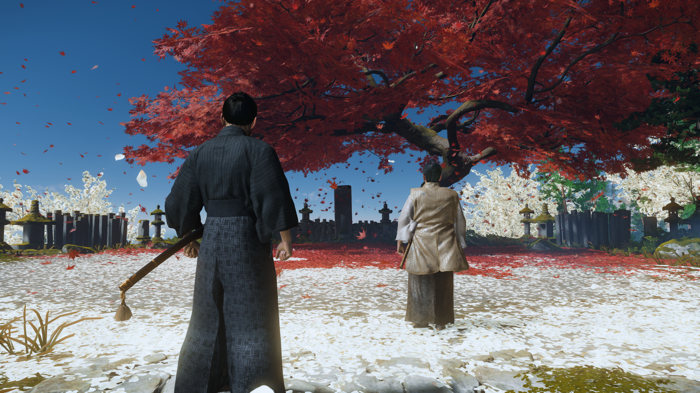
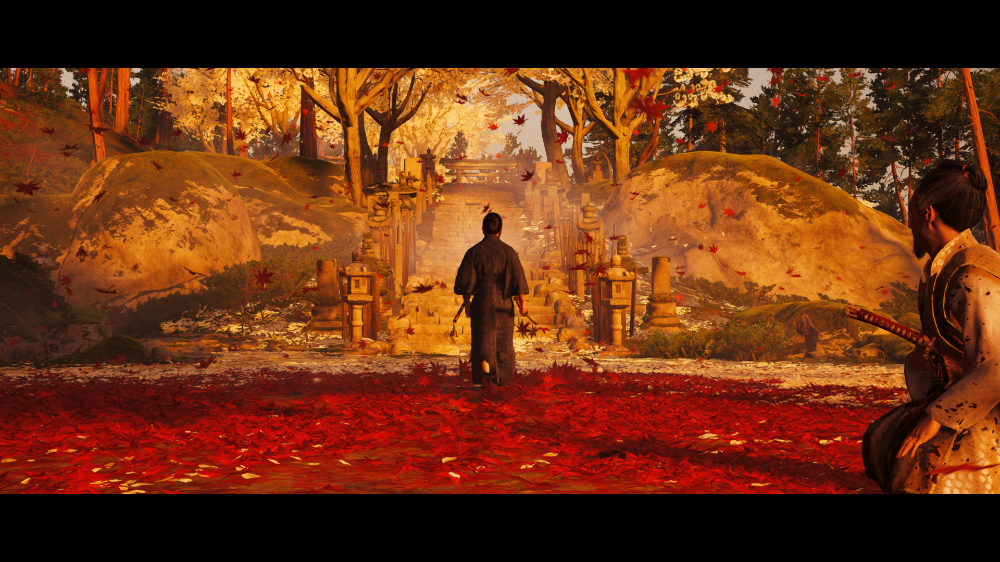

# **цусима основная компания + длц (сложность: "кошмар")**
Какую-то подробную статистику в виде процента пройденного всего контента игра не дает, но все мейн миссии, истории древних героев и истории ики я выполнил (ну и бОльшую часть второстепенных историй цусимы). Собирательством я не люблю заниматься, поэтому забил на это (тем более учитывая их количество). На кошмаре сильно помогают расходники, лук и правильное снаряжение, поэтому самое тяжелое - это пережить начало, а дальше становится куда проще. Ну и боссы мне показались достаточно простыми, даже последний длц’шный, но игра все равно отличная. Ассасин здорового человека

