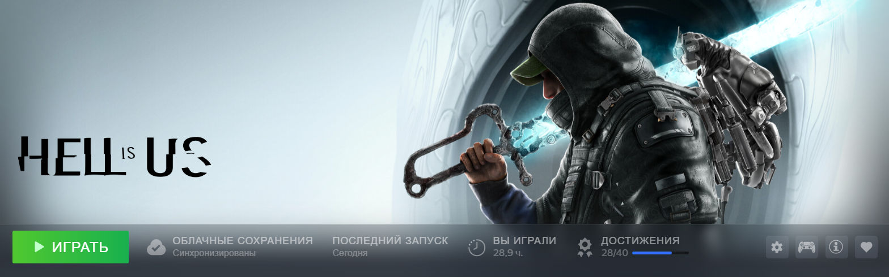
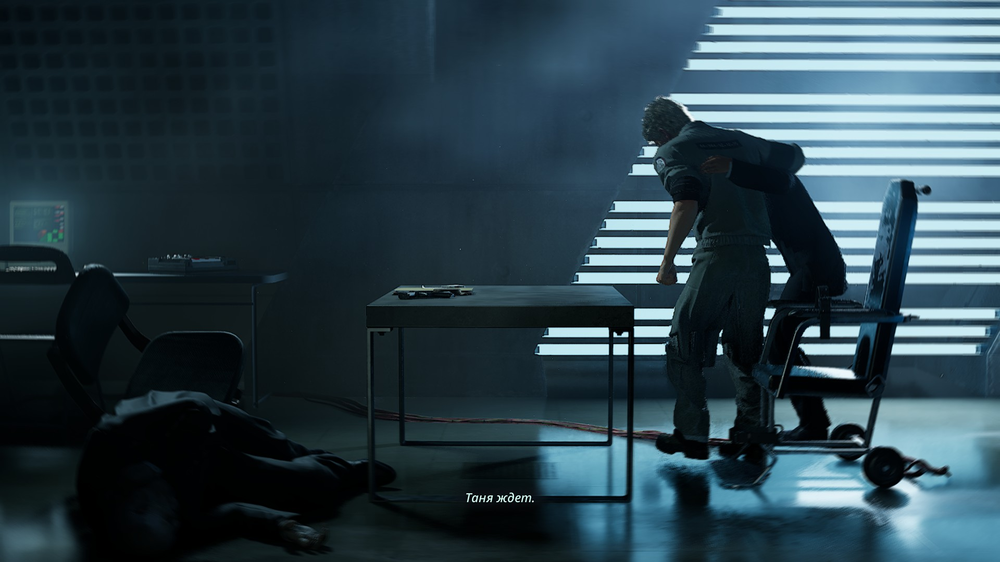
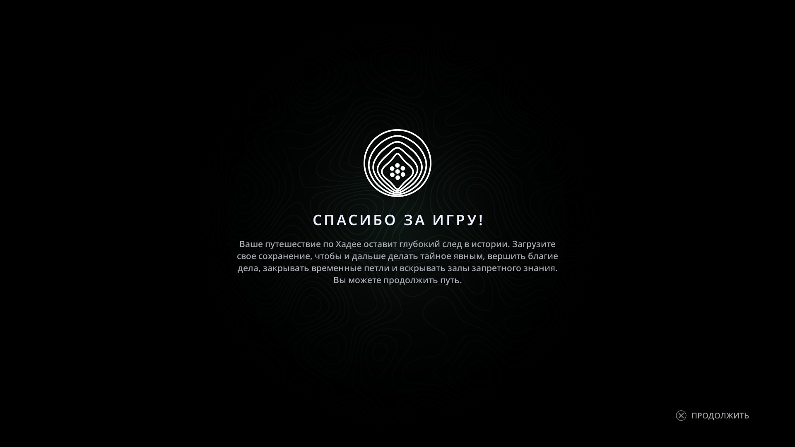

# **головоломщика никто не остановил (сложность: "Без пощады")**
Плюсы: крутой визуал (спасибо UE5); отличный саундтрек; интересный эксплоринг; хороший дизайн локаций; хороший сюжет (был, пока под конец его не слили). Минусы: посредственный геймплей; скучные мобы (всего 2 босса на всю игру, но хотя бы интересно сделаны); ни на что не влияющие сайд квесты; самое главное - Г О Л О В О Л О М К И, а точнее их общее количество и особая душность отдельных. В итоге весь геймплей строится на том, что ты уныло бьешь мобчиков (с максимально ужасно сделанными атаками у большинства, но угрозы они все равно не представляют, так как даже на последней сложности затыкиваются простым спамом атаки) с перерывом на душные головоломки, иногда разговаривая с нпц, и так до титров. Самое забавное, что под конец игры так нормально ничего и не объяснили. Зато после титров выкатили анонс следующей части (которой не будет, потому что мало кто побежал игру покупать, когда у тебя в один день релиз с силксонгом лол). Крайне не рекомендую в это играть

