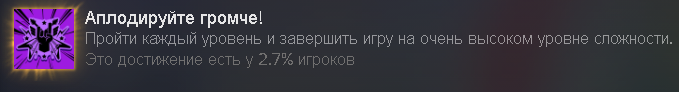
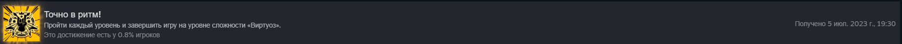

# **Hi-Fi RUSH (Высокий уровень сложности и виртуоз)**
Hi-Fi RUSH - топ. Особенно, когда открывается парирование. Если бы игра вышла в прошлом году, то спокойно бы выиграла номинацию лучшей игры года, по крайней мере для игроков. Из недостатков можно отметить только отсутствие лока камеры. Такую высокую концентрацию фана и адекватного челленджа мало какие игры генерировали. Все босс файты сделаны максимально оригинально. Ни один из них не похож ни на кого другого. Особенно последние 2 были просто шикарными. В первом случае потому, что на заднем фоне начала играть ремикснутая версия пятой симфонии, а во втором - сам босс. Очень редко со мной происходит такой момент, когда я хочу выбить максимальный ранг на миссии, но эта игра - один из таких случаев. Во второй половине игры я уже просто машинально начал попадать в ритм. Ну и самый главный плюс это компаньон котик, и возможность за него поиграть в конце игры.

