# **Slice of P(eak) (лучший соулс не от миядзаки) (3 прохождения до выхода длц: 1. До нерфов (сейв потерян); 2. После + лаксазия без нанесения атак; 3. SL10 (11.11.2023). DLC Overture: 1. Прохождение длц на втором сейве с прокаченным уровнем (21.06.2025) (все боссы); 2. SL10 (26.06.2025) (все боссы))**
Во всех прохождениях были забанены (даже на SL10): использование любых видов самонов; точильный камень на идеальное парирование;  любые виды кубов; покупаемые расходники (обычные хилки и заточка оружия использовались, они не входят в эту категорию)

## Первое прохождение на рандомной аккаунте (до нерфов)

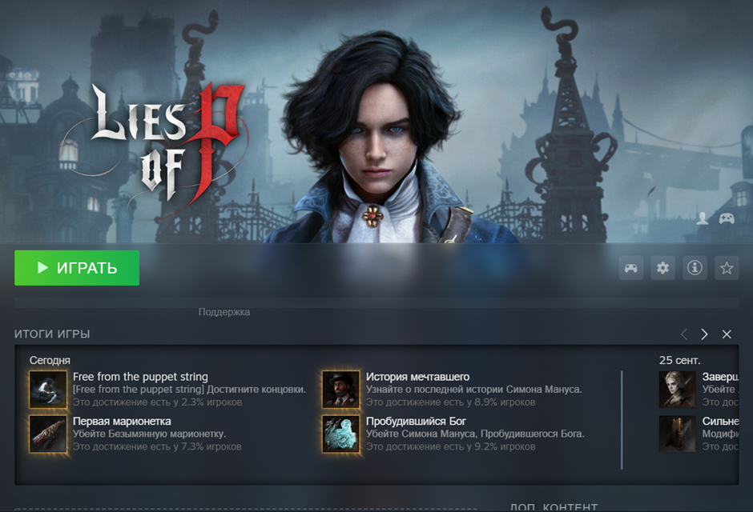

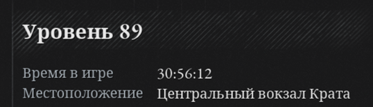

## Второе прохождение на мейне (после нерфов)

[Лаксазия без нанесения атак](https://youtu.be/IODoQqlR7ig)

## Третье прохождение (SL10) (11.11.2023)
Прошел без использования покумаемых расходников. Сердце-П прокачивалось.
На мое удивление, ран со стартовым уровнем оказался достаточно простым (сложным, но не мега хардкорным). Да, на некоторых боссах приходилось сидеть по часу, но не сказать, что это много. Наносимый дамаг по боссам и мобам был всегда приемлемый (ну кроме мануса, просто босс всегда жирный был). Можно было навесить на себя кучу предметов с резистами и ходить с небольшим перевесом, что бьет только по регену стамины. Даже почти все красные атаки не шотали перса с фулл хп (исключение: финальный босс). А также, можно было взять АБСОЛЮТНО любое оружие, и спокойно его использовать (главное вес не набрать слишком большой). Это приятно, что в игре нет таких ограничений в виде нужных статов для использования гана, потому что в соусах и их клонах такая система раздражала даже на обычном прохождении. На sl 10 моим самым используемым оружием была вилка (Трезубец Завета), потому что атаки у нее были достаточно быстрыми, имели огромную ренжу и в нативке криты. Катану я юзнул на одном боссе, слишком долго и сложно ее реализовывать, хоть и на бумаге достаточно сломана. До вилки юзал гаечный ключ, который себя показывал отлично на медленных боссах, но дальности атаки ему дико не хватало. [Лаксазия](https://youtu.be/gYFSuyPU-RY?si=yK99QRrL9SK6guO8), [безымянная марионетка](https://youtu.be/RmCYSvrcrZo)

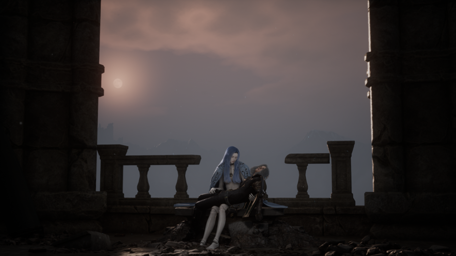

## Overture DLC.
## Прохождение длц на втором сейве (сложность: “Легендарный гвардеец”; все боссы) (21.06.2025)

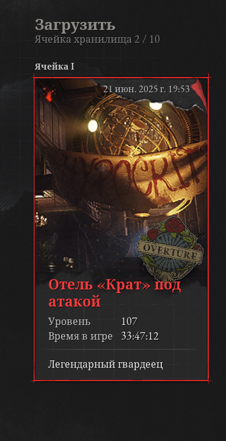

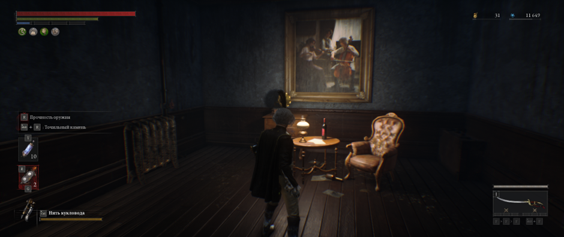
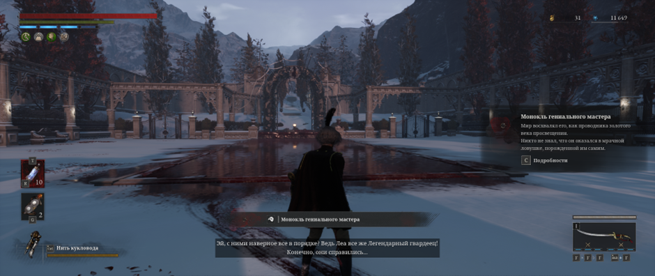

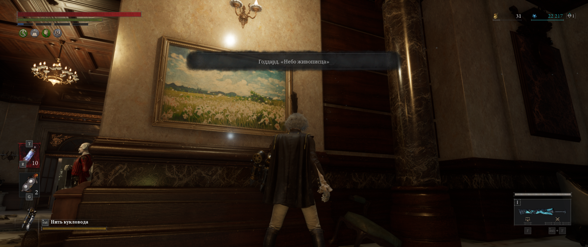
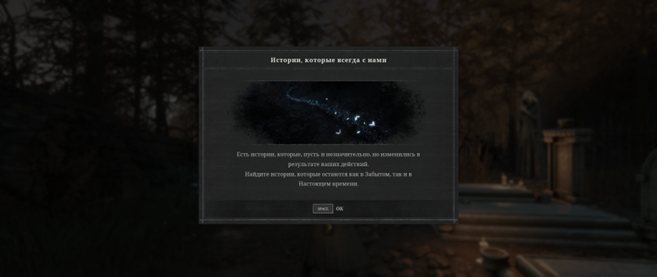

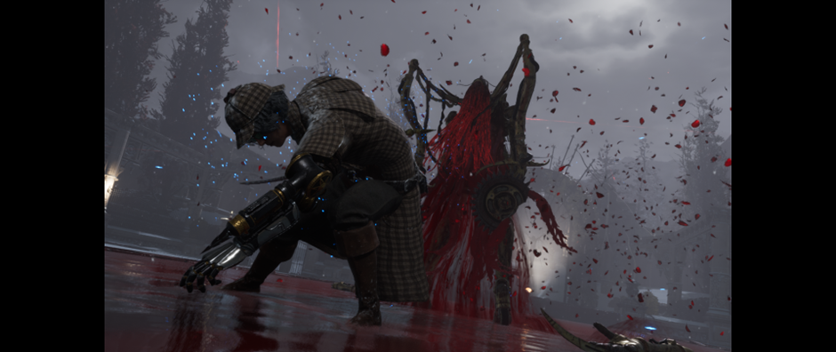
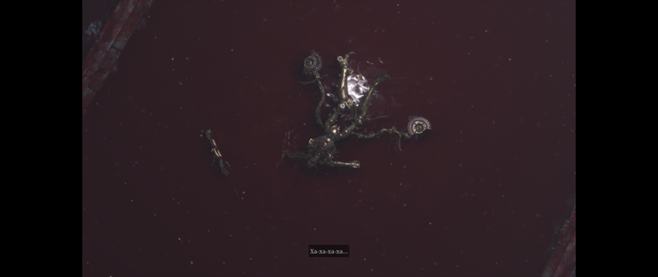

## SL10 на третьем сейве (сложность: “Легендарный гвардеец”; все боссы) (26.06.2025)
Как же меня уничтожал Арлекино, но просто на невероятном чуде и капельке скила получилось его победить. Остальные боссы тоже доставили некоторых проблем, но прям финальный на их фоне выделяется. Не очень уверен, что много челов это проходило на начальном уровне на НГ+0 без использования самонов, кубов и покупаемых расходников. На ютубе есть только 1 гений, который на арене + 5 сложности убил его на начальном уровне без получения дамага, но там амулеты и прокачка P органа из нг+2(3), с которыми урон разогнать в разы проще и стамина сама восстанавливается при дефлектах. Этого всего на обычном нг нет. Ты либо бегаешь без стамины, либо без урона (при этом ваншотаешься всегда). Амулеты в статы дают такую нищую прибавку, но без них тоже не вариант босса бить. Благо хоть гаечный ключ наносит хоть какой-то дамаг по хп и стойкости, а еще у него имбовое умение легенды, от которой финальный босс просто улетел на 1/5 хп в титры. Опыт от такого прохождения невероятно душный, но зато какое удовольствие было победить Арлекино при таких условиях

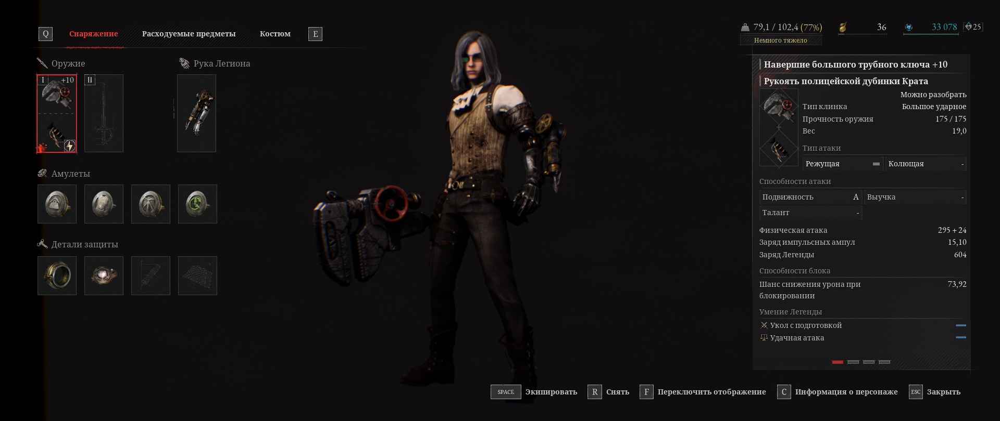

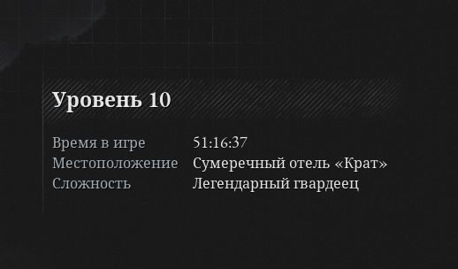

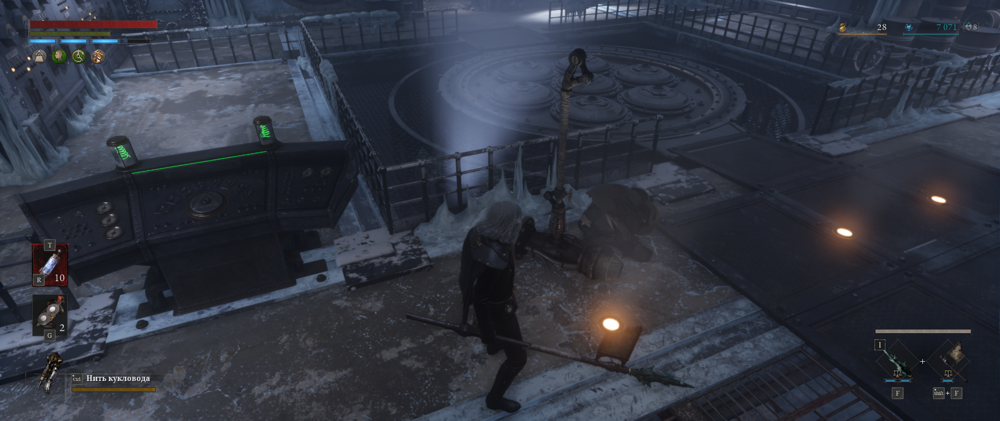
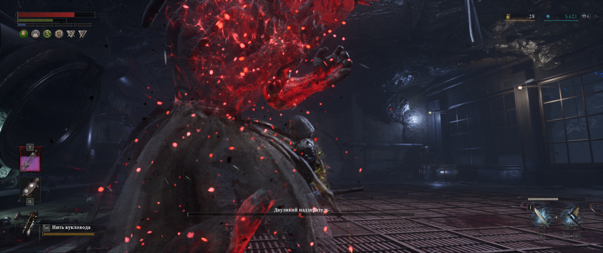
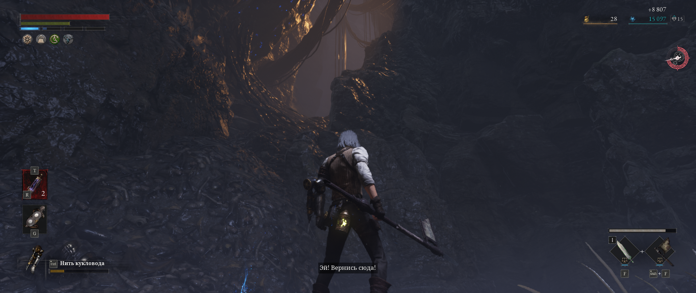

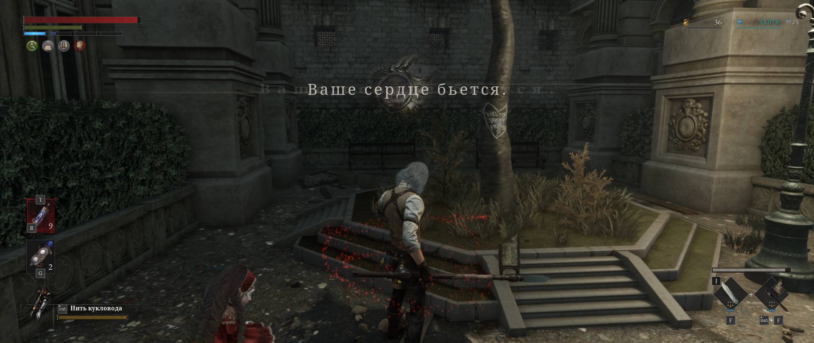

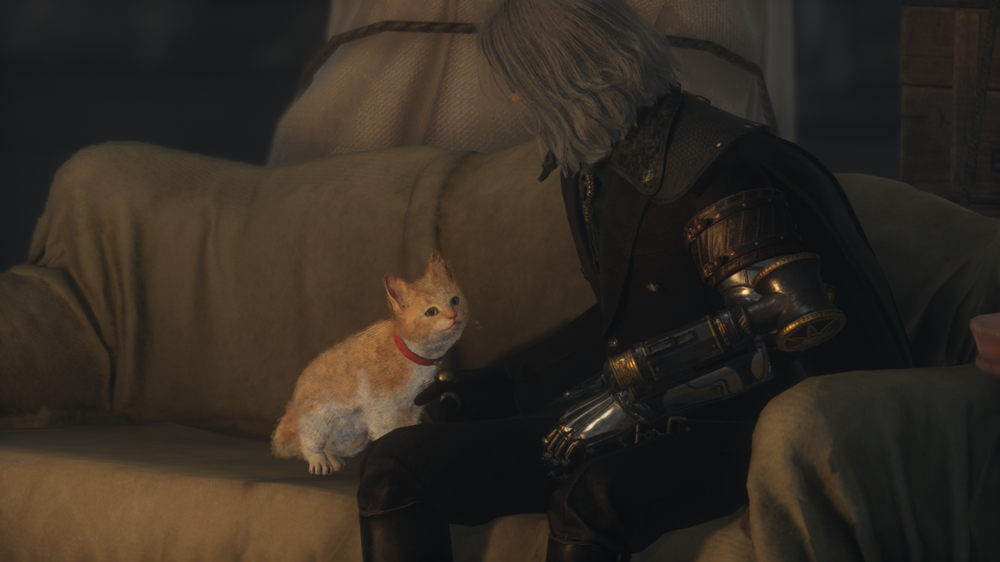