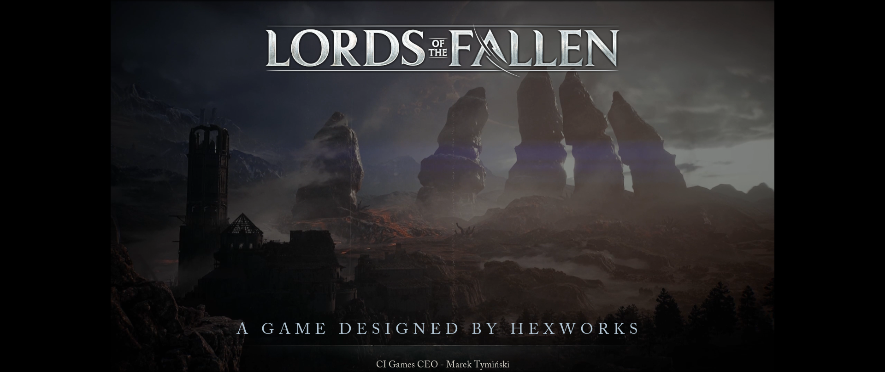
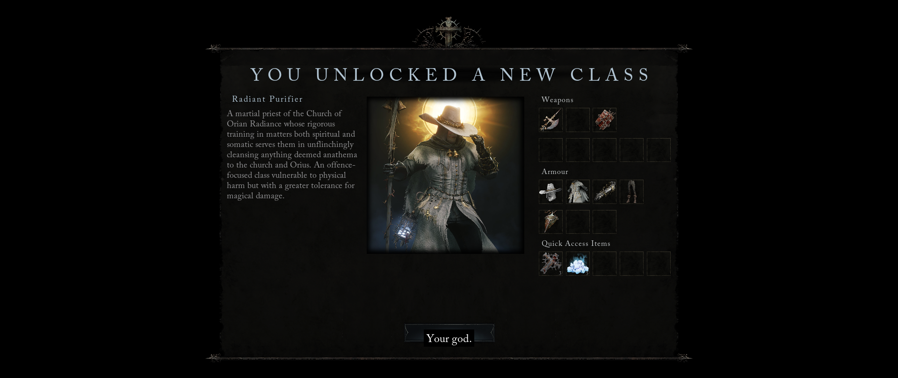

# **нищ дс 2 (legacy difficulty; radiance build) version 2.5**
Стоит упоминания. Я прошел почти половину игры на ветеране, увидел финального босса на ютубе (и комментарии к нему), удалил сейв и пошел проходить на легаси. Я не понимаю, как можно было сделать хуже, чем в оригинале. Максимальная сложность ветеран сделало игру душнее, браво.    
А теперь к изначальной (оригинальной) сложности. Какой же всратый баланс у игры. Эндгейм боссы наносят очень мало урона, рандомный моб сносит почти за 3 удара. Легаси (основная) сложность игры чутка лучше ветерана (харда) только потому, что обычным мобам не подкрутили кучу хп и урона, но боссы с мид гейма перестают ощутимый урон наносить (это еще если учесть тот факт, что почти все они максимально тонкие и их хп просто испаряется на глазах). Даже на финальном можно просто кнопку удара нажимать с перерывом на хилку. Большинство так называемых "боссов" начинают сразу появляться в игре как рядовые противники. Видимо настолько был "скромный" бюджет, что разнообразие врагов закончилось к середине игры. Основная "сложность" этого сосалика - это пройти локацию с кучей мобов и попытаться дойти до костра. Или скорее до возможности его поставить в определенном месте, так как большинство таких чекпоинтов требуют расходник, который ты либо фармишь, либо покупаешь (по сути платные скамейки). Еще хотел упомянуть, что последнего босса переделали в недавних патчах. Он стал лучше только на легаси, так как на ветеране челы его теперь пройти не могут (хд). Графон в игре норм, локи в целом тоже. Ощущения от этого продукта "вау, вышла вторая часть дарк соуса 2". Игра более-менее (особенно после патчей), но как будто любой другой сосалик (который не супер треш) будет лучше

