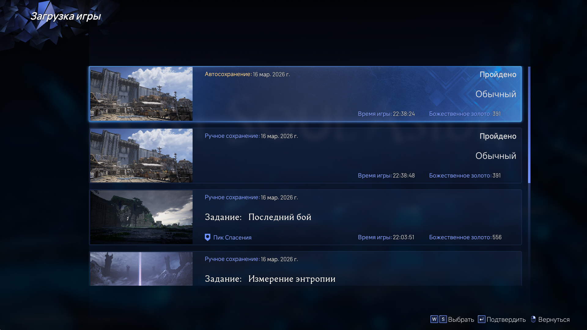
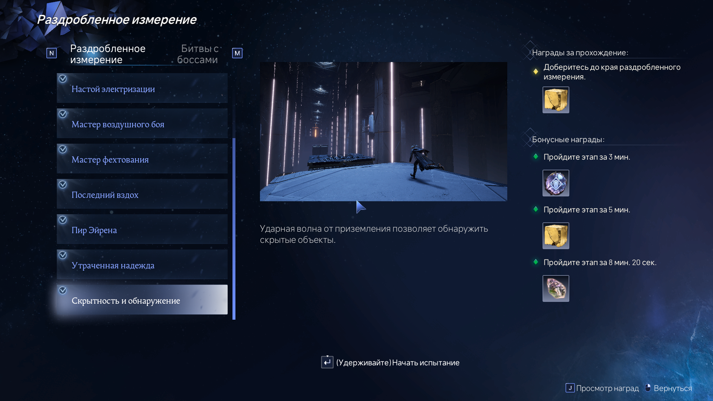

# **финал фентези XVI-2 (сложность: обычный)**
Финалка дома. Оберег Селерии не использовал, потому что игра и так слишком легкая (даже наоборот, я надевал на себя кольцо Золотого Льва, который на 50% увеличивал урон по мне, но сильно сложнее играть не стало). Только раздробленные измерения хоть как-то развлекали

