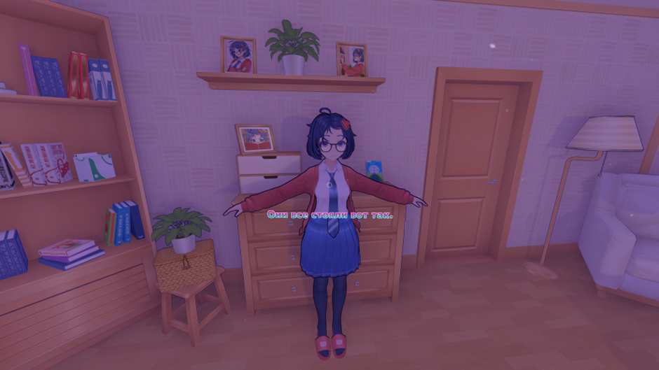
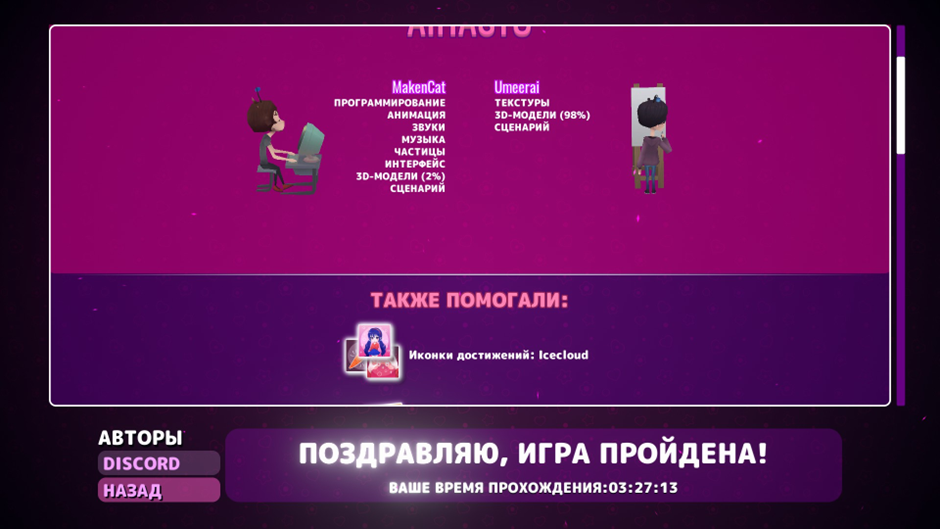
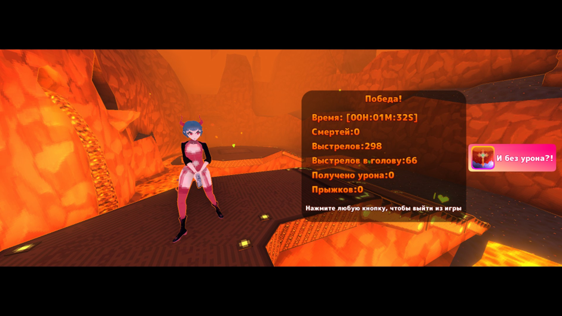

# **мисиде (version 0.923)**
Вообще, если без лютых паст на 10 страниц, то мисиде в целом неплохая бродилка в своем жанре. В ней хороший визуал, даже какой-то саундтрек есть. Может для «профессиональных» актеров озвучки итоговый результат в игре покажется трешаниной, но как обычный игрок ты этого не особо замечаешь + скорее всего, так и было задумано из-за специфичного сеттинга. Не знаю, че докопались до мини игр, они неплохо разбавляют бродильный геймплей. Но игра очевидно недоделана, так как нормального эндинга не завезли, много чего не показали из-за продолжительности, контента в целом мало. Хотелось бы большей нелинейности (хоть что-то приближенное к детройту, хэви рейну). Но так как в таком сеттинге из конкурентов только доки (2д визуальная новелла лол, это как манхву читать, только с меньшим количеством картинок) и яндере симулятор (кусок мусорного кода), то и ожиданий не так много

