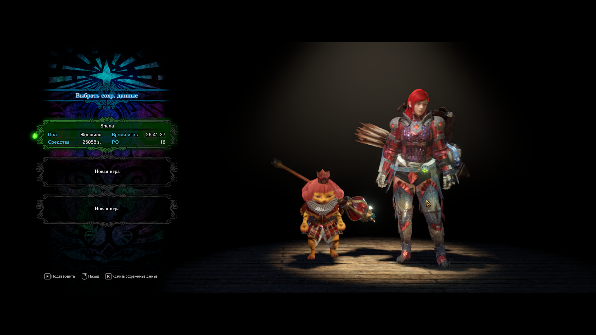
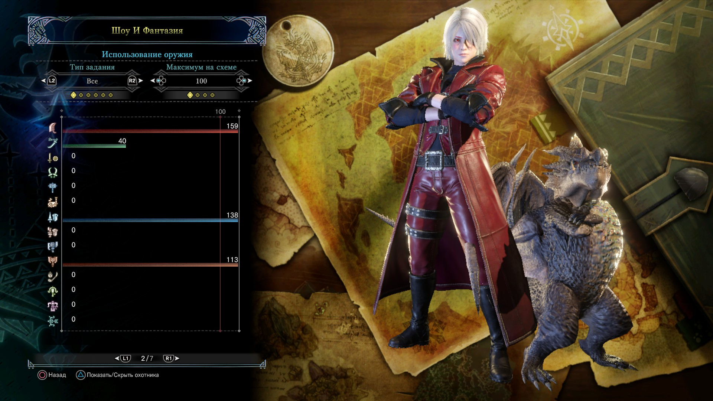
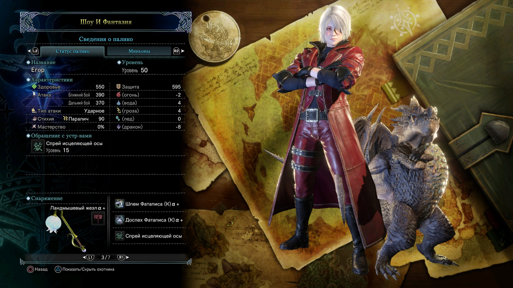
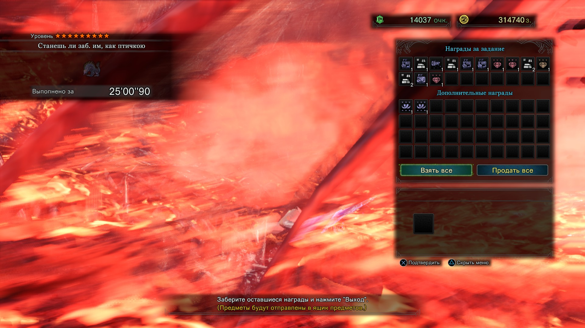
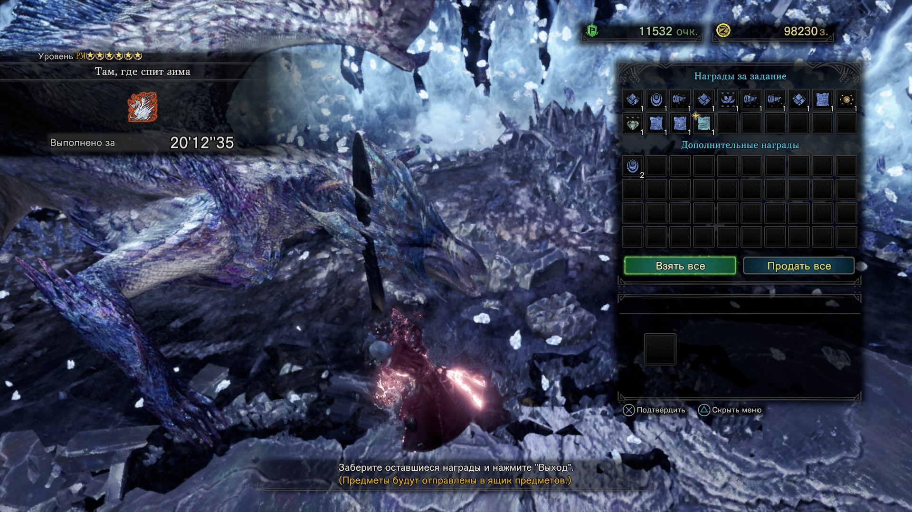

# **ледяной (2 прохождения (сейва): 1. Лучник, без дополнения; 2. world + iceborne с разными оружиями)**
## Первое прохождение с луком
Мейби в дополнении (которое больше самой игры, и которое нужно отдельно покупать за такую же цену) приходится гриндить шмот, но конкретно я с луком застрял только на Нергиганте, потому что он очень сильно любил станить и шотать. А так, игра отличная. Есть парочка странных моментов (например, приходится минут 30 собирать следы босса перед тем как его найти), но они не критичны на первом прохождении

## Второе прохождение с разными оружиями (world + iceborne dlc)
В целом длц прикольное. Добавили кучу крутых монстров (раджанг, велхана, брахидиоса и т.д.), новые мувы оружиям, локации. Но я до сих пор не понимаю такого восторга от Фаталиса. Максимально рандомный босс, который убивает тебя таймером, если у тебя нет крутого билда. Какой-нибудь Алатреон тоже душит таймером и необходимостью в стихийном уроне, но почти все его атаки это хорошая возможность внести дамага. У Фаталиса же половина атак никак не наказывается (спасибо сету АТ Велханы и греатсворду за нормальный таймер). И еще мне не очень понравился хватательный коготь. С него целиться в монстра очень неудобно, любая атака скидывает, дальность применения максимально низкая. Еще и камни надо подбирать постоянно, что не очень удобно делать на арене с боссами. Короче, для меня это худшее оружие охотника. Под конец игры очень много гринда надо, чтобы дойти до РМ 100. Самое то, чтобы побегать в мультиплеерами с челиками. Коллаборации тоже прикольно сделаны (кроме миссии Заказ: Дух Леса, она отвратительная). Путеводные земли я минимально трогал. Не очень удачный контент. Не знаю, кому пришло в голову так их дизайнить, но тратить еще 50 часов, чтобы все что нужно оттуда выфармить было в падлу. В целом все еще отличная игра, но эти косяки можно было и исправить, а не отправлять челов ставить моды на корректировку баланса (я ни один мод принципиально не ставил для игры. Хотя вот подсветку лута не мешало бы накатить)  
Заметка. Фаталис соло, Алатреон соло, Бахамут (Бегемот) соло, экстрим Бегемот в мульиплеере, Леший соло, древний Леший в мультиплеере, АТ Велхана в соло,фуриос Раджанг соло. Если что-то надо было подфармить, то залетал в мультиплеер. А так, обычно в первый раз я убиваю боссов в одиночку

