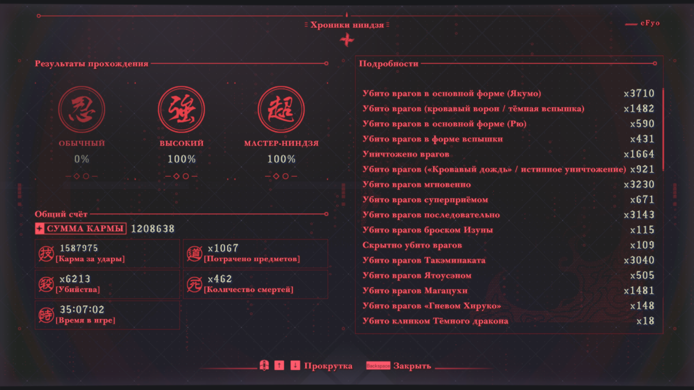
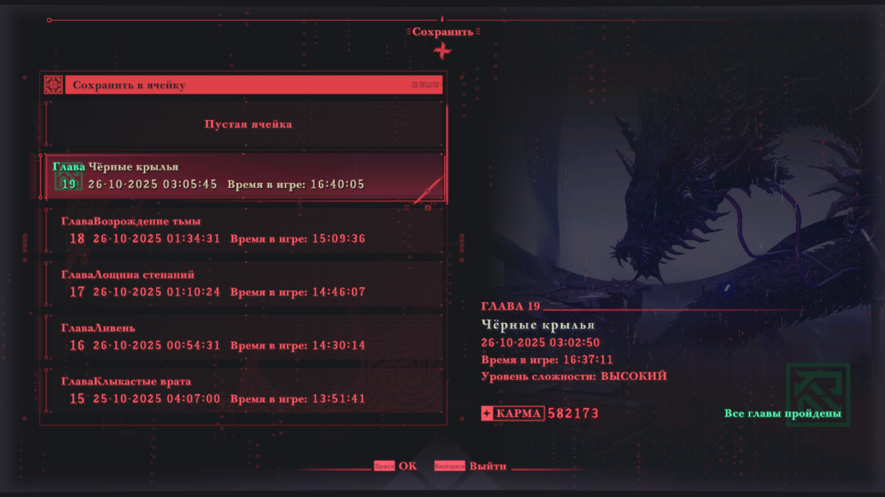
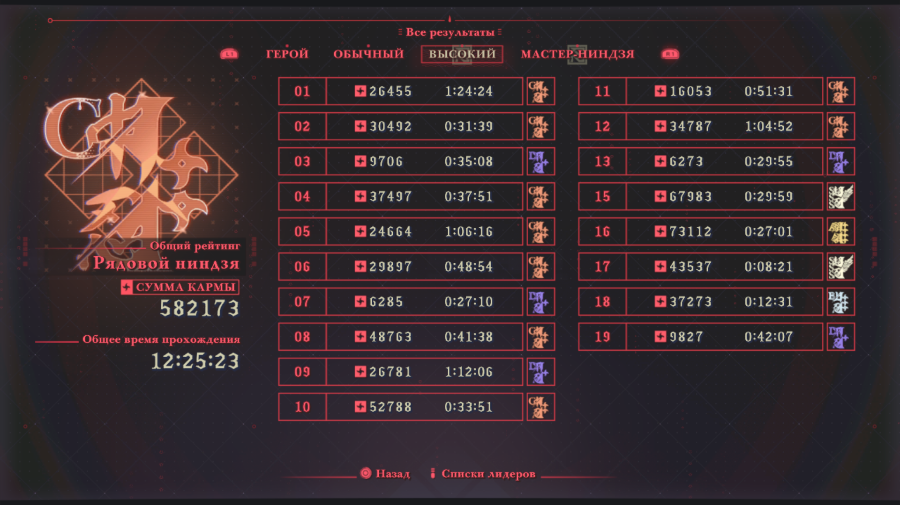
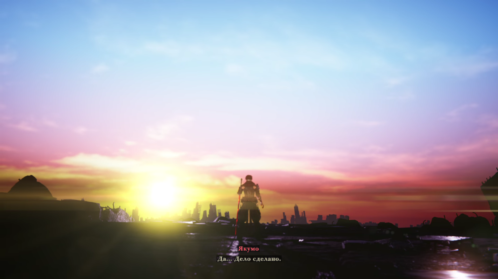
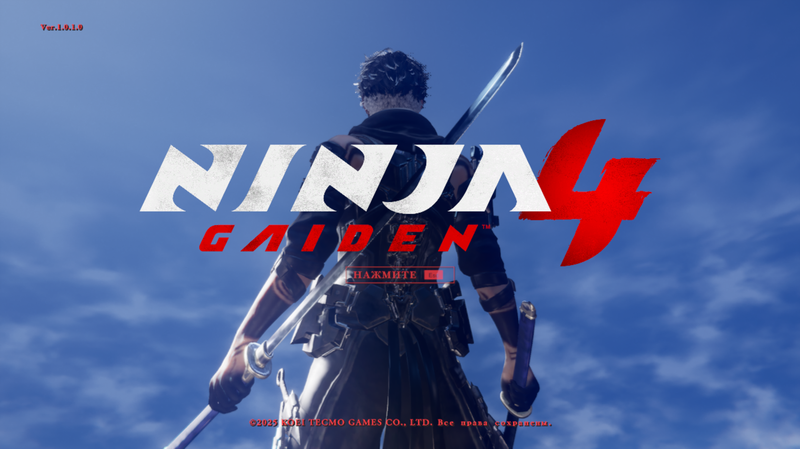
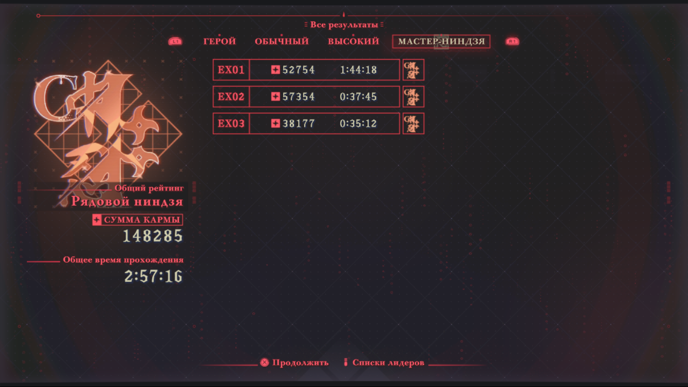
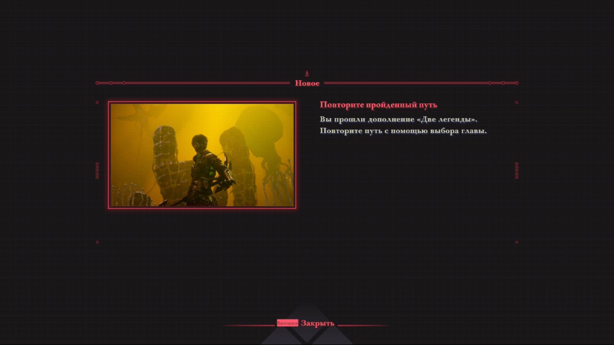
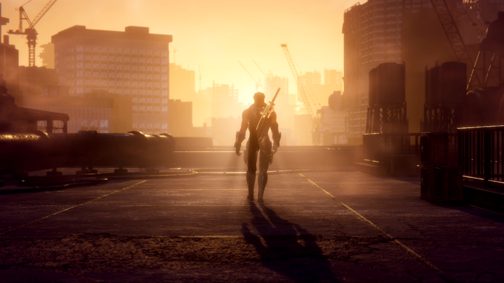
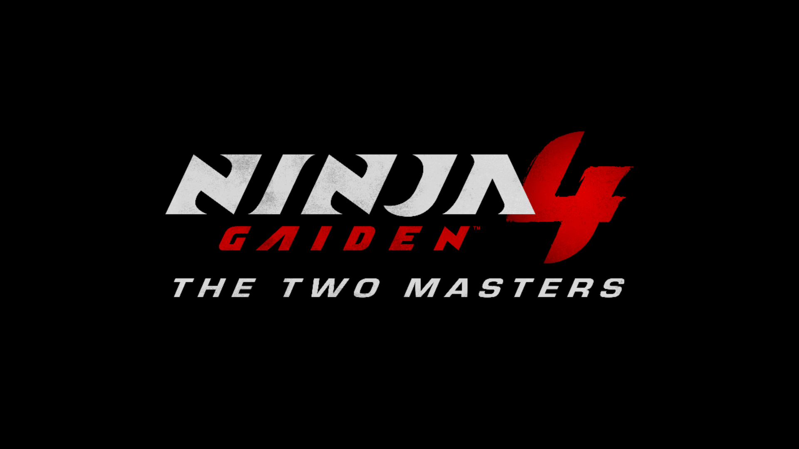

# **Лучшая экшен и слэшер игра (сложность: МАСТЕР-НИНДЗЯ, НГ+ Якумо + длц "Две легенды" тоже на МАСТЕР-НИНДЗЯ)**
## Основная сюжетка
Платинумы сделали шедевр. О сложности мастер-ниндзя: если кратко, то на нг+ очень проходимо. Расходники в игре слишком сильные, а наваливают их очень много (как и с деньгами в игре). Хотя и без лютого абуза на скилле очень хорошо проходится. Я только на последних миссиях начал по полной юзать бафалки

## Дополнение "Две легенды"
Длц шикарное. Не вижу проблемы в том, что оно короткое. С таким количеством нового контента продолжительность вполне адекватная

