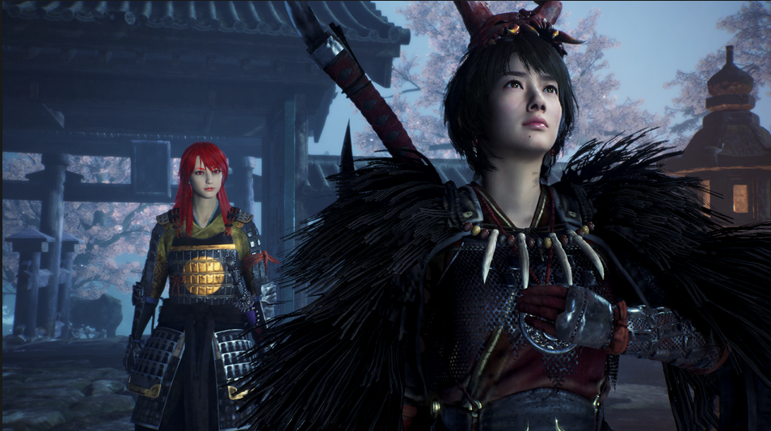
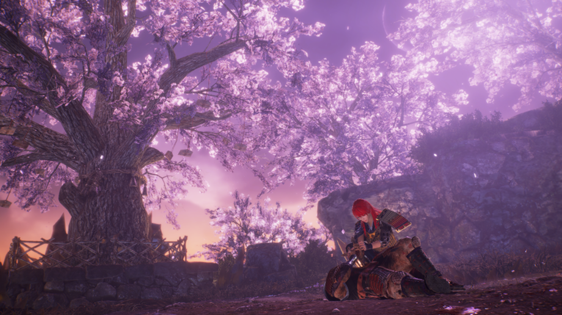
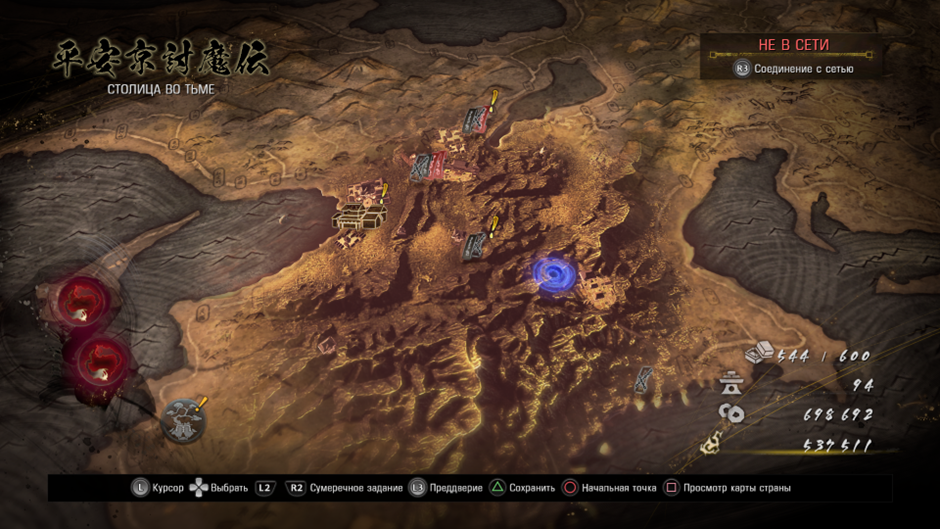
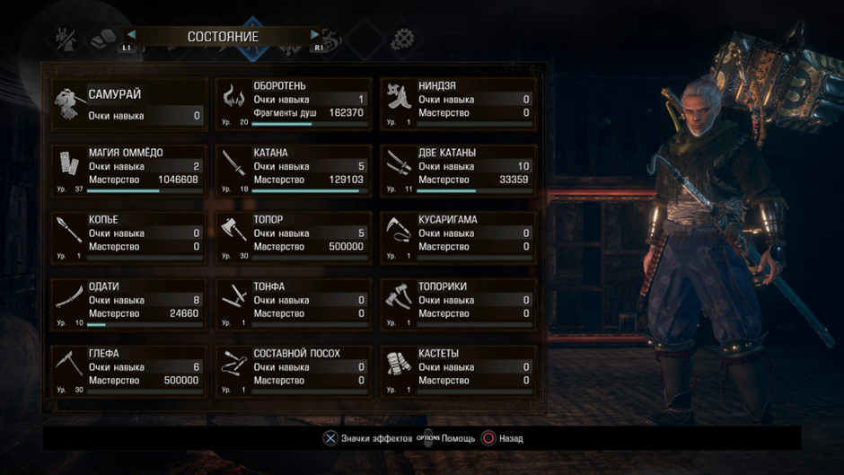
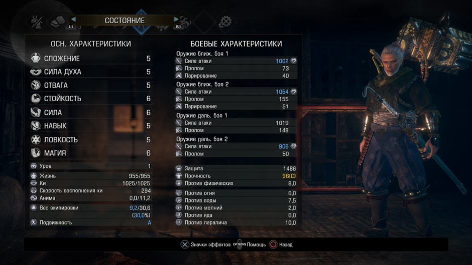

# **ниох2 (2 прохождения: 1. Катана гейминг, мэйн миссии, без длц; 2. SL1. Мэйн миссии основная сюжетка + мэйн миссии во всех 3 длц)**
Сразу скажу, что вторая часть стала в разы лучше первой, и что в нее точно стоит поиграть. Локи стали выглядеть в разы лучше. Разных мобов стало больше, и уже не так сильно раздражают повторы. Боевка стала разнообразнее, так как добавили особое парирование (контрудар на красные атаки) и способности демонов, что только пошло на пользу игре, потому что геймплей стал куда динамичнее. Боссы тоже теперь имеют 2 состояния: обычное и в мире тьмы. И сами по себе они стали гораздо лучше, чем были. Даже откровенно душных я в этот раз не обнаружил. Большинство боссов наказывают за бездумный блок, что тоже хорошо (есть специальные атаки, которые обнуляют стамину при блоке. Прокаченная на 99 стамина не даст соврать). Особенно порадовал последний босс, у которого было по 4 стадии. По своей концепции, он очень похож на душу пепла, только с куда более большим количеством хп и урона (в первой нио финальный босс был неведомый огромный треш). Хилки (и не только) теперь можно купить за кэшбэк с продажи всякого мусора (автопокупка даже есть), что избавляет от душного фарма. При входе на босс арену тебе сразу возвращают души и форму, не надо бегать и подбирать (ульту я принципиально всю игру игнорировал в обычном прохождении, и вполне без нее проходил). Это тоже прикольно. Диаблоидная система также осталась, но зато добавили новые оружия и они даже прикольные. Смена стоек стала полезнее, по ощущениям. За редактор персонажа тоже огромный лайк. Больше могилок с призывом союзников, да и сама игра как-то комфортнее стала для новичков. Кстати, не стоит повторять мою ошибку, и скипать все катсцены, потому что я не нашел на ютубе адекватного объяснения сюжета 2 части. Из минусов: структура уровней, которая редко меняется; незначительные (по сравнению с прошлой частью), но повторы мобов и лок; суперское повествование сюжета. Вторая часть отлично справилась с исправлением ошибок прошлой игры. Лучше начать со с неё, скипая первую. Если от прошлой части меня больше тошнило, то тут ситуация сложилась, наоборот.

## SL1 основная сюжетка + все 3 длц (только мэйн миссии) (было очень больно)
Почти на всех боссов стабильно уходило по 2-4 часа, а иногда и больше. Есть парочка исключений, которых я случайно убил за 2-3 трая, но это скорее удача. К каждому боссу приходилось искать какой-то подход (свапать оружия, ёкаев). В основном использовал глефу и топор, но на последнем боссе третьего длц переключился на катану, так как мне показалось, что с ней мои шансы успешно задоджить его двойные атаки мечами гораздо выше, чем с любой другой пушкой (ну по итогу так и прошел). Никаких ограничений (кроме 1 лвл героя) в ране не было, но даже так это не особо облегчало задачу. Из магии использовал только талисман чистоты, что-то новое придумывать я не хотел. Специально выфармливать какие-то шмотки или оружия я не стал (даже могилки только в начале чистил, потом перестал), носил то, что дропали мобы и боссы. Поэтому дамага было не так много, как хотелось. Умение делать комбо с помощью оружия и способностей ёкаев приносит ощутимый импакт в боях. И только в этом ране я придрочился к тому, что надо постоянно переключать стойки, так как это тоже вносило лютый импакт, если ты умело ими пользуешься (спидраны с ютуба это показывают). Самый напряженный босс файт был с носителем кошмаров. Его атаки двумя мечами одновременно + взрывающийся пол, было невероятно сложно доджить. Все-таки, (на достаточном везении) удалось его пройти. Перепроходить для видео я уже передумал, но есть видос с [Отакэмару](https://youtu.be/gCqqZlioD5U?si=8YiCb4AQfGPNqFFf) (основная сюжетка)

