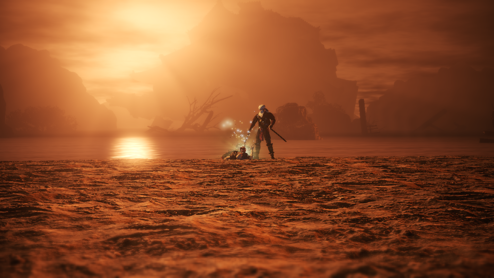

# **НИОК**
- Она очень долгая, если учесть, что я проходил только мейн миссии. С этим можно было бы смириться, если только не было скучных и однообразных лок.
- Ключевой минус: минус босс котик (белый тигр, хотя че там от тигра мне до сих пор непонятно), земля пухом.
- Игра всячески одобряет и даже заставляет фармить себе лвл (что указывает рекомендованный уровень миссий), зельки (по дефолту у тебя их 3 дается, но можно разбить шмот ненужный, и у тебя будет 8 хилок. Или собрать ВСЕХ зеленых чудиков на карте), предметы, УЛЬТА, потому что средний игрок задушится траить боссов около идеально.
- Несколько боссов были прикольными (окацу, ода нобунага), большинство более-менее норм, но были прям ужасные и максимально наглые, на которых требуется нереальное задрачивание или максимальная удача.
- Большинство локаций - унылый коридорчик.
- На перекатах фреймов неуязвимости мало.
- Если говорить про прокачку статов, то она весьма специфична. Ты намертво привязан к одной пухе, если собираешься качать только один стат. Но если ты начнешь равномерно распределять очки, то такими темпами можно не скоро закончить игру (ну магия оп, так что все может быть не так плохо).
- Про стойки я даже хз че сказать, потому что я ими банально не пользовался, так как мне они показались максимально ситуативными. Средняя стойка всегда была лучшим выбором по соотношению дамаг/подвижность. Но сама боевка мне больше понравилась.
- Почему мне не дают ульту сразу на босс файте? Почему ее нужно выфармливать перед тем, как войти на арену к боссу? Не очень понятно. Как итог: забил на нее, даже не прокачивал. Когда была возможность ультануть - ультить, а не было - продолжал тыкать палкой.
- У большинства боссов огромный хп бар, поэтому файт минимум 5 минут идет, если делать все идеально. Ну это не особо минус игры, просто держу в курсе.
- Для меня прям нереально сложных боссов не было, но были максимально нечестные, но это уже не в новинку, поэтому в некоторые моменты придется открыть форточку, иначе велик шанс задушиться, и больше не открыть эту игру.
- Рядовые мобы постоянно повторяются.
- Кульминацией стало то, что после скриншота у меня должен был пойти мультик и титры, но игра внезапно ВЫЛЕТЕЛА, и откатила меня к ласт боссу основной компании, поэтому на длс боссов я забил болт. Больше нет особого желания запускать игру.

Если какие-то итоги подводить, то игруха чисто на 5 баллов. Все-таки какой-никакой челлендж. К этой боевке приходилось адаптироваться, а когда привыкаешь, становится гораздо легче. По моему мнению, лучше в другие соусы поиграть. Потому что игра балансирует между честной сложностью и духотой

