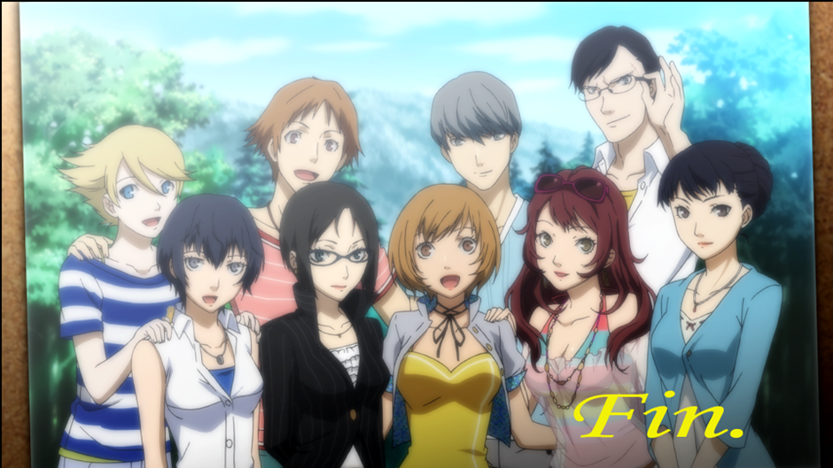
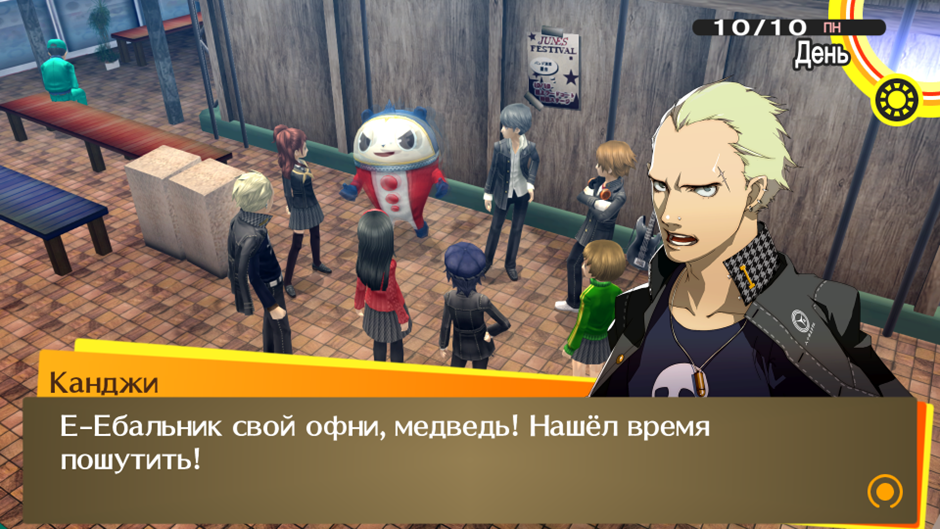
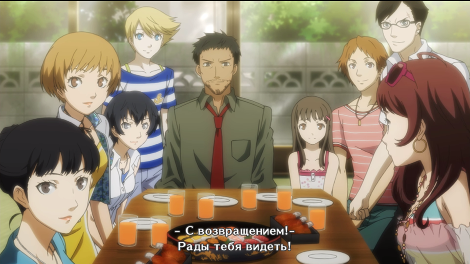

# **золото (сложность: Normal; True Golden Ending)**
За русские буквы спасибо [Работягам](https://vk.com/rabotyagi_rus). Выбрал транслитерацию Хэпбёрна, потому что хотел более фановый перевод. Крупных косяков в нем замечено не было, смело рекомендую. О самой игре. Саундтрек 10/10, как и стилистическое оформление в преимущественно желтом цвете (ну и большинство локаций отлично смотрятся). Супер много гриндить не приходилось, максимум перед митсуо и тру финальным боссом. Боссы интересные, социальные линки тоже. Почти все концовки выбил, кроме Адачи (я с ним вообще не общался). Из парочки негативных моментов (спойлеры): предугадать, кто убийца, практически невозможно, вплоть до конца игры (даже если внимательно следить за ним все время); какой смысл был убивать Нанако, если вы потом ее оживляете через 5 минут (драма теряется); Люцифер не такой сильный, как в смт 3 (хорошо, что я не стал ради него гриндить) (хд)

