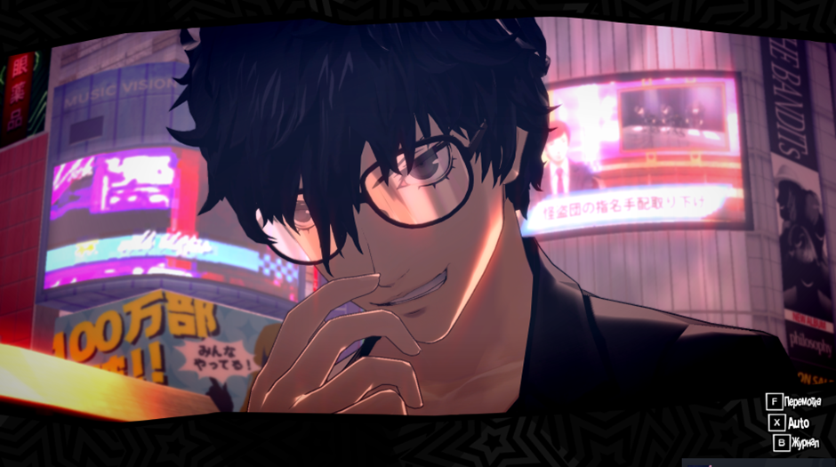
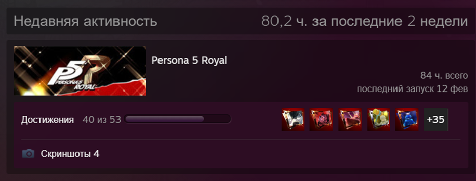
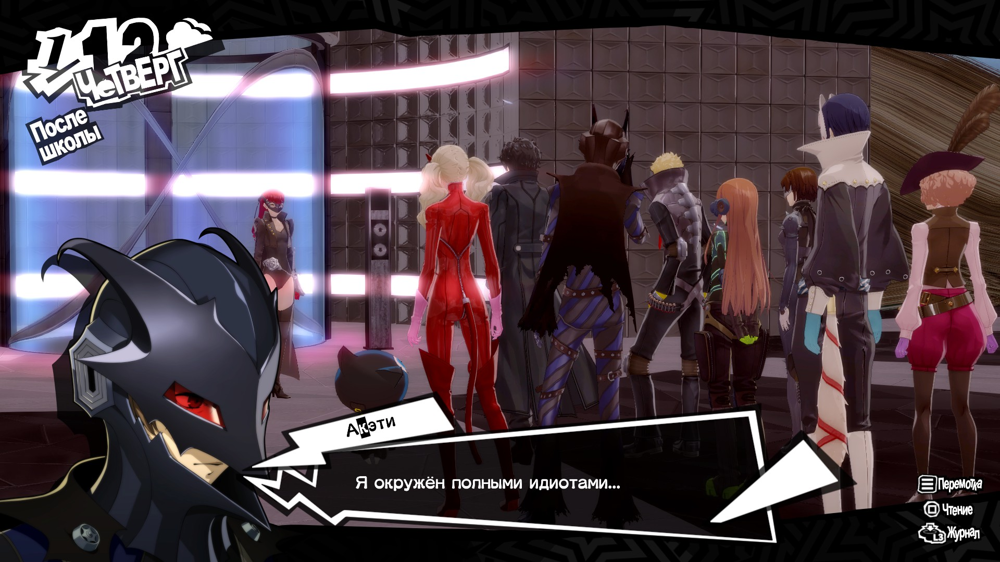
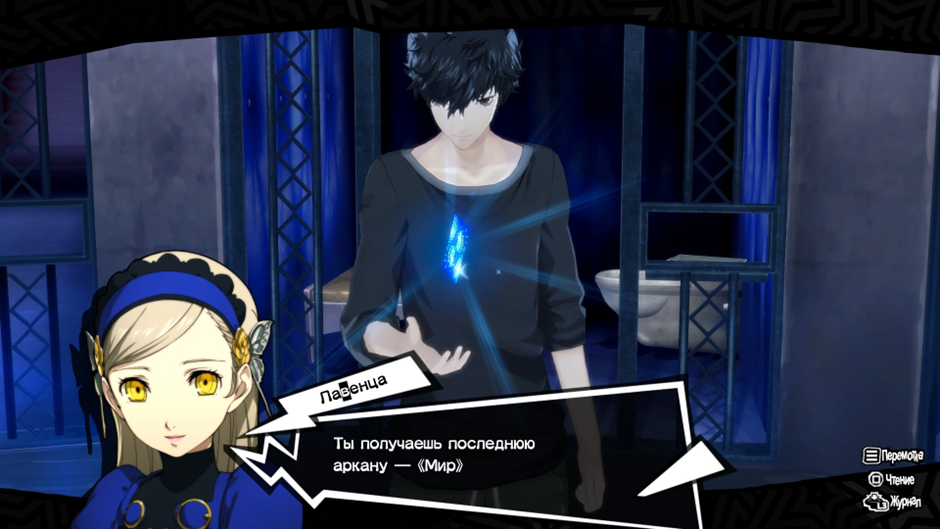
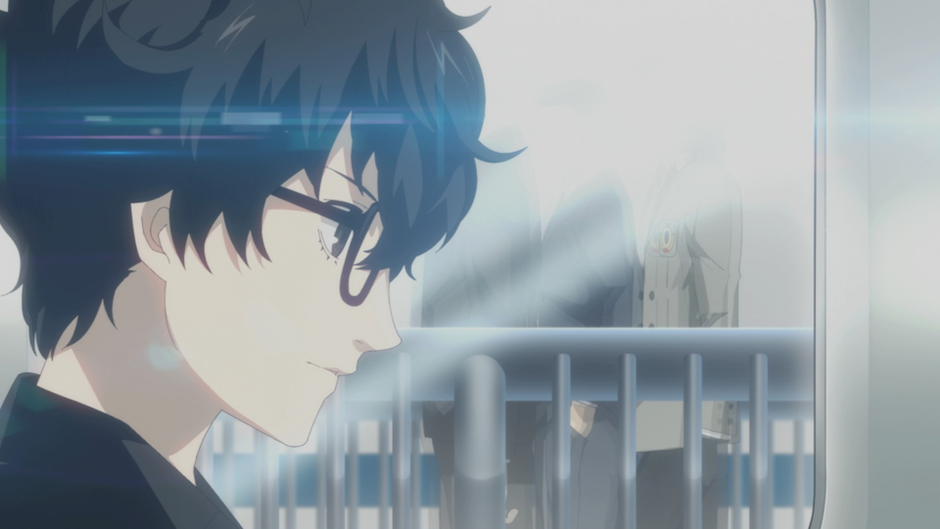
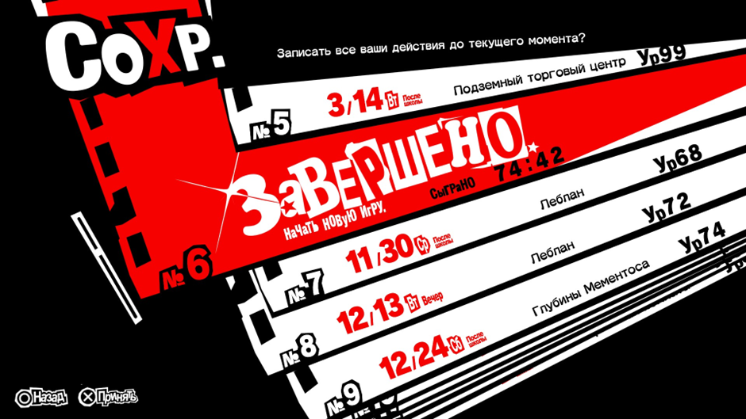

# **P5R (2 прохождения: 1. Нормал без третьего семестра; 2. Хард дифа с третьим семестром. Ограничения на харде: без использования бесплатных персон из коллекции, без использования в битвах идзанаги но оками, без использования бонусного контента (костюмы, расходники, деньги))**
## Первое прохождение (Normal; True Vanilla Ending)
Я проходил без спойлеров, поэтому забил на Маруки в середине прохождения. Только потом узнал, что он нужен для анлока 3 семестра, но уже было поздно. Поэтому мое прохождение закончилось на истинной концовке оригинальной персоны 5. Еще спасибо [челам](vk.com/persona5ru) за перевод

## Второе прохождение (Hard difficulty (сложнее merciless); True Royal Ending)
Даже без использования имбовых длц персон в игре все еще есть Люцифер, Йошитсуне и Метатрон. Но даже если не использовать их, то с оставшимися вариантами игру будет все равно легко пройти. Потому что тиммейты в лейте тоже способны наносить кучу урона, а также жестко бафать и дебафать. В этой игре не так много боссов, у которых много ходов, и которые способны шотнуть хоть кого-то. Только Маруки показал хоть какой-то дамаг в лейте и заставил немного подумать. В игре я умер максимум 4 раза, и то в ирли гейме. Ближе к лейту меня вообще ни один босс не смог убить. Еще и экспы с голдой щедро насыпают. Короче, мем “play a real smt game” обретает смысл (серьезно, даже в 4 персоне у меня на нормале было куда больше проблем). Если говорить про сам дополнительный контент в виде третьего семестра, то атлус проделали отличную работу (время вышло достаточно коротким, потому что я пропускал большинство диалогов, которые уже видел в прошлом прохождении)

