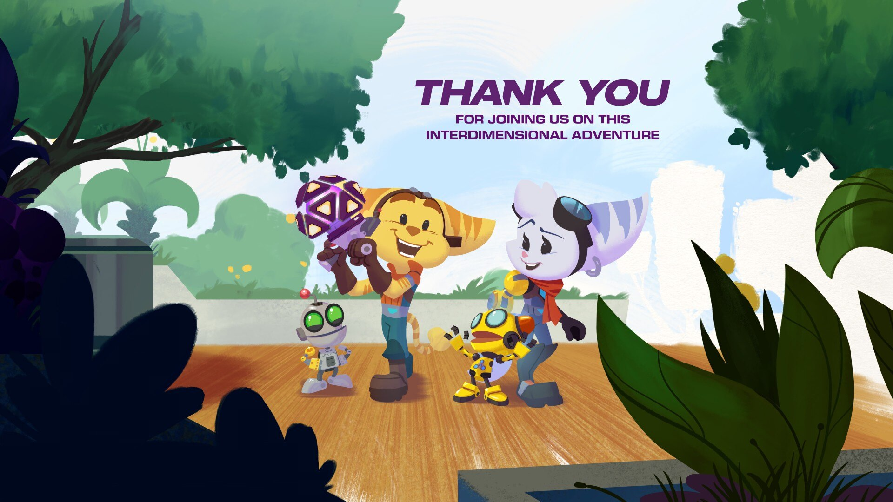

# **Пушистики (сложность: легенда)**
Игра является безумным аттракционом веселья. Не было ни одного эпизода, который был бы максимально скучным и нудным. Графон (вместе с эффектами) шикарный, глаза радовались до конца игры. Порт и оптимизация этого всего сделана достаточно хорошо (1 вылет за всю игру и парочка минорных багов, которые фиксятся рестартом контрольной точки). Доступного разнообразного арсенала вполне хватает на всю игру. Сцены тоже поставлены отлично. Отдельно стоит отметить взаимодействие игры с геймпадом. Миллион видов вибрации на любое действие, адаптивные триггеры, которые имитируют каждое оружие. Единственная игра, которая раскрыла геймпад на все 100 процентов. Геймплей прикольный, но максимальная сложность для меня была достаточно простой (даже на геймпаде без включенной помощи в прицеливании), хотелось бы немного хардкорнее. Мини-боссы и обычные враги достаточно интересные (даже не смотря на то, что они часто повторяются). Саундтрек в игре шикарный. Одна из немногих игр, где я выкручивал музыку поверх остальных звуков, чтобы послушать.
Сюжетка просто норм. Для человека, который впервые знакомится с серией, самое то (только жалко, что предыдущую часть не портанули на ПК)

