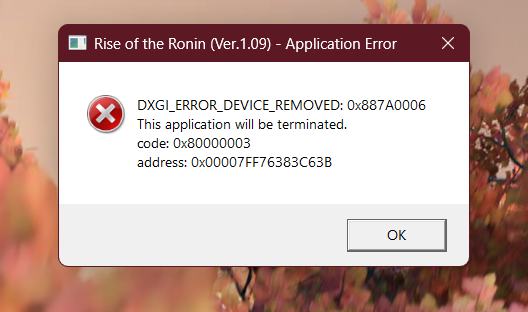

# **Кусок японского кода (дроп)**
Уже давно пора было перестать делать игры на своем кастрированном движке, но у тим ниндзя свои планы на этот счет. Низкий фреймрейт, периодические вылеты игры по необъяснимой причине и все это при графике со времен PS3. Так мало того, геймплей стал в разы хуже, если сравнивать с предыдущими играми этого же издателя. Кому вообще пришла гениальная идея забиндить парирование на Y, где обычно находится силовая атака. Ну я еще могу понять подход в ву лонге, но конкретно это решение тяжело осмыслить. Сами оружия по ощущениям стали хуже ощущаться и играться, в сравнении с нио. Боевка не чувствуется из-за этого динамичной. Если по отдельности брать каждый элемент, то везде чувствуется какой-то даунгрейд. В итоге получился какой-то ужасный клон цусимы. Короче, тим ниндзя расстроили. Я надеюсь, что они сделают определенные выводы и перестанут выпускать настолько неоптимизированный продукт

