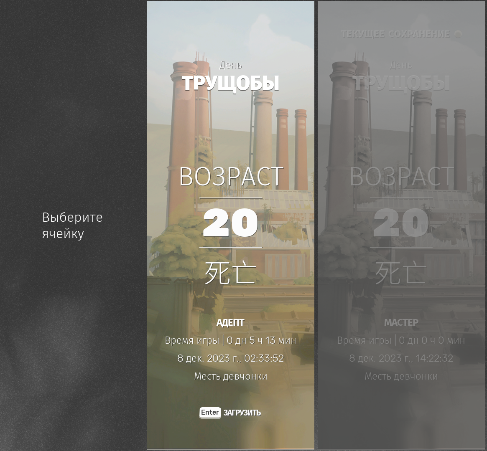

# **сифу (сложность: адепт)**
Сифу на нормале я закончил за 5 часов, учитывая закрепы на всех уровнях. Игра очень короткая, всего 5 уровней. Все бы ничего, если бы боевка была бы на уровне секиро, но увы, получилось хуже в разы. Там, где нормальная игра тебя за секунду предупредит, что сейчас будет атака снизу или особая атака, сифу кладет болт и заставляет наизусть заучивать тайминги каждого выпада босса. Окна для парирований и уклонений, соответственно, супер маленькие. А на большинстве уровней, шорткаты не ведут прямо к боссу. Игра-то сама по себе достаточно интересная, но столько неоднозначных моментов

