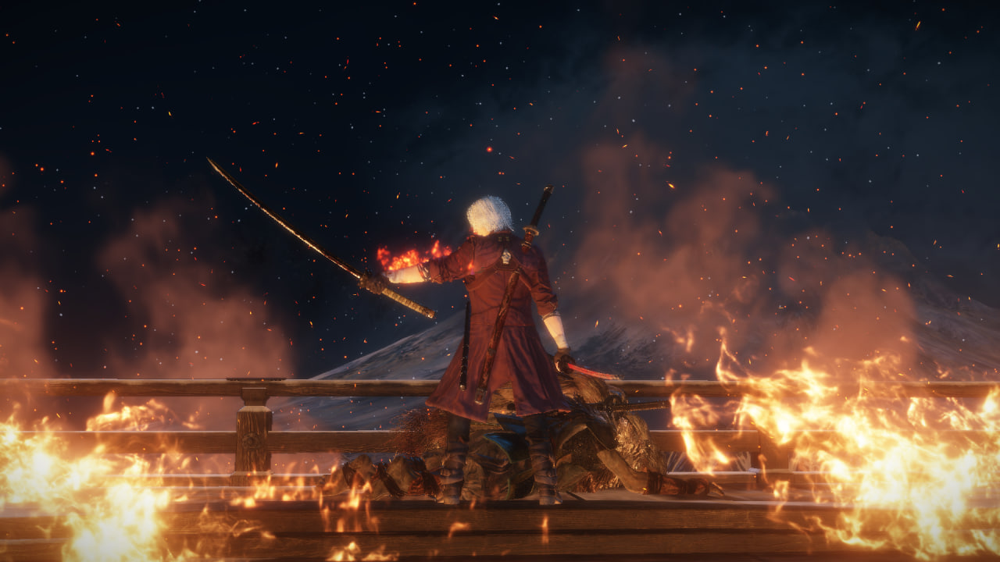
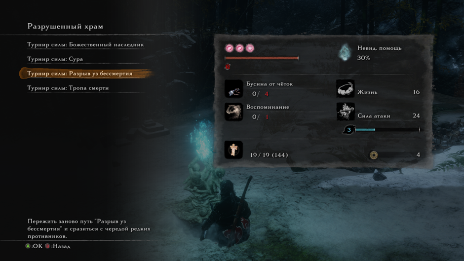
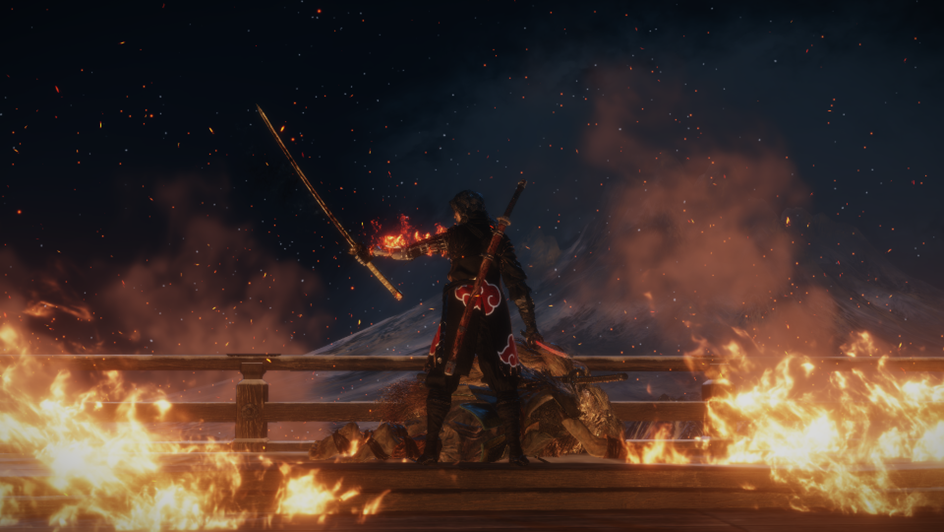

# **Глубокий вдох, громкий выдох. Как кипит моя кровь (Прохождения: ванильная с двумя ответвлениями и со всеми боссами в игре, в том числе и иными (с амулетом Куро); Sekiro:Resurrection Ver. 1.15 App Ver. 1.06 с двумя ответвлениями и со всеми боссами, кроме иных (с амулетом Куро); ванильная с двумя ответвлениями и со всеми боссами в игре, в том числе и иными (БЕЗ амулета Куро))**
По моему мнению, Cекиро является лучшей игрой Миядзаки. Почти все боссы сделаны отлично, откровенных проходных нет. Лучший финальный босс в линейке игр автора. Уникальная боевка, которая не похожа ни на одну из его предыдущий игр, и которая работает просто отлично. Дизайн локаций, который не уступает дс1, а иногда даже и превосходит его. Играть стало куда интереснее, потому что бои стали более интенсивные и требует от тебя не просто нажимать одну кнопку переката. При этом, вариативность подхода к боссам достаточно высокая, ведь существуют протезы и разные комбо (даже действия на одну и ту же атаку противника могут сильно различаться), которыми еще надо уметь пользоваться в разных ситуациях. Геймплей быстрый и динамичный, так как механики игры способствуют этому (концентрация, толстенный хп бар, высокая подвижность мобов). Даже музыка отлично дополняет игру и позволяет чувствовать ритм атак противника. Единственное, что в игре не так - это тот факт, что протезы используются за эмблемы (которые нужно фармить). Короче, игра 10

(Sekiro vanilla)

## Sekiro: Resurrection Ver. 1.15 App Ver. 1.06. Если затрагивать сам мод, то он супер. Боссы стали гораздо интереснее и сложнее + куча других нововведений. Самое то для тех, кому ванильный Секиро наскучил

(Sekiro: Resurrection Ver. 1.15 App Ver. 1.06)

Isshin, Saint Sword (Sekiro: Resurrection Ver. 1.15 App Ver. 1.06)
https://www.twitch.tv/videos/1966225257
(Sekiro: Resurrection)

## Паста про усложненный режим игры (без амулета Куро)
Оформил 2 забега с нового сейва без амулета Куро со всеми боссами (и их иными версиями) на ванильной версии игры. На удивление, Филин и остальные его 2 версии отлетели чуть ли не за первые траи, а вот Госпожа Бабочка резко начала напрягать на турнире силы. Из примечательного. Почти все выпады, усиленные атаки и граб-атаки шотают на фулл хп. Даже через блок у тебя почти нет шансов выжить, если концентрация на грани срыва. Поэтому, отстоять в защите не получится, нужно учить каждый замах босса, и парировать его. Новыми красками заиграли протезы в турнире силы, так как там не тратятся эмблемы и расходники, поэтому их можно спокойно использовать (особенно выделяется зонт, которым можно парировать все атаки (даже грабы), кроме круговых, а затем моментально использовать его для усиленной атаки с определенным эффектом. Сюрикены тоже себя здорово показали с навыком, которые позволяет после использования протеза делать длинный рывок + атаку к боссу за короткое время). В обычном прохождении, подход: "буду просто стоять и парировать все атаки босса (иногда делать тычку), чтобы убить его через концентрацию" переставал эффективно работать где-то с середины игры. Без амулета Куро - это перестает работать с нулевой, поэтому приходится комбинировать парирования, агрессивный стиль игры и перекаты, чтобы наносить урон по хп босса. Так и дамаг по концентрации больше становится, и босс не успевает ее восстановить. В этом плане Филин - идеальный пример, где у тебя 1/3 файта - это атака по нему, другая 1/3 - парирования, а оставшуюся 1/3 составляют перекаты (или протез зонт) там, где парирование атаки использовать не вариант (в силу того, что ты будешь в долгой анимации после парирования), так как вместо нее можно дать халявную тычку по врагу. Ну и единственное, что меня не устроило - это количество хп у демона ненависти. Мало того, что этого чела тыкать минут 10, так если ты хоть раз ошибешься, то с большой вероятностью отправишься на костер (ну или воскреснешь, а только потом отправишься на костер). А еще, он играется так, как будто я в элден ринг зашел первым лвл'ом бить великана. Поэтому пришлось использовать так называемую "фишку", где ты его просто скидываешь с арены, и он умирает. Формально, никакие баги и глитчи не используются, только игровые механики, просто разраб не думал, что ты сможешь долететь и схватиться за нужную стенку. Да и в принципе, резчик (демон ненависти) и сам остается доволен своей участью, так что не вижу в этом ничего плохого хд. Больше чизить никого не приходилось. Ну и в принципе, Куро не врал, когда говорил, что я себя обрекаю на "страдания". Пришлось некоторых боссов закреплять, хотя их мувсет я примерно помнил

(Sekiro vanilla charmless)

