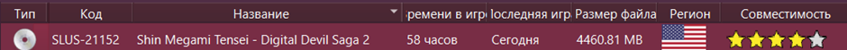
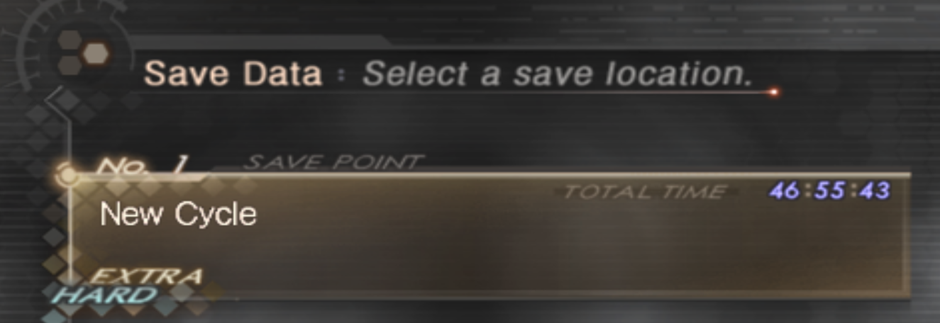
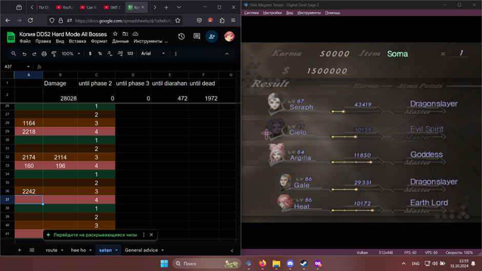
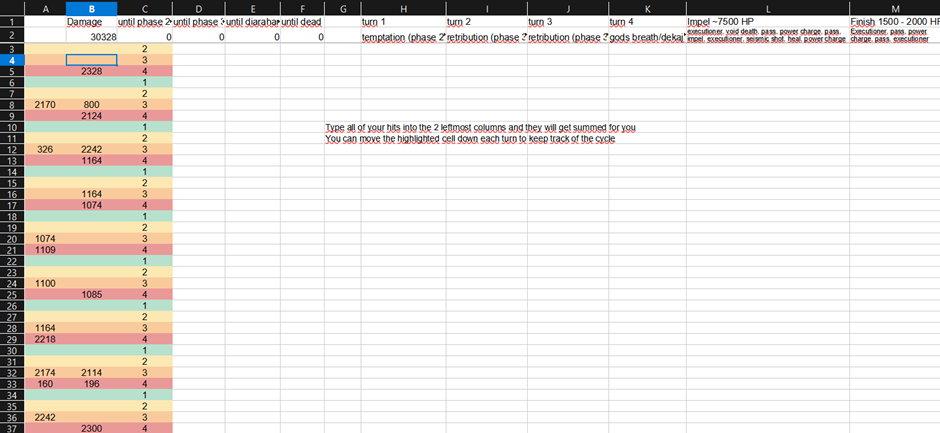
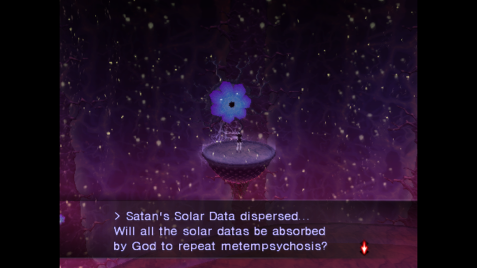
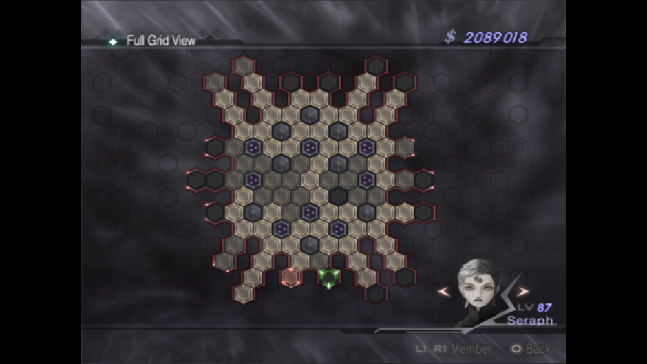
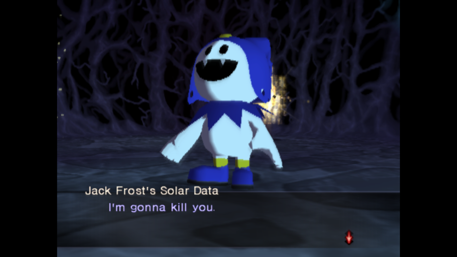
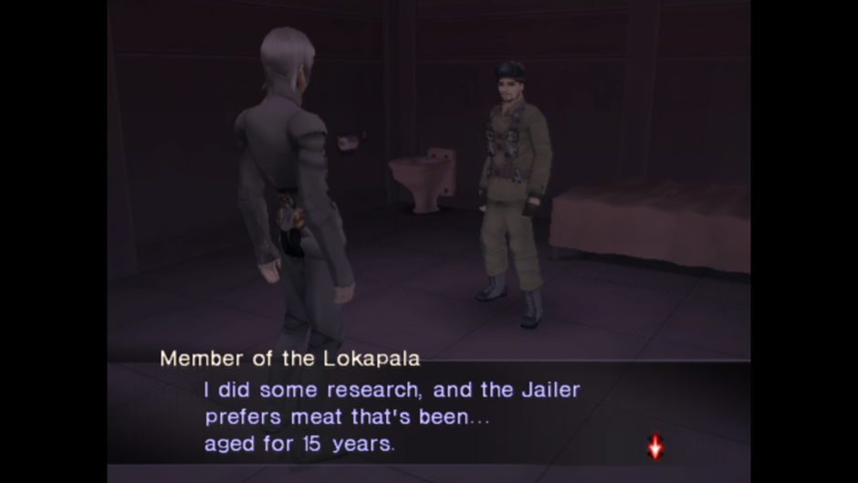
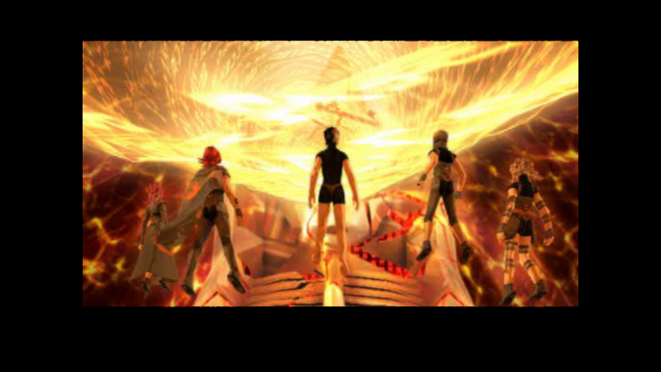
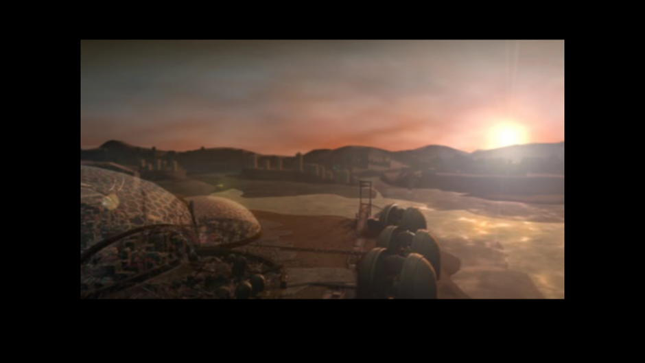

# **I comprehend (сложность: hard, ALL BOSSES)**
Свой сейв с ддс 1 я потерял, поэтому чтобы разблокировать хардмод, я использовал сейв от chiikyuggi (02/11/2018; 31KB) (Digital Devil Saga New Game + All mantras unlocked). Скорее всего, сохранение потерялось из-за обновления эмулятора, но мне все равно стоило сделать бэкап на этот случай. Кольца за убитых секретных боссов в первой части я не использовал, так как я их не убивал. Остальные бонусы не так сильно влияют на прохождение (+10к баксов (лол), +5 к статам союзников (в лейте не решает вообще), бесполезная абилка Аргиллы в конце).
Что до самой игры, то она одна из лучших в серии smt. Баланс сложности отличный, шикарный саундтрек, неплохой сюжет, один из сложнейших опциональных боссов в серии smt - Сатана (мне достаточно сильно повезло одолеть его примерно за 15 попыток). Забавно, что в нее так мало людей поиграло. Игра годная. Также [табличка](https://docs.google.com/spreadsheets/d/1GJ-JCrp2X41xG_BZBmLiXAydGvJhlsmU_SWmgu6h4gc/edit?gid=462462708#gid=462462708) с Сатаной, которая мне сильно помогла

