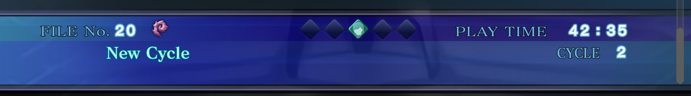
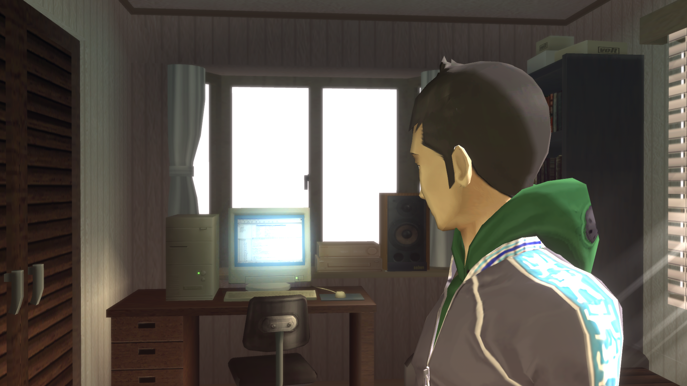

# **one more friend rejected (maniax) (сложность: normal)**
Некоторые лабиринты просто мозговыносящие. Последняя лока максимально ужасно выглядела. У кого-то из разрабов был фетиш на красные квадраты с узорами. Очень сильно всю игру напрягали рандомные схватки. Как мне кажется, их количество можно было бы и приуменьшить. А так, игра очень атмосферная. Каждый файт требовал определенного подхода. Максимум геймплея, минимум диалогов. Если оценивать сам ремастер, то могло быть и лучше за такую цену, но в целом норм. Парочка модификаций (на анлок фпс’а и замену музыки на оригинальную не сжатую) все недостатки поправляют

