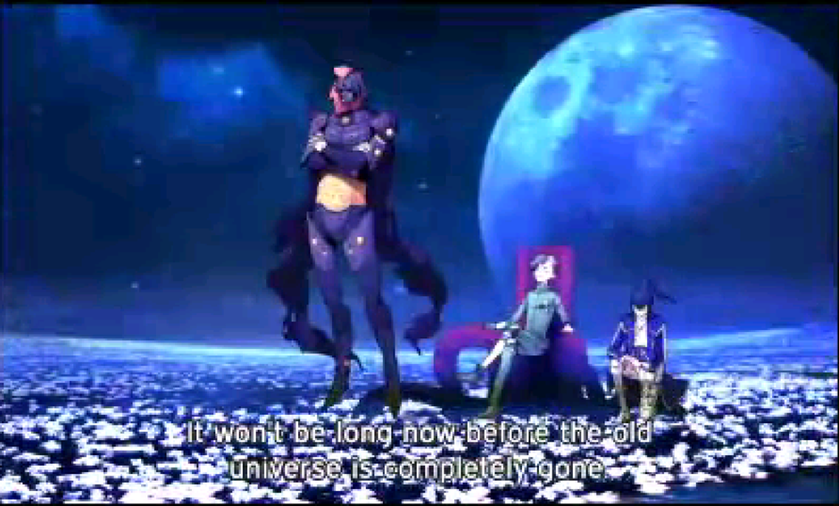
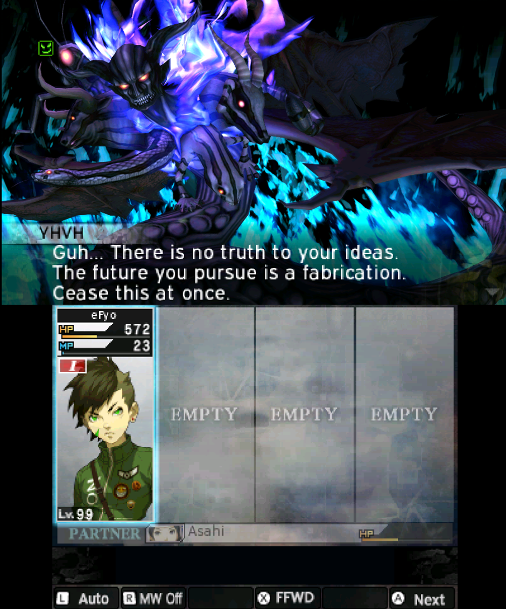
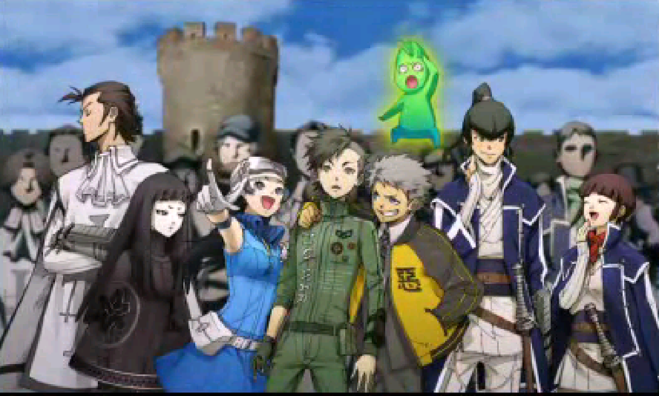
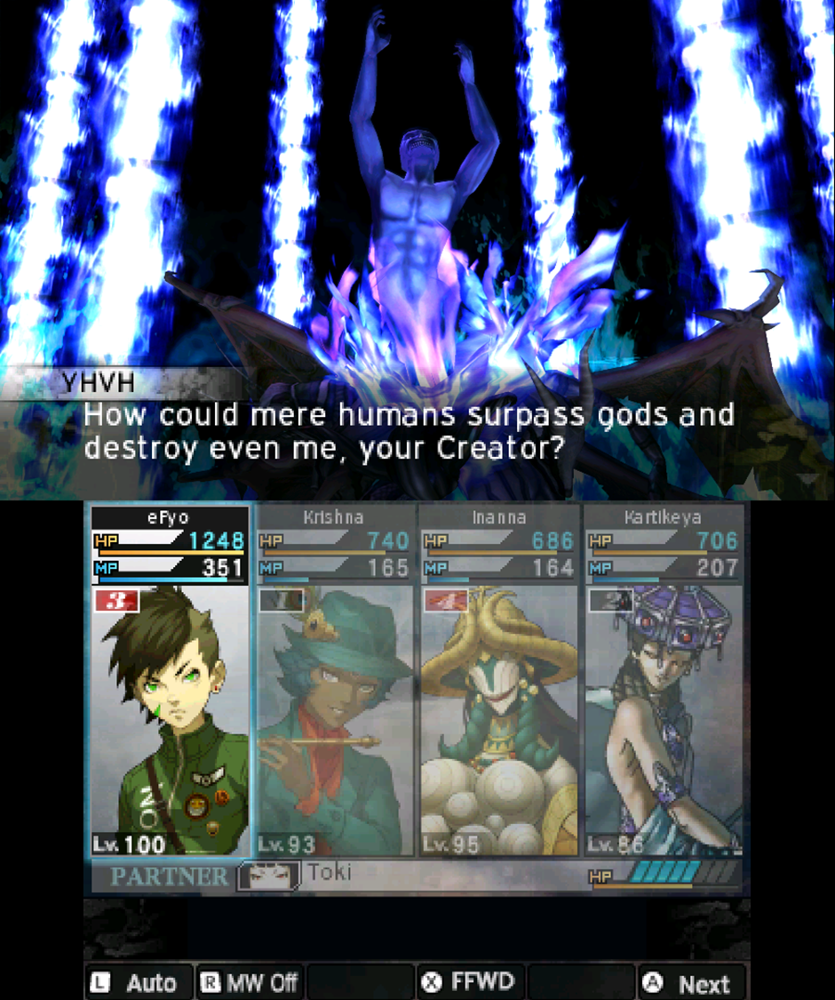
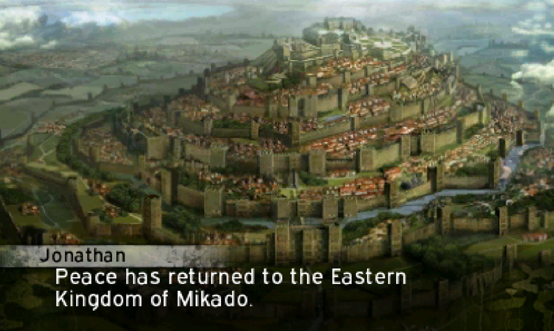
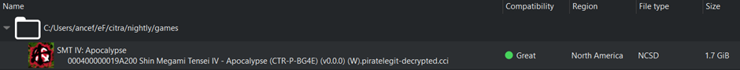
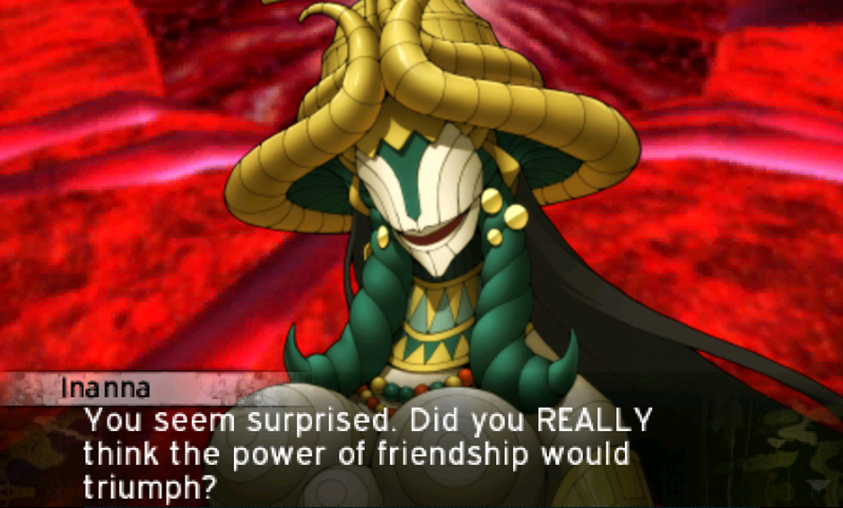
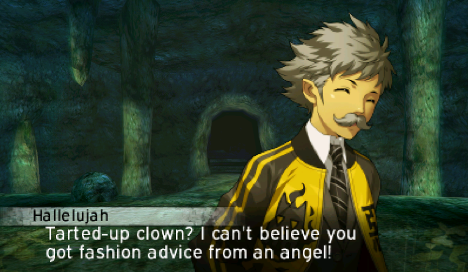

# **Heh… It’s apocalypse time (difficulty: War; all endings; mage build)**
Бой с финальным боссом выглядит пиздато, но именно сражаться против него на предпоследней сложности максимальный рак мозга. Немного неудачного рандома и можно отправляться заново его убивать минут 30 + успех очень сильно зависит от твоей пачки, буквально стак мечты надо собрать + еще и мана кост напрягает. Еще и экономика максимально убитая в игре. Денег очень мало дают, цены в магазинах просто космические. Пришлось на Яхву докачивать все длц на фарм, чтобы не задушиться об гринд. Походу реально под дополнения для фарма балансили экономику (достаточно новая практика для атлус давать все самое имбовое за лишние деньги). За исключением этих моментов, в остальном, достаточно неплохая игра. Гораздо бодрее оригинальной четвертой части

## Концовка с Дагдой

## Концовка с друзьями

## Концовка “хаос”

## Концовка “закон”

