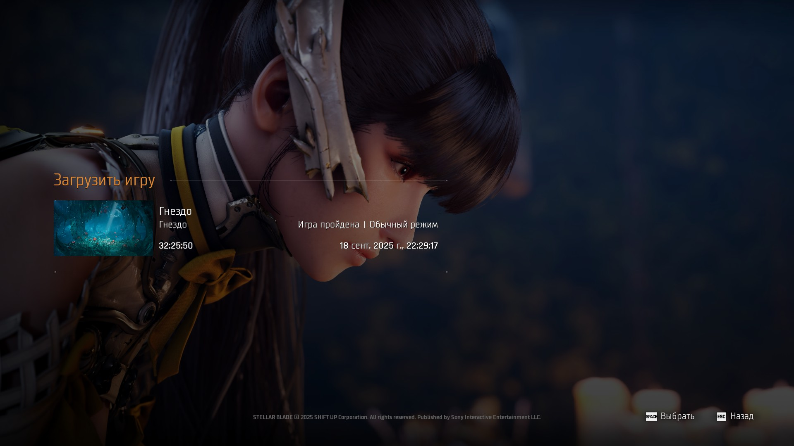
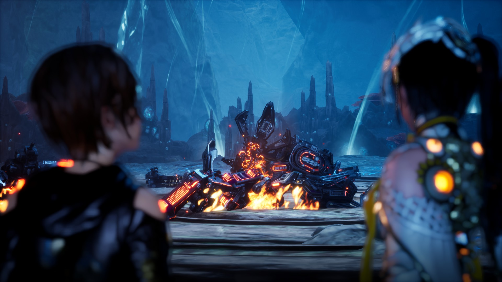
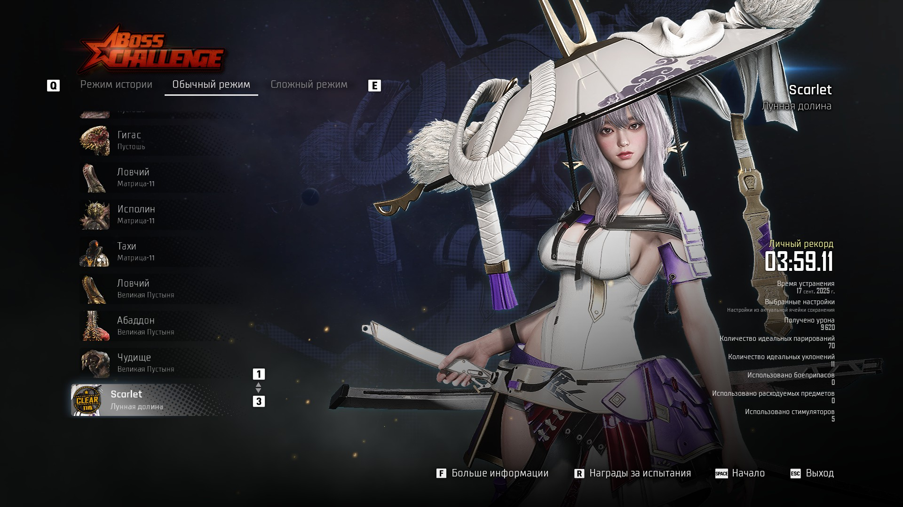
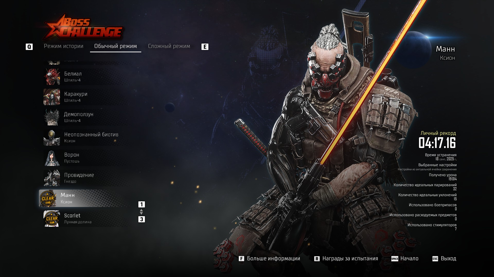

# **симулятор костюмчиков (сложность: обычный режим; тру эндинг; все боссы + dlc)**
Скарлет - лучший босс в игре. Недостатки: челы зачем-то мини задержку добавили перед постановкой блока; с навыками налажали (почему нельзя было сделать кулдаун у абилок как в фф16 не понятно. Всю игру нажимаешь одну самую полезную бета абилку и альфа. Другие просто бесполезно лежат); по сложностям какой-то дисбаланс произошел (на обычном режмиме никаких проблем не возникает до босса Ворона. На сложном режиме ты отлетаешь от рандомного моба за 2 тыки и практически не дамажишь). Несмотря на это, игра все равно отличная. Дизайн локаций, саундтрек, кастомизация перса, дизайн боссов, геймплей - это все очень здорово сделано. Правда, как обычно, насрали побочками унылыми, да еще и в большом количестве, но этот контент можно пропустить

