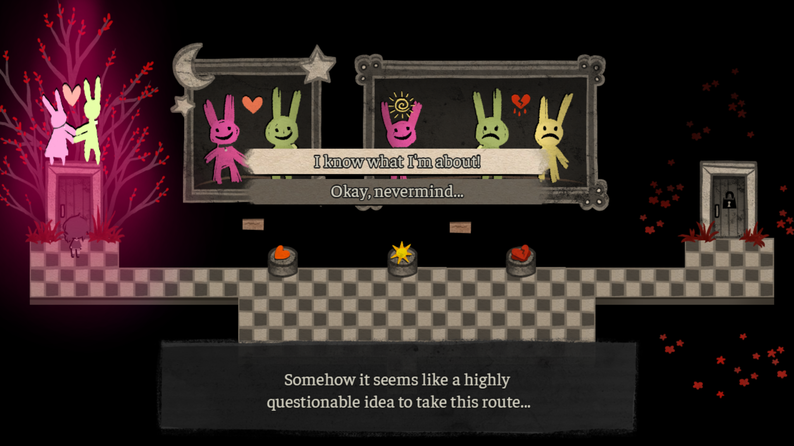

# **Гроб**
Ну, я надеюсь, что к 3 главе он все-таки закончит начатое (а не сломается в самый важный момент). Никакой симпатии к женскому ГГ не было и после первой главы, а тут все сомнения только подтвердились. Остальные развилки я не особо могу назвать каноном, так как действия не особо соответствуют характеру мужского ГГ, да и вряд ли кто-то выбрал бы остальные концовки на первом прохождении (только если им Эшли понравилась, но тут только клиника поможет). Не знаю, че челы так активизировались именно на моменте “инцеста” (там и других моментов вполне хватает), но именно эта тема затрагивается только в одной концовке (только если конкретно игрок к этому подводит) и то, в виде “пророчества”, которое легко можно задоджить, а по факту еще ничего не произошло. А так, я видел игрушки интереснее в таком жанре, поэтому игра в целом норм под пивом

Q U E S T I O N A B L E