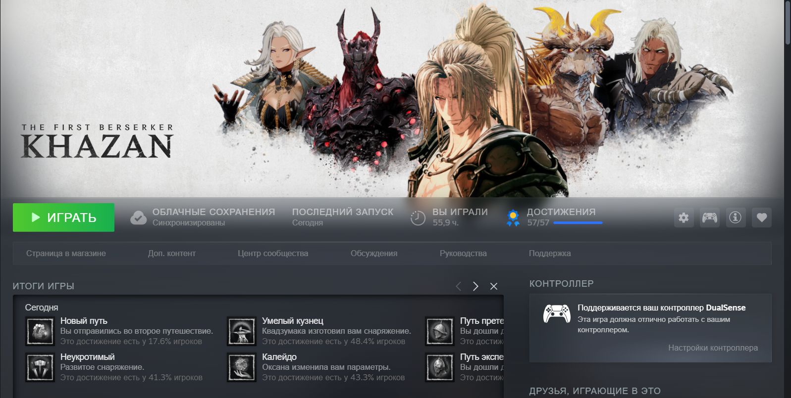
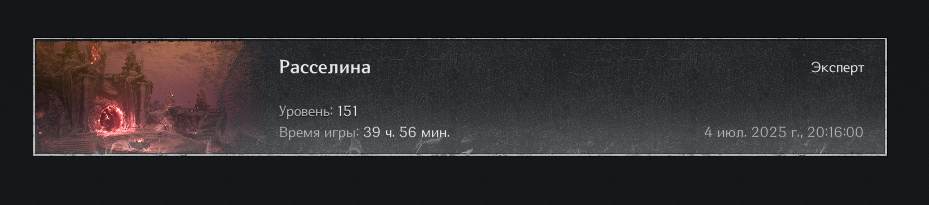
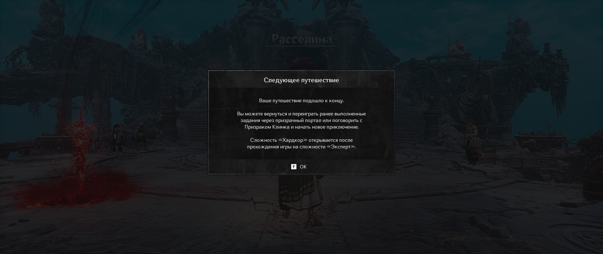
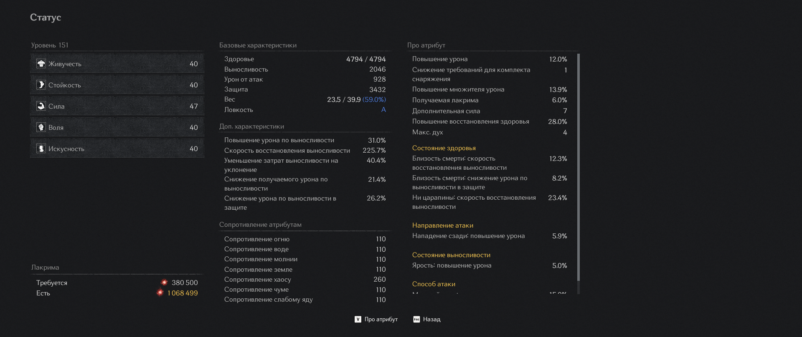
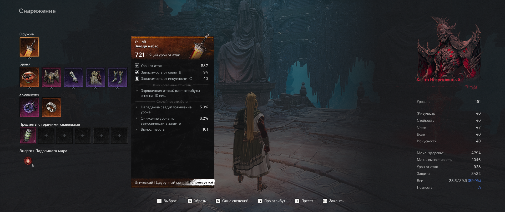
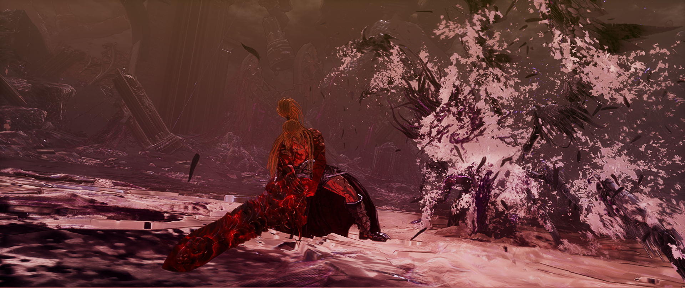
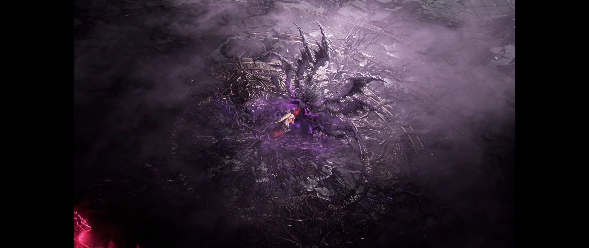
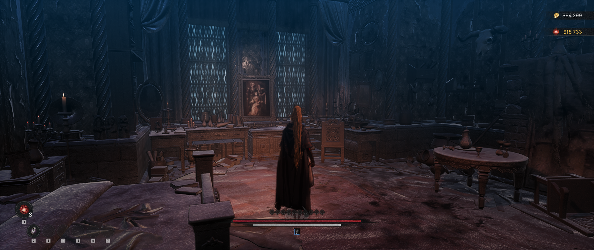
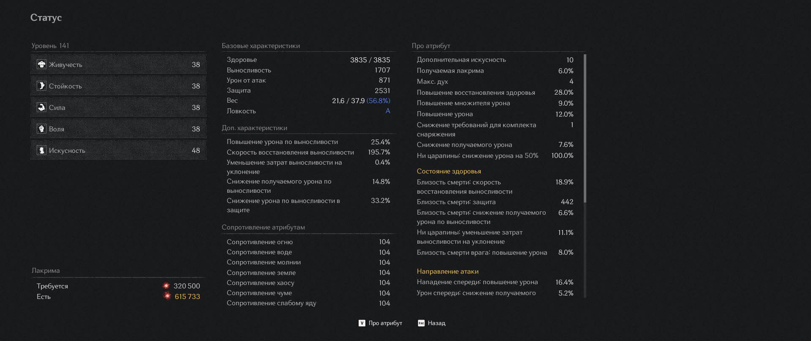
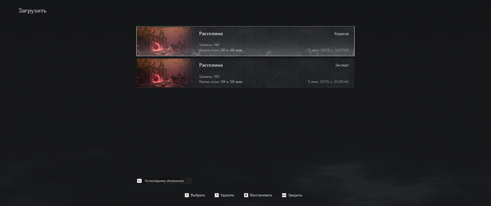

# **Казан готов (2 прохождения: 1. Сложность: "Эксперт", билд через двуручный меч, true Ending (все остальные концовки тоже выбиты путем сейвскама), 100% прохождение, 04.07.2025; 2. Сложность: "Хардкор", билд через копье, true ending (все остальные концовки тоже выбиты сейвскамом), 100% прохождение, 13.07.2025)**

## Прохождение на эксперте
В целом шикарная игра. Еще бы челам побольше денег дали, чтобы не надо было повторять некоторых боссов иногда по 3 раза. Плюс локи разнообразить и оружий новых добавить, а то 3 маловато. Вообще бы тогда не было претензий к игрухе. Игра геймплейно похожа на допиленную не казуальную 16 финалку (или типикал игру от создателей нио). Слэшерный сосалик, в котором не иронично можно боссов держать в станлоке от длинных комбух, пока стамина или абилки не захончатся. Правда они часто любят преждевременно из стана выходить, но это чисто заскриптованный момент  
Все мейн и доп миссии выполнены, все горшки собраны, все камни душ собраны, все концовки выбиты (они пратически ничем не отличаются. Только на стандартной концовке у Озмы 2 фазы, а не 3. А, ну еще кат-сцены немного другие)

Khazan True Ending

Khazan Normal Ending

Khazan Chain Ending

## Прохождение на хардкоре
Хардкор оказался достаточно простым и сбалансированным в моем прохождении. Возможно все дело было в копье, которое на этой сложности мне показалось достаточно сильным по нескольким причинам. Во-первых, на хардкоре любой босс за 1-2 тычки выбивает блок + мобы часто стакают противные статусы, даже через парирование. Это вынуждает играть преимущественно через перекаты. Такой расклад идеален для копья благодаря сетовым бонусам и древу навыков, которые больше вознаграждают уклонение на грани, чем парирование. Во-вторых, ты очень быстро на нем выходишь из любой анимации атаки, чтобы успеть перекатиться. В-третьих, держать в контроле на копье гораздо проще, чем на том же двуручном мече. В-четвертых, дистанция вообще не является проблемой, если босс решит отойти. С копьем ты очень быстрый и далеко атакуешь. И при этом он отлично выбивает мобов из равновесия и дамажит неплохо. Но, скорее всего, с двуручем была бы +- такая же ситуация по сложности игры на хардкоре. Им стоило добавить новые атаки боссам, тогда бы это внесло больше разнообразия и сложности. А так в целом отличная сложность (даже с такой странной камерой когда лочишься на противнике)

Челы поленились сообщение обновить для новой сложности лол

