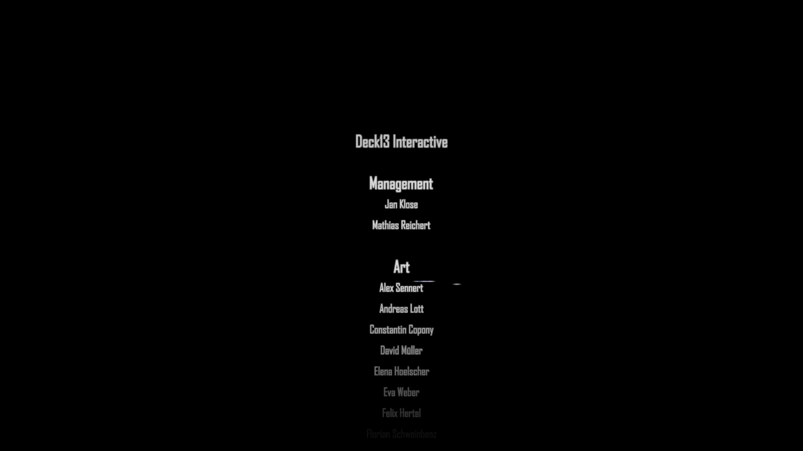
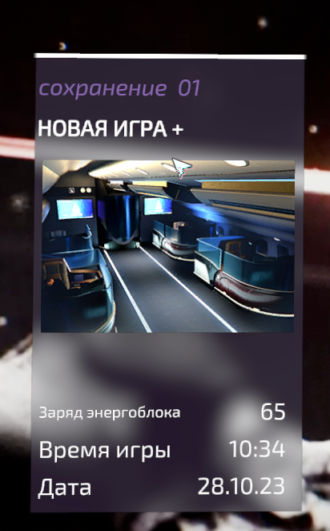

# **Not wheelchair gaming**
Большинство элементов в игре стало лучше. Добавили прикольное парирование, которое в разы разнообразило игру. Стал лучше саунд в игре. Новая система аптечек мне больше понравилась (почти как в полом рыцаре сделали), хоть и немного облажались с балансом, потому что некоторых боссов из-за этого я мог спокойно пересустейнивать. Сами боссы стали в разы лучше и разнообразнее, чем в прошлой части. Добавили кат-сцены (и флешбеки). Сделали побочные миссии. Больше оружия, больше кастомизаций для дрона. Даже особо не терялся в локациях, потому что они стали чутка адекватнее и разнообразнее.
Из минусов: худший редактор персонажа за всю историю сосаликов (можно было сделать конкретного гг, как было в прошлой части, потому что из-за этого решения только хуже стало); хоть боссов и 11 штук, но они повторяются; лвл дизайн по-прежнему не очень хорош, но не так плох, как в первой части; иногда мобов пачками закидывают.
До уровня отличных игр, лично для меня все равно не дотягивает, но было достаточно близко. Хотя бы не был огромный лабиринт под конец игры

