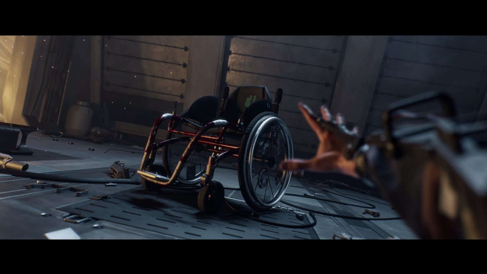

# **Wheelchair gaming**
Некоторые локи просто запутанный лабиринт, от которого потом начинает голова болеть. Большинство из них однотипные, серые и скучные. Количество мобов на локах иногда зашкаливает, и часто они могут убить тебя за 2-3 тычки. Ничем, кроме firebug throttle я не бегал, потому что все остальное оружие супер долгое, и не подходит против рашащих врагов. Всех боссов, кроме как “норм” не описать, но есть одно исключение: чел, который через какое-то время отбегает от тебя и начинает лечиться в безопасной зоне, пока ты не убьешь появившегося огромного робота (самый первый босс в игре), которого чтобы уронить (чтобы его можно было дамажить), нужно выждать 1!!! определенную атаку босса, и с разгона дать ему по ногам (и в это время тот чел продолжает хилиться). И такой сценарий может хоть раз 100 повториться, пока вы не убьете босса. И да, сам босс тоже может разорвать лицо за 3 тыки. На прокачке и фарме сделан слишком большой акцент, потому что без нужного уровня тебе не открыть секретки и путь дальше, да и сносить тебя будут тогда за 1 удар. Какого-то разнообразия в плане прокачки и снаряжения тоже нет, а сама игра заканчивается тем, что чел тянется за коляской. Конец соответствует общему качеству игры. Прикольный сеттинг и музыка в хабе - единственные достоинства этой игры

