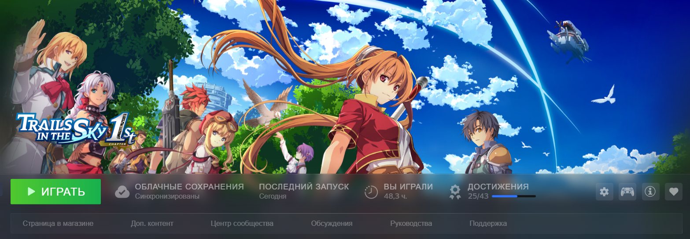
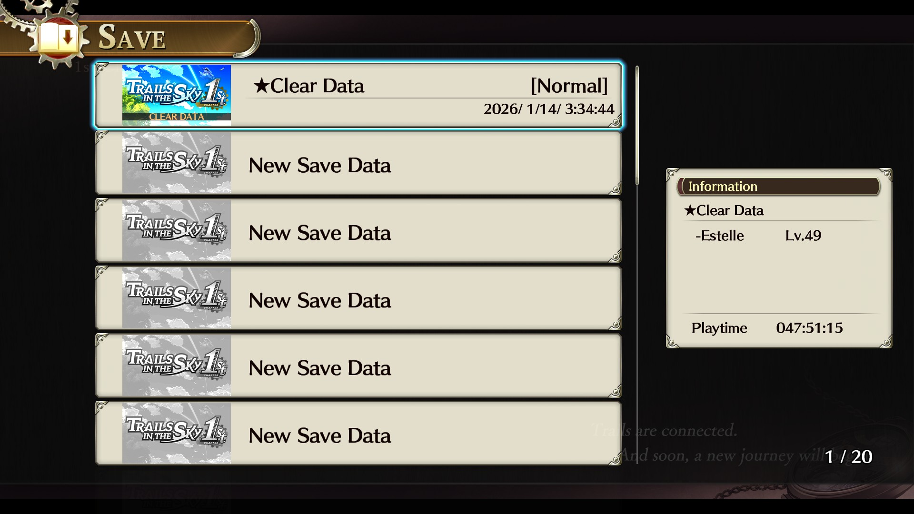
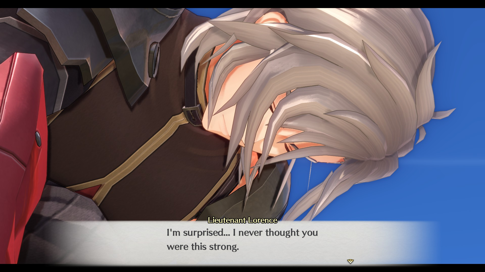

# **следы в небе 1 глава (сложность: нормал)**
В целом неплохо, но между ключевыми ивентами (реально чем-то интересным) идет просто какая-то нереальная скукота. Ладно еще сайды (они хотя бы реально неплохие), но в мейн сюжетке так растягивать события это надо постараться. Может кому-то и нравится такое долгое раскрытие персов и сюжета, но для лично для меня это явный минус (учитывая, что персы реально очень много текста вываливают постоянно). Событие с театром топ. Боевка неплохая (пришлось в прологе переставить сложность найтмер на адекватный нормал, потому что анплеебл треш). Музыки маловато, но хотя бы звучит отлично. Эстель как ГГ для меня никакущая получилась. Персонаж создан, чтобы отыгрывать местного клоуна (чаще получается, чем нет). Может в некст игре произойдет развитие, но пока слабейший перс. С Джошуа хотя бы история интересная, да и какой-то "чарактер девелопмент" есть. Клоэ бест перс. Гораздо интереснее показана, чем то недоразумение в пати. Если бы Эстель выпнули из сюжета и поставили Клоэ, то было бы интереснее, да и пошло бы явно на пользу. Анонс ремейка второй части уже в разы перспективнее выглядит, так что потыкать есть смысл, но прикасаться к другим частям трейлсов нет никакого желания с таким повествованием (по крайней мере, в "правильной" последовательности прохождения). Ремейк - шикарный, как игра в целом - неплохо, но не более

(Стим не все часы подсчитал. Общее время прохождения около 70 часов. Таймер игры же не считает время когда ты сворачиваешься + когда фейлишь драку)

