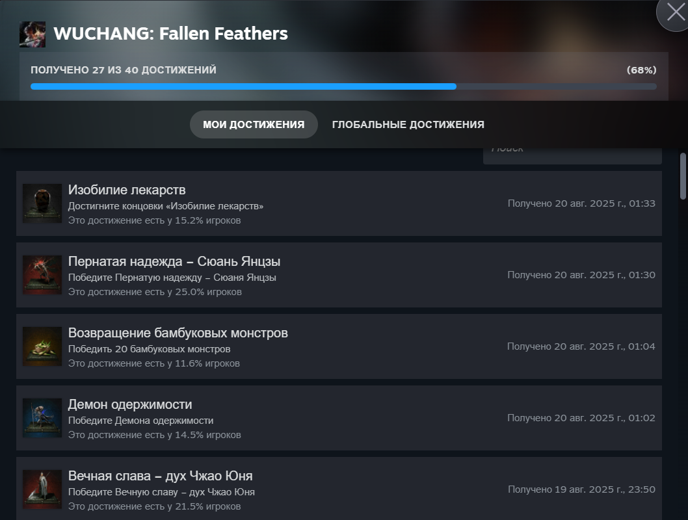
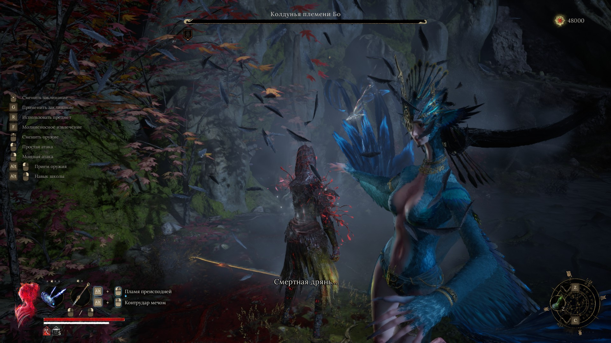
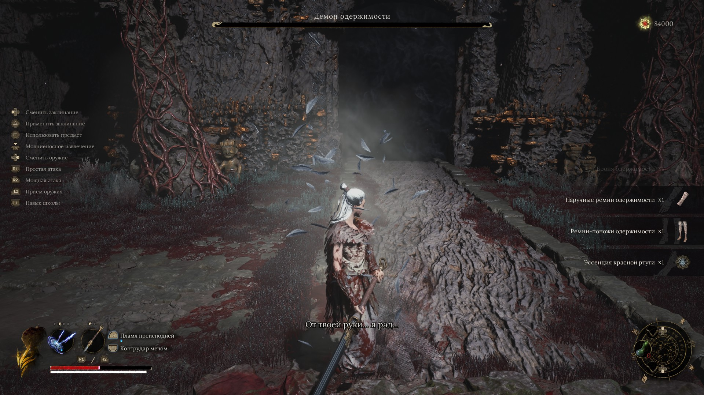

# **ужасный вучонг (все боссы; "плохая" концовка; билды через топор и длинные мечи)**
Игра максимально посредственная, но самое смешное для меня произошло под конец игры. Я прошел всех боссов в игре, старался выполнять все побочки (скорее всего из-за кривой реализации и самой игры большинство заруинилось) и НЕ отдал злому челу предмет в конце. В итоге прокнула плохая концовка :)))))))))))). Это все, что нужно было знать об игре, но ниже паста подробная паста.  
Буквально почти каждый босс в игре болеет тем, что делает чарж рывок сквозь тебя и не останавливаясь, долетает почти до конца арены (а иногда этим спамит). Скорее всего, задумка была в том, чтобы копить ману на таких атаках, а потом использовать навыки оружия когда противник подойдет поближе, но играется все равно всрато, потому что: a) ты либо после такой атаки стоишь ждешь, потому что бежать через пол арены; б) добегаешь до босса с нулевой стаминой, который уже начинает кастовать другую атаку. Еще в добавок человеческие боссы любят после комбы своих атак сразу отпрыгивать (тайминг для ответной атаки очень узкий), так еще этот отпрыг им дает НЕУЯЗВИМОСТЬ. В итоге половину драки бьешь воздух. Бекстабы тоже 50/50. Иногда не понимаешь, как это вообще засчиталось (заряженная атака в бок летела), а реже - как это не прокнуло. Трекинг тоже не очень хорошо работает. Иногда бьешь вообще не в ту точку, на которой залочен. Файты с огромными зверями самые интересные получаются, потому что атаки у них не такие быстрые и длинные (кстати, часто боссы любят продолжать фигачить воздух), и выходит их дамажить. И даже так, когда боссы наносят какой-то космический дамаг, игра все равно достаточно простая (15 хилок под конец игры). Все остальное в этом "шедевре" еще хуже сделано. Музыкальное сопровождение - говно (на двух боссах во второй фазе хоть какой-то саундтрек играл, и на том спасибо). Левел дизайн тоже срань. Разработчикам так в падлу было нормально костры ставить, что они решили все шорткатами нахуярить в локациях, которые потом превращаются в ебучий лабиринт. Прокачка оружия заканчивается чуть раньше середины игры, потом ничего нового не открывается. Стоит отметить, что только к визуалу претензий никаких нет

