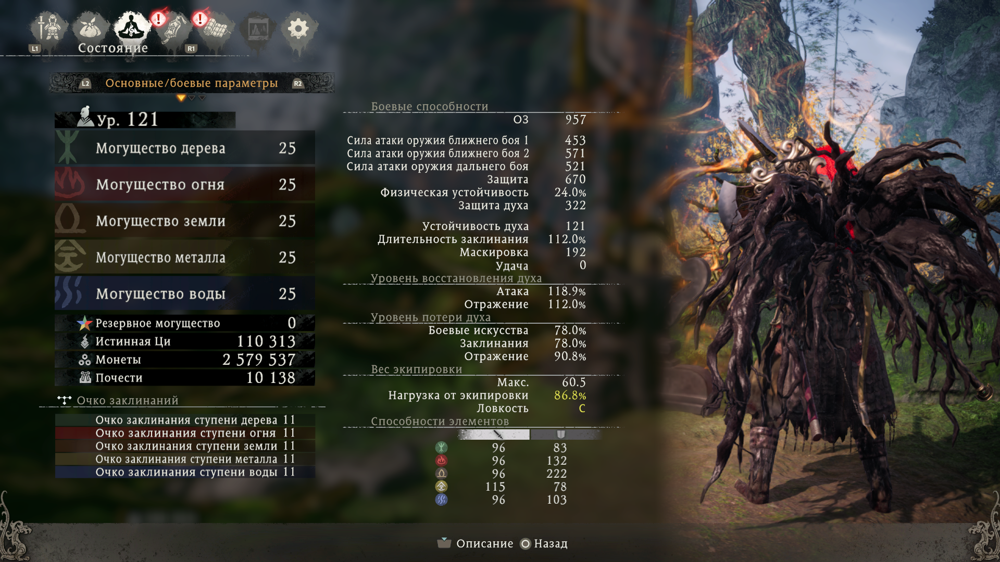
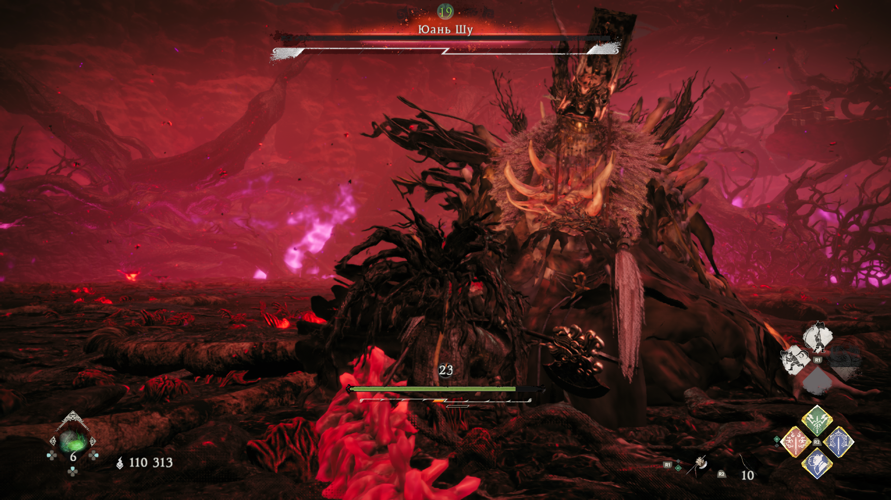

# **Ниох Лонг (мейн задания сюжеток + 3 длц)**
В целом, Wo Long: Fallen Dynasty хорош. Разрабы поправили косяки, которые были на релизе (оптимизацию и баланс всего в игре). Хоть и не полностью, но стало в разы лучше. Но есть несколько неоднозначных моментов, которые хотелось бы подметить (А в итоге получилась очередная паста):
- Проходил я без компаньонов и с огромными молотами и секирами, так как у них самые долгие атаки и % шанса парирования меньше всего + прокачивались все статы и равномерно. Магия (кроме взрыва стихии) почти не использовалась, потому что не очень полезная. И даже так, большинство боссов отлетали за пару траев. Сложности возникают до того момента, пока ты не освоился в игре и на последних длс боссах. И то, "сложность" - это когда у меня уходило больше 20 минут на босса. Так что тут разрабы немного налажали, так как в ниох мне больше нравился баланс сложности.
- Геймплей в Секиро работает лучше. В ву лонг'е у тебя за парирование отвечает отскок (он как бы выполняет задачу небольшого отскока в сторону и парирования одновременно), при этом, тратится концентрация. А перекат у тебя на двойное нажатие отскока. И тут есть несколько проблем: 1. Ты НЕ хочешь нажимать отскок, так как он не дает никакого профита (ты тратишь свою концентрацию, но не тратишь концентрацию противника). Ну разве что ты хочешь отбежать похилиться, но хилка НАСТОЛЬКО быстро кастуется, что в этом нет никакого смысла; 2. Ты пытаешься отпарировать миллион тычек, которые летят в твою сторону и случайно прокаешь перекат (= смерть или минус куча хп). Самый ржачный момент, что ты можешь одновременно зажать блок и парировать атаки противника (так как это две разные кнопки). Мало того, что ты сам по себе куда жирнее, чем в том же нио и секиро, так и еще блок не накладывает никакого штрафа для парирования (как мне кажется, парирование всегда должно нести определенный риск). Почему нельзя было оставить парирование с отскоком на кнопке блока (при этом оставив нормальный перекат) не понятно. Еще в игре есть прыжок, которым даже можно круговые атаки доджить. Но какой от этого смысл, если в игре ЛЮБАЯ атака парируется (даже огромные взрывы). Это буквально можно назвать "идеальным отскоком" и так будет даже точнее. В свое время секиро очень сильно хейтили за то, что в игре кроме парирования ничего больше делать не надо (тем временем существовали круговые атаки, выпады, протезы, боссы с огромной концентрацией, ну и агрессию еще можно было навязывать). В ву лонг'е буквально этим всю игру и занимаешься. Ну зато эффектно выглядит.
- Ужасные флаги, которые разрабы прячут на каждой локакции в самых изощренных местах. А от их количества зависит наносимый урон по боссу, который привязан к локе, и получемый тобой дамаг. Ну хоть количество хилок сделали фиксированным.
- Оптимизация далеко не идеальная, но зато теперь можно с комфортом (в большинстве случаев) поиграть. Буквально 2 вылета за всю игру, и то почему-то именно на кат-сценах (как в ниох 1 было ХД). Графон, в целом, пойдет (с пивом), но не такими жертвами.
- Эффекты и анимации прям слишком красочные, часто мешают на самих атаках сконцентрироваться, но для меня не критично.
- Лор не особо понял, сюжет прям смешной. Особенно, ржачно смотрится ГГ, который КАЖДУЮ СЦЕНУ МОЛЧКОМ СТОИТ И ЧТО-ТО ДЕЛАЕТ. Тут прям напрашивается мем: "ВООБЩЕ НИЧЕ НИКОГДА НЕ СКАЗАЛ ВАШ ГЕРОЙ, ВООБЩЕ НИКОГДА ОН И НИЧЕГО НИКОГДА НЕ СКАЗАЛ, И ЩАС МОЛЧИТ..." (c).
- Саундтреки как всегда достаточно хороши, на некоторых боссах даже шикарные.
- Разнообразие оружия с их уникальными абилками вполне хватает.
- Редактор перса тоже отличный

