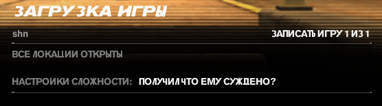

|Оценка|Игры|
|:-:|:-|
|Маст плей (10)|Sekiro: Shadows Die Twice, Dishonored 2, Dishonored, Lies of P, Dark Souls 3, Kingdom Hearts 3, Shin Megami Tensei V: Vengeance, GTA:SA, TES IV: Oblivion, TES V: Skyrim, Clair Obscur: Expedition 33, Hollow Knight, Batman: Arkham Knight, Rogue Legacy 2, Salt and Sanctuary, Devil May Cry 3, Hi-Fi RUSH, Furi, Spider-Man: Shattered Dimensions, Spore, Persona 5 Royal, Armored Core VI, Resident Evil 4 Remake, Lego Batman 2: DC Super Heroes, Undertale, The Legend of Zelda: Breath of the Wild, The Legend of Zelda: Tears of the Kingdom, Baldur’s Gate III, Nioh 2, Simpsons hit and run, Final Fantasy VII Remake Intergrade, Split Fiction, It Takes Two, Devil May Cry 5, Ghost of Tsushima Director's Cut, Terraria, Fallout: New Vegas, Dragon Age: Origins, Black Myth: Wukong, Shin Megami Tensei: Digital Devil Saga 2, Monster Hunter Rise: Sunbreak, Spark the Electric Jester 3, Sonic Frontiers - The Final Horizon
|Почти маст плей (9-8.5)|Bloodborne, Persona 4 Golden, Ratchet & Clank: Rift Apart, Persona 3 Reload, Octopus: Dadliest Catch, Valiant Hearts: The Great War, South Park: The Stick of Truth, Ghostrunner, Fable, Borderlands 2, Lego Star Wars 3, The Outer Worlds, Celeste, Mirror's Edge, CS:GO (dead), The Escapists, Final Fantasy VII Rebirth, Kingdom Hearts birth by sleep, Kingdom Hearts 2 (HD 2.5 ReMIX), Dark Souls: Remastered, Metal Gear Rising: Revengeance, DOOM (2016), Monster Hunter: World, Orcs Must Die 2, GTA: Vice City, Shin Megami Tensei: Digital Devil Saga, Rogue Legacy, Thymesia, Saints Row 4, Transistor, Cyberpunk 2077, Singularity, Far Cry 3, Tarzan (video game), A Way Out, Persona 5 Strikers, Dying Light, Blasphemous, Neon White, DmC: Devil May Cry, Final Fantasy XVI
|Прикольные игры (8)|NINJA GAIDEN 2 Black, Warhammer 40,000: Space Marine 2, Shin Megami Tensei III Nocturne HD Remaster, Minecraft, Cuphead, Battlefield 4, Transformers: War for Cybertron, Orcs Must Die! 3, Infamous: Second Son, Super Hot, Shift Happens, GTA V, The 3rd Birthday, Bulletstorm, Bioshock Infinite, Borderlands 3, Watch Dogs, Wizard of Legend, Wo Long: Fallen Dynasty, Bayonetta 1, Avowed, Magicka, Ultimate Spider-Man
|Неплохие игры (7)|Brutal Legend, Blasphemous 2, Fallout 4: Game of the Year Edition, Stranger of Paradise: Final Fantasy Origin, Touhou 6 - The Embodiment of Scarlet Devil, The Surge 2, PAYDAY 2, Dead by Daylight, MiSide, Divinity: Original Sin 2, Sonic DX, PICO PARK, Dragon Age: The Veilguard, Final Fantasy 15, AI LIMIT, Shin Megami Tensei IV: Apocalypse, Ninja Gaiden Σ2, Devil May Cry 4: Special Edition, Code Vein, Magicka 2, Marvel's Spider-Man Remastered
|С пивком норм (6)|Fallout 3, Sonic Adventure 2 Battle, Demon's Souls (2009), Shin Megami Tensei IV, Ratchet & Clank (2016), Just Cause 2, Battlefield: Bad Company 2, Tales of Berseria, Shadow the hedgehog (game), Deadpool, Titanfall 2, Hogwarts Legacy, Assassin's Creed, Heavy Rain, The Lord of the Rings: War in the North, Lego Star Wars 2, Prototype 2, The Surge, Crisis Core -Final Fantasy VII- Reunion, Bloodborne PSX, TimeShift, Kingdom Hearts 1 (HD 1.5 ReMIX), Call of Duty 1, Saints Row: gat out of hell, Patapon 1, Patapon 2, Patapon 3, Mafia 2, Sonic Heroes, Saints Row: The Third, The Coffin of Andy and Leyley, Star Wars Jedi: Fallen Order, SIFU, KANNAGI USAGI, I am bread, G-Force, Dark Messiah of Might and Magic, TankiOnline, DMC 1
|Сомнительно(5)|Elden Ring, Afterimage, Trove (dead game xd), Dark Souls 2, Life is Strange, Homefront: The Revolution, Homefront, We Happy Few, League of Legends, Nioh, Freedom Fighters, Devil May Cry 2
|Мусор(4-1)|Black Souls 1, Genshin Impact, God Eater 3, Mortal shell, Lords of the fallen (2023), Tower of Fantasy, Senua's Saga: Hellblade II
|Дроп (без оценки)|Gothic II, TES 3, Othercide

Оценка игр преимущественно (на 90%) основывается на их геймплее

## Hi-Fi RUSH (Высокий уровень сложности и виртуоз)
Hi-Fi RUSH - топ. Особенно, когда открывается парирование. Если бы игра вышла в прошлом году, то спокойно бы выиграла номинацию лучшей игры года, по крайней мере для игроков. Из недостатков можно отметить только отсутствие лока камеры. Такую высокую концентрацию фана и адекватного челленджа мало какие игры генерировали. Все босс файты сделаны максимально оригинально. Ни один из них не похож ни на кого другого. Особенно последние 2 были просто шикарными. В первом случае потому, что на заднем фоне начала играть ремикснутая версия пятой симфонии, а во втором - сам босс. Очень редко со мной происходит такой момент, когда я хочу выбить максимальный ранг на миссии, но эта игра - один из таких случаев. Во второй половине игры я уже просто машинально начал попадать в ритм. Ну и самый главный плюс это компаньон котик, и возможность за него поиграть в конце игры.

## НИОК
- Она очень долгая, если учесть, что я проходил только мейн миссии. С этим можно было бы смириться, если только не было скучных и однообразных лок.
- Ключевой минус: минус босс котик (белый тигр, хотя че там от тигра мне до сих пор непонятно), земля пухом.
- Игра всячески одобряет и даже заставляет фармить себе лвл (что указывает рекомендованный уровень миссий), зельки (по дефолту у тебя их 3 дается, но можно разбить шмот ненужный, и у тебя будет 8 хилок. Или собрать ВСЕХ зеленых чудиков на карте), предметы, УЛЬТА, потому что средний игрок задушится траить боссов около идеально.
- Несколько боссов были прикольными (окацу, ода нобунага), большинство более-менее норм, но были прям ужасные и максимально наглые, на которых требуется нереальное задрачивание или максимальная удача.
- Большинство локаций - унылый коридорчик.
- На перекатах фреймов неуязвимости мало.
- Если говорить про прокачку статов, то она весьма специфична. Ты намертво привязан к одной пухе, если собираешься качать только один стат. Но если ты начнешь равномерно распределять очки, то такими темпами можно не скоро закончить игру (ну магия оп, так что все может быть не так плохо).
- Про стойки я даже хз че сказать, потому что я ими банально не пользовался, так как мне они показались максимально ситуативными. Средняя стойка всегда была лучшим выбором по соотношению дамаг/подвижность. Но сама боевка мне больше понравилась.
- Почему мне не дают ульту сразу на босс файте? Почему ее нужно выфармливать перед тем, как войти на арену к боссу? Не очень понятно. Как итог: забил на нее, даже не прокачивал. Когда была возможность ультануть - ультить, а не было - продолжал тыкать палкой.
- У большинства боссов огромный хп бар, поэтому файт минимум 5 минут идет, если делать все идеально. Ну это не особо минус игры, просто держу в курсе.
- Для меня прям нереально сложных боссов не было, но были максимально нечестные, но это уже не в новинку, поэтому в некоторые моменты придется открыть форточку, иначе велик шанс задушиться, и больше не открыть эту игру.
- Рядовые мобы постоянно повторяются.
- Кульминацией стало то, что после скриншота у меня должен был пойти мультик и титры, но игра внезапно ВЫЛЕТЕЛА, и откатила меня к ласт боссу основной компании, поэтому на длс боссов я забил болт. Больше нет особого желания запускать игру.

Если какие-то итоги подводить, то игруха чисто на 5 баллов. Все-таки какой-никакой челлендж. К этой боевке приходилось адаптироваться, а когда привыкаешь, становится гораздо легче. По моему мнению, лучше в другие соусы поиграть. Потому что игра балансирует между честной сложностью и духотой

## Freedom Fighters (предпоследняя сложность)
Такая душка этот фридом файтер. В детстве он как-то пободрее выглядел. Подумал, ща такой веселый шутанчик будет на предпоследней сложности, но по итогу всю игру бегал отправлял тиммейтов зачищать локу, а сам сидел со спины их ресал, как местная хилочка. Еще и чекпоинты в половине случаев находятся либо супер далеко, либо он один на всю карту. Неловкое движение в сторону врага - смерть, и идем по новой проходить еще 20-30 минут. Разброс пуль огромный у всех ганов (кроме снайперки и пулемета, которые раз в год дают потрогать) из-за чего убить врага на средней дистанции становится довольно затруднительной задачей, да и вообще стрелять. Саунд так себе, который надоел повторяться уже на середине игры. Короче, игра ни о чем, не стоило вообще ее вспоминать

## Фури (только без фурри) (2 рана: обычная и фури+)
Если ласт босса скипать (альтернативная концовка), то игра 10 на 10, особенно максимальной сложности Furi+. Я хз, как можно было сделать финального босс файт настолько душным и неуместным. Типо у нас вся игра завязана на парированиях, уворотах и атаках, а меня заставляют играть в совершенно другую игру, да и еще максимально скучную. Радует, что это только один такой плохой босс, ведь весь остальной геймплей шикарный. Я давно не испытывал такой неподдельный восторг от игры

## Гашиш от конторы
Когда игра с достаточно интересной и перспективной боевкой скатилась до уровня типичной выжималки денег с унылейшими ивентами, посредственными заданиями и околонулевым лейтгеймом. И ведь мало того, что скипать диалоги нельзя, так они еще и сами по себе скучные и нудные, как будто их нейросеть писала. И единственная причина заходить в эту подделку - потыкаться в мобов в бездне раз в 2 недели

## Sonic Heroes
Если проходить только одну кампанию (4-5 часов продолжительность), то игра прикольная. Если начнете проходить все оставшиеся (которые повторяются точь-в-точь), то рискуете задушиться, а оценка игры падает до 0 колец, ведь геймплей вообще никак не отличается. А все ради того, чтобы анлокнуть истинного финального босса. Поэтому я прошел только команду соника, а на остальное забил, чтобы оставить более положительное впечатление от игры

## FF15
Игра в начале максимально унылая и начинает раскачиваться только под позднюю середину игры. Кроме крутого графона и лютого афига от происходящего в некоторых босс файтах сложно что-то еще подчеркнуть. FF7 во всех аспектах играется бодрее, и выглядит лучше. А эти нескипабельные поездки на машине в ирли в какой-то момент начинают надоедать. Я даже и не удивлен, почему эта часть мало кому зашла. Нам даже поиграть за других героев дают только ПОД КОНЕЦ ИГРЫ (вот тут я не уверен, может я что-то упустил). И либо я не понял, как в это играть, либо проглатывать миллион аптечек на боссах (потому что они часто просто шотают) - это нормальная тема. Боевка тоже не особо интересная (пока ты не врубаешь ульту). Была одна миссия веселая, где я был на переговорах, и игра мне постоянно говорила, что от моих выборов зависит, получу я важного для сюжета персонажа или нет. Ну по итогу, я решил вести себя так, чтобы провалить миссию, но как и ожидалось, ЭТО НИКАК НЕ ПОВЛИЯЛО НА СЮЖЕТ, просто я лишился пару строк диалога и некоторых наград. Я понимаю, что у вас сюжет максимально прямолинеен и скучен, но не до такой же степени

## Глубокий вдох, громкий выдох. Как кипит моя кровь (Прохождения: ванильная с двумя ответвлениями и со всеми боссами в игре, в том числе и иными (с амулетом Куро); Sekiro:Resurrection Ver. 1.15 App Ver. 1.06 с двумя ответвлениями и со всеми боссами, кроме иных (с амулетом Куро); ванильная с двумя ответвлениями и со всеми боссами в игре, в том числе и иными (БЕЗ амулета Куро))
По моему мнению, Cекиро является лучшей игрой Миядзаки. Почти все боссы сделаны отлично, откровенных проходных нет. Лучший финальный босс в линейке игр автора. Уникальная боевка, которая не похожа ни на одну из его предыдущий игр, и которая работает просто отлично. Дизайн локаций, который не уступает дс1, а иногда даже и превосходит его. Играть стало куда интереснее, потому что бои стали более интенсивные и требует от тебя не просто нажимать одну кнопку переката. При этом, вариативность подхода к боссам достаточно высокая, ведь существуют протезы и разные комбо (даже действия на одну и ту же атаку противника могут сильно различаться), которыми еще надо уметь пользоваться в разных ситуациях. Геймплей быстрый и динамичный, так как механики игры способствуют этому (концентрация, толстенный хп бар, высокая подвижность мобов). Даже музыка отлично дополняет игру и позволяет чувствовать ритм атак противника. Единственное, что в игре не так - это тот факт, что протезы используются за эмблемы (которые нужно фармить). Короче, игра 10

(Sekiro vanilla)

Sekiro: Resurrection Ver. 1.15 App Ver. 1.06. Если затрагивать сам мод, то он супер. Боссы стали гораздо интереснее и сложнее + куча других нововведений. Самое то для тех, кому ванильный Секиро наскучил

(Sekiro: Resurrection Ver. 1.15 App Ver. 1.06)

Isshin, Saint Sword (Sekiro: Resurrection Ver. 1.15 App Ver. 1.06)
https://www.twitch.tv/videos/1966225257
(Sekiro: Resurrection)

### Паста про усложненный режим игры (без амулета Куро)
Оформил 2 забега с нового сейва без амулета Куро со всеми боссами (и их иными версиями) на ванильной версии игры. На удивление, Филин и остальные его 2 версии отлетели чуть ли не за первые траи, а вот Госпожа Бабочка резко начала напрягать на турнире силы. Из примечательного. Почти все выпады, усиленные атаки и граб-атаки шотают на фулл хп. Даже через блок у тебя почти нет шансов выжить, если концентрация на грани срыва. Поэтому, отстоять в защите не получится, нужно учить каждый замах босса, и парировать его. Новыми красками заиграли протезы в турнире силы, так как там не тратятся эмблемы и расходники, поэтому их можно спокойно использовать (особенно выделяется зонт, которым можно парировать все атаки (даже грабы), кроме круговых, а затем моментально использовать его для усиленной атаки с определенным эффектом. Сюрикены тоже себя здорово показали с навыком, которые позволяет после использования протеза делать длинный рывок + атаку к боссу за короткое время). В обычном прохождении, подход: "буду просто стоять и парировать все атаки босса (иногда делать тычку), чтобы убить его через концентрацию" переставал эффективно работать где-то с середины игры. Без амулета Куро - это перестает работать с нулевой, поэтому приходится комбинировать парирования, агрессивный стиль игры и перекаты, чтобы наносить урон по хп босса. Так и дамаг по концентрации больше становится, и босс не успевает ее восстановить. В этом плане Филин - идеальный пример, где у тебя 1/3 файта - это атака по нему, другая 1/3 - парирования, а оставшуюся 1/3 составляют перекаты (или протез зонт) там, где парирование атаки использовать не вариант (в силу того, что ты будешь в долгой анимации после парирования), так как вместо нее можно дать халявную тычку по врагу. Ну и единственное, что меня не устроило - это количество хп у демона ненависти. Мало того, что этого чела тыкать минут 10, так если ты хоть раз ошибешься, то с большой вероятностью отправишься на костер (ну или воскреснешь, а только потом отправишься на костер). А еще, он играется так, как будто я в элден ринг зашел первым лвл'ом бить великана. Поэтому пришлось использовать так называемую "фишку", где ты его просто скидываешь с арены, и он умирает. Формально, никакие баги и глитчи не используются, только игровые механики, просто разраб не думал, что ты сможешь долететь и схватиться за нужную стенку. Да и в принципе, резчик (демон ненависти) и сам остается доволен своей участью, так что не вижу в этом ничего плохого хд. Больше чизить никого не приходилось. Ну и в принципе, Куро не врал, когда говорил, что я себя обрекаю на "страдания". Пришлось некоторых боссов закреплять, хотя их мувсет я примерно помнил

(Sekiro vanilla charmless)

## ЭлденРингАкаХудшаяИграМиядзаки (2 прохождения: 1. Билд через ловкость с когтями и катанами в лейте; 2. Билд через силу с мечом Гатса на всю игру + онли парирование Маления)

Плюсы игры:
- Красивые локации (хоть и пустые).
- Сложные, оригинальные и достаточно интересные ключевые боссы в игре (в большинстве случаев). Хоть я и считаю, что Маления моментами нечестный противник, но то, что это достаточно крутой босс - факт (еще и качественный, и самый запоминающийся во всей игре), и я испытал большое удовольствие, одолев ее 3 разными билдами.
- Визуально привлекательная игра (включая оружия, посохи).
- Спустя 2 прохождения, могу сказать, что оружия между собой вполне сбалансированы, хоть и не так хорошо, как в прошлых частях. Все руинит их скилы (weapon arts), но я ими не особо пользовался.
- Прыжок, который даже иногда полезен бывает.

Минусы:
- Открытый мир со всеми вытекающими проблемами, когда ты недокач пришел на локу и наоборот, когда ты перекач и бегаешь всех унижаешь.
- Никудышная система квестов, которая перекочевала из предыдущих игр автора, из-за чего ты идешь читать гайды, как их не пропустить случайно.
- Часто повторяющиеся данжи (ну и награда, обычно, соответствующая данжам). Во втором прохождении я в них перестал вообще заходить.
- Система крафта бесполезная, ни разу ей не воспользовался.
- Нужные оружия тоже иногда сложно найти без подсказок с интернета.
- Существование достаточно сломанных духов призывания (благо их существование можно игнорить, и тебя не заставляют их использовать).
- Лучше бы финальным боссом была Маления, а не та жижа в конце. Даже среди подделок соуса не найдется такой же отвратительный.

Из всех игр автора, для меня данная является худшей из лучших, и это не из-за плохих боевых механик, оружия или боссов, а из-за других не менее важных факторов, которые сформировали соответствующую оценку пользователей на метакритике

## Бест соус (5 прохождений: 1.Билд со скимитарами (без длц); 2.Билд через удачу и кровотечение с ножом бандита (без длц); 3. SL1 (без dlc); 4. Билд через двуручный меч изгнанника (ALL BOSSES); 5. SL1 (ALL BOSSES))
### Билд через двуручный меч изгнанника

### Первый SL1 ран (main bosses)

